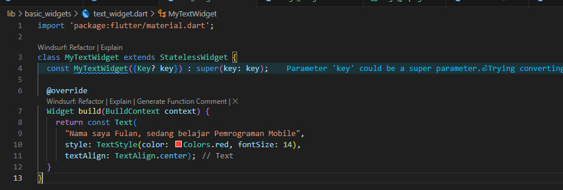
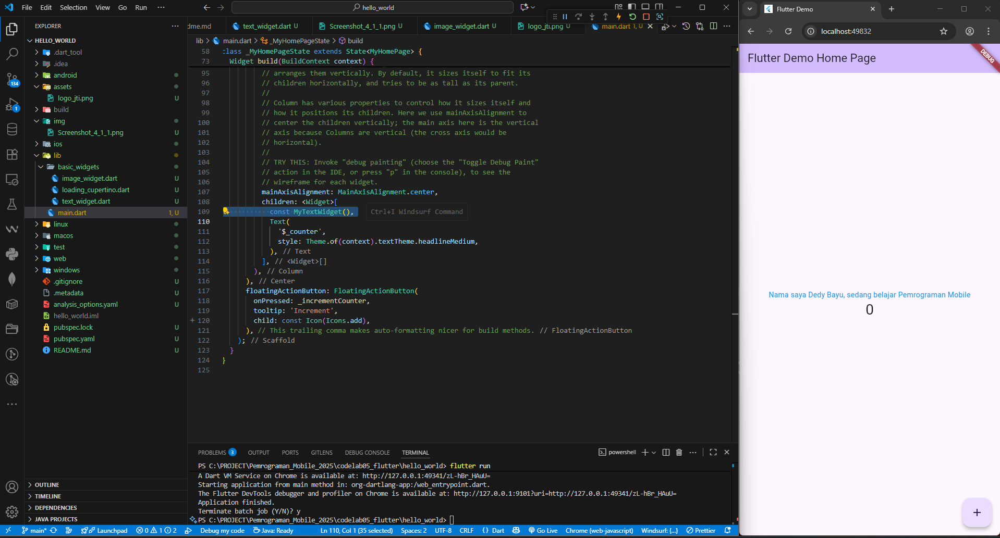
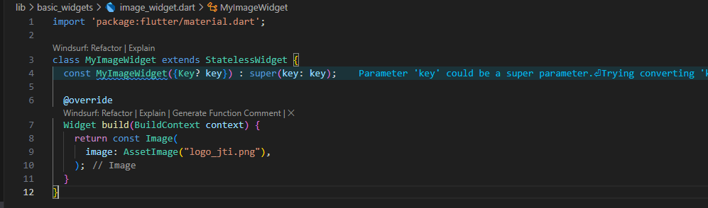
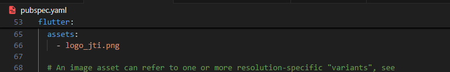
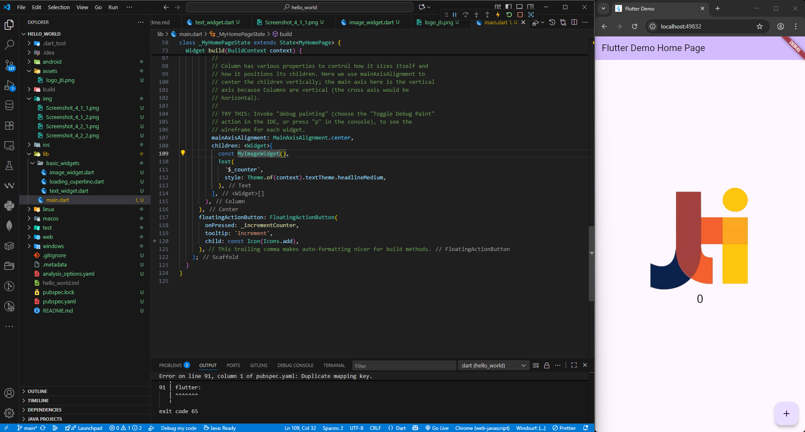

| Nama               | NIM        | Kelas   |
| -------------------- | ------------ | --------- |
| Dedy Bayu Setiawan | 2341720041 | TI - 3H |


# Praktikum 1: Membuat Project Flutter Baru

## Langkah 1

# Praktikum 2: Menghubungkan Perangkat Android atau Emulator

## Langkah 1

# Praktikum 3: Membuat Repository GitHub dan Laporan Praktikum

## Langkah 1

# Praktikum 4: Menerapkan Widget Dasar

## Langkah 1: Text Widget

Buat folder baru **basic_widgets** di dalam folder **lib**. Kemudian buat file baru di dalam basic_widgets dengan nama ```text_widget.dart```. Ketik atau salin kode program berikut ke project hello_world Anda pada file ```text_widget.dart```.



Lakukan import file ```text_widget.dart``` ke main.dart, lalu ganti bagian text widget dengan kode di atas. Maka hasilnya seperti gambar berikut. Screenshot hasil milik Anda, lalu dibuat laporan pada file ```README.md```.




## Langkah 2: Image Widget

Buat sebuah file ```image_widget.dart``` di dalam folder ```basic_widgets``` dengan isi kode berikut.



Lakukan penyesuaian asset pada file ```pubspec.yaml``` dan tambahkan file logo Anda di folder assets project hello_world.



Jangan lupa sesuaikan kode dan import di file ```main.dart``` kemudian akan tampil gambar seperti berikut.




# Praktikum 5: Menerapkan Widget Material Design dan iOS Cupertino
