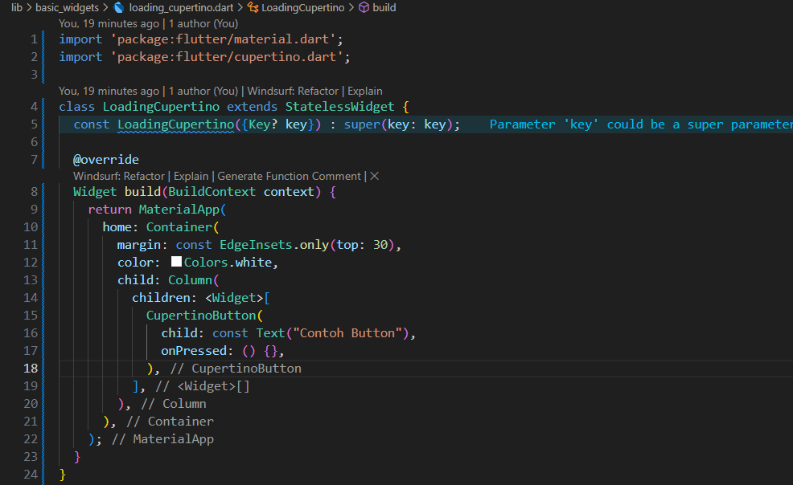
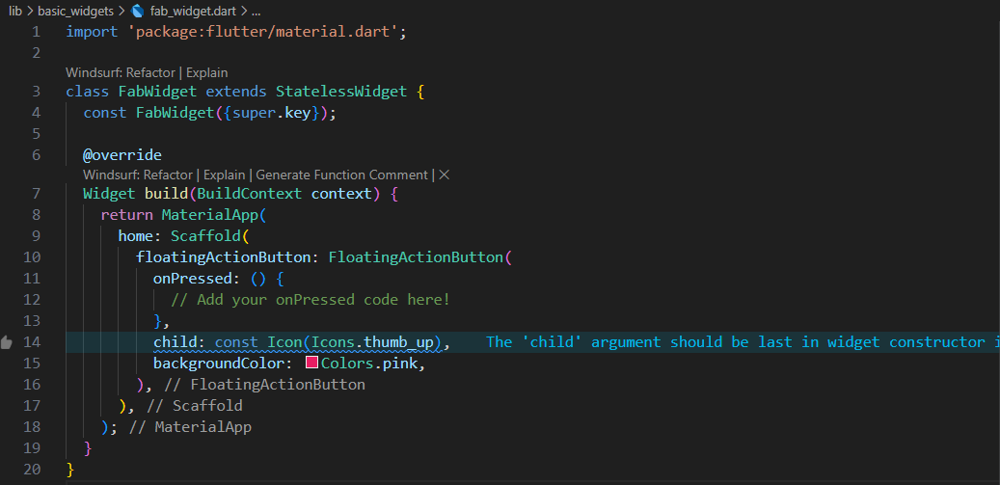
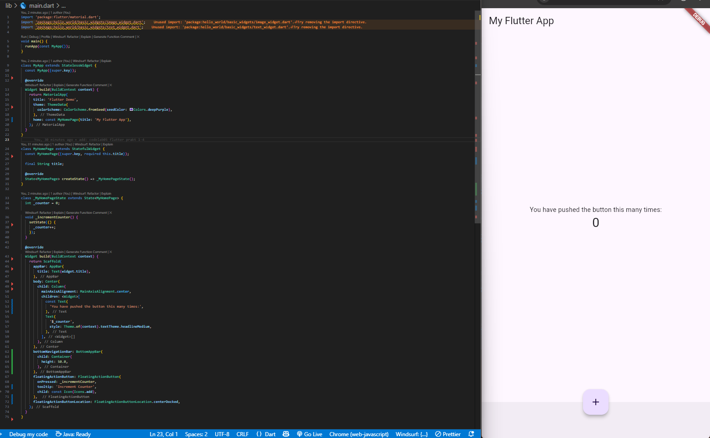
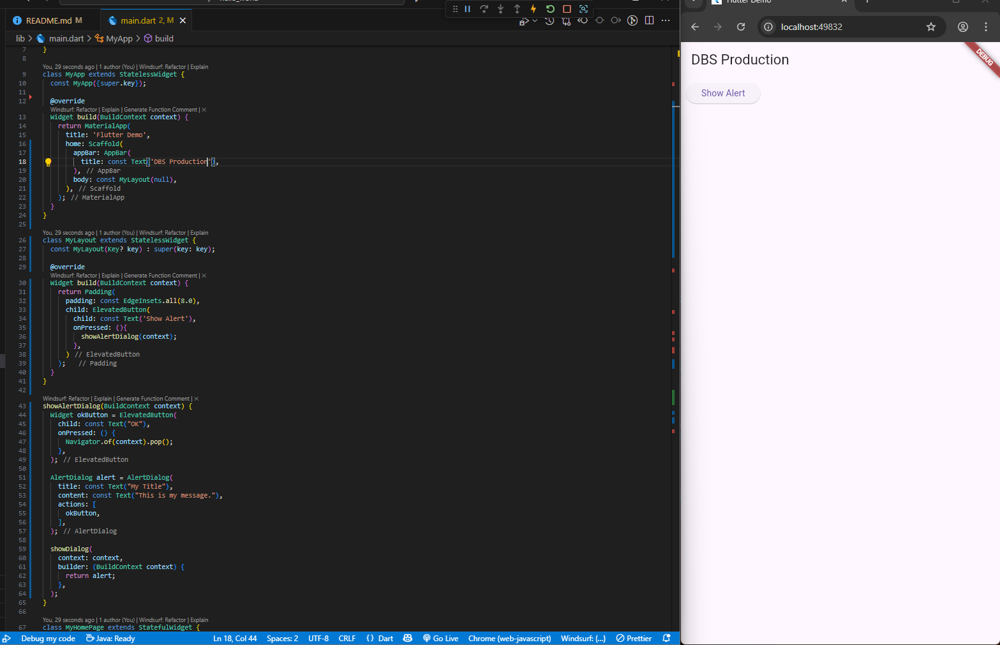
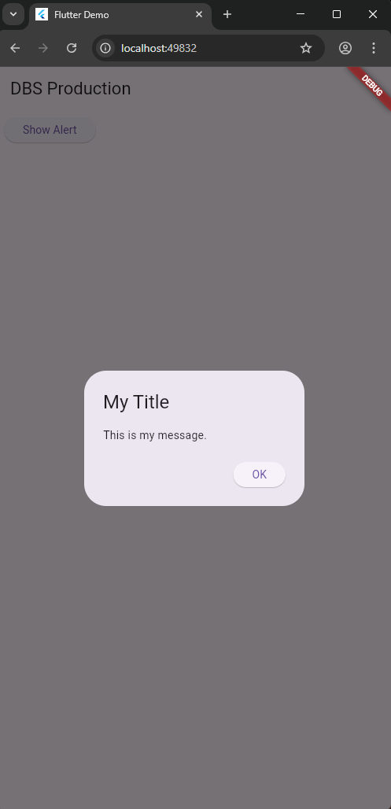
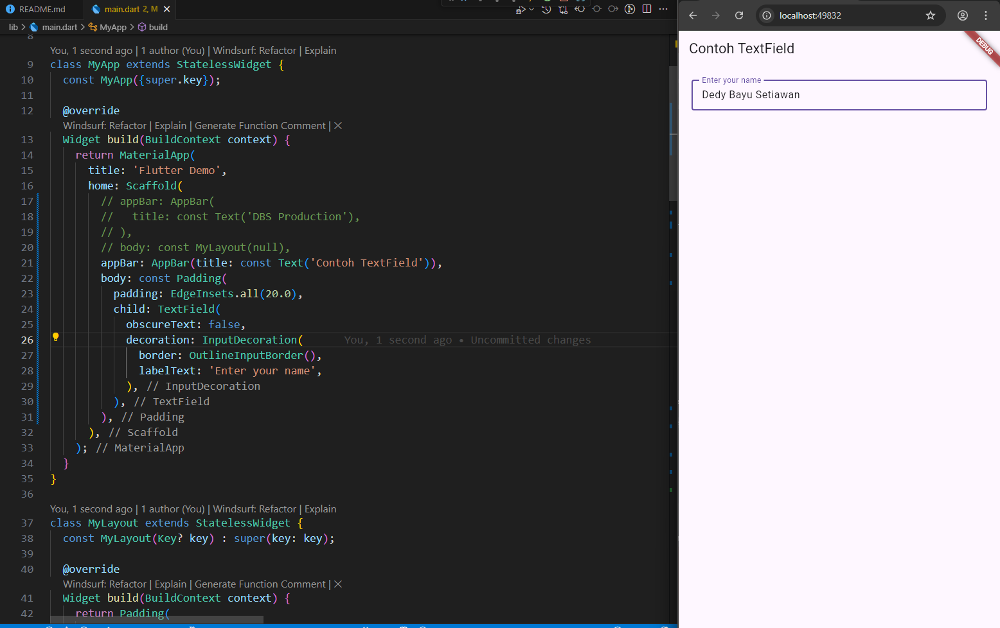

| Nama               | NIM        | Kelas   |
| -------------------- | ------------ | --------- |
| Dedy Bayu Setiawan | 2341720041 | TI - 3H |


# Praktikum 1: Membuat Project Flutter Baru

## Langkah 1

# Praktikum 2: Menghubungkan Perangkat Android atau Emulator

## Langkah 1

# Praktikum 3: Membuat Repository GitHub dan Laporan Praktikum

## Langkah 1

# Praktikum 4: Menerapkan Widget Dasar

## Langkah 1: Text Widget

Buat folder baru **basic_widgets** di dalam folder **lib**. Kemudian buat file baru di dalam basic_widgets dengan nama ```text_widget.dart```. Ketik atau salin kode program berikut ke project hello_world Anda pada file ```text_widget.dart```.


Lakukan import file ```text_widget.dart``` ke main.dart, lalu ganti bagian text widget dengan kode di atas. Maka hasilnya seperti gambar berikut. Screenshot hasil milik Anda, lalu dibuat laporan pada file ```README.md```.


## Langkah 2: Image Widget

Buat sebuah file ```image_widget.dart``` di dalam folder ```basic_widgets``` dengan isi kode berikut.


Lakukan penyesuaian asset pada file ```pubspec.yaml``` dan tambahkan file logo Anda di folder assets project hello_world.


Jangan lupa sesuaikan kode dan import di file ```main.dart``` kemudian akan tampil gambar seperti berikut.


# Praktikum 5: Menerapkan Widget Material Design dan iOS Cupertino

## Langkah 1: Cupertino Button dan Loading Bar
Buat file di basic_widgets > ```loading_cupertino.dart```. Import stateless widget dari material dan cupertino. Lalu isi kode di dalam method Widget build adalah sebagai berikut.




## Langkah 2: Floating Action Button (FAB)
Button widget terdapat beberapa macam pada flutter yaitu ButtonBar, DropdownButton, TextButton, FloatingActionButton, IconButton, OutlineButton, PopupMenuButton, dan ElevatedButton.

Buat file di basic_widgets > fab_widget.dart. Import stateless widget dari material. Lalu isi kode di dalam method Widget build adalah sebagai berikut.




## Langkah 3: Scaffold Widget
Scaffold widget digunakan untuk mengatur tata letak sesuai dengan material design.




## Langkah 4: Dialog Widget
Dialog widget pada flutter memiliki dua jenis dialog yaitu ```AlertDialog``` dan ```SimpleDialog```.

Ubah isi kode ```main.dart``` seperti berikut.






## Langkah 5: Input dan Selection Widget
Flutter menyediakan widget yang dapat menerima input dari pengguna aplikasi yaitu antara lain Checkbox, Date and Time Pickers, Radio Button, Slider, Switch, TextField.

Contoh penggunaan TextField widget adalah sebagai berikut:



## Langkah 6: Date and Time Pickers
