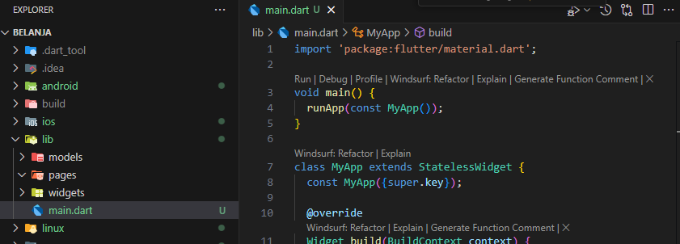
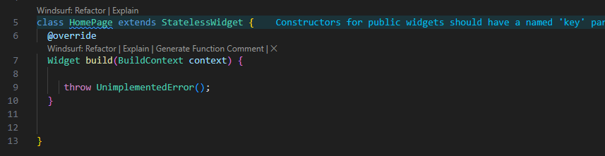
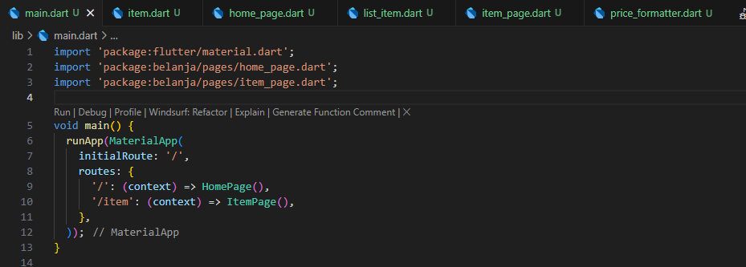
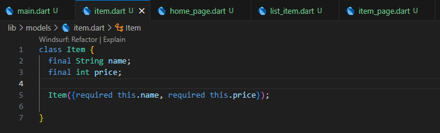
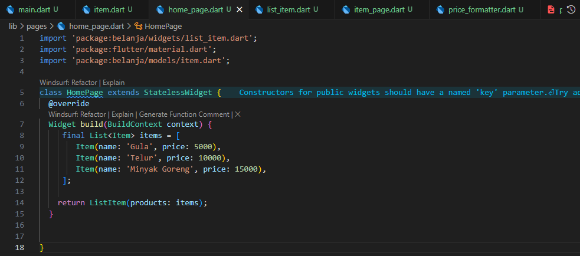
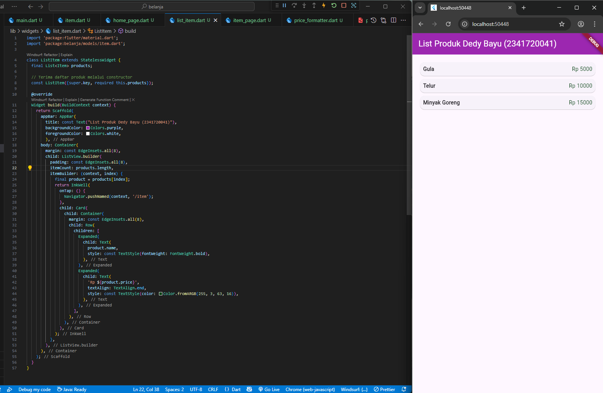
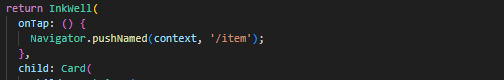
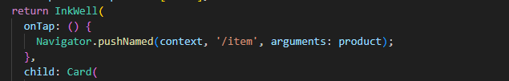
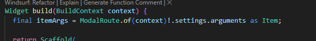
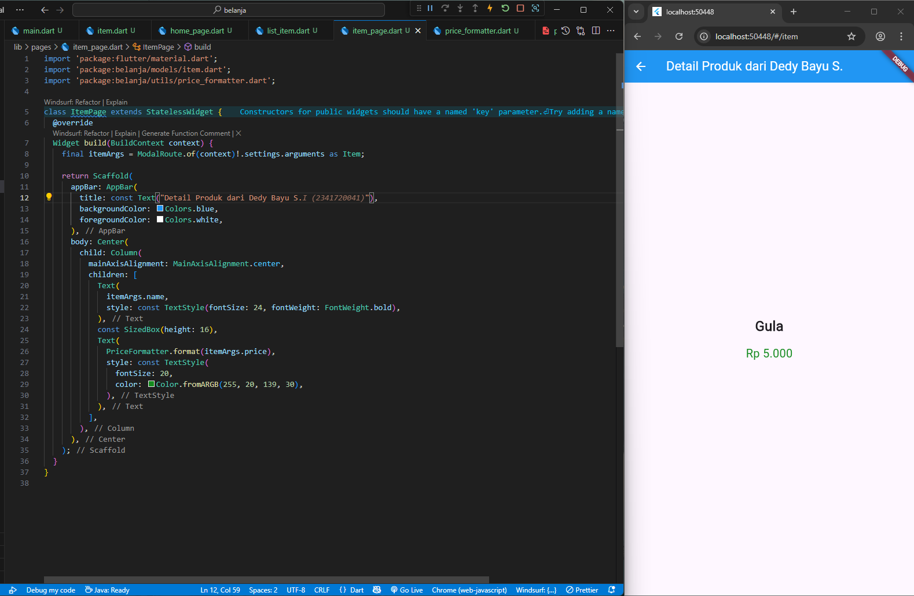

| No. Presensi | Nama               | NIM        | Kelas   |
| ------------ | ------------------ | ---------- | ------- |
| 08           | Dedy Bayu Setiawan | 2341720041 | TI - 3H |

<br>

# Praktikum 1: Membangun Layout di Flutter

## Langkah 1: Buat Project Baru


## Langkah 4: Implementasi title row


# Praktikum 2: Implementasi button row
## Buat widget buttonSection


# Praktikum 3: Implementasi text section
##  Buat widget buttonSection


# Praktikum 4: Implementasi image section
##  Buat widget imageSection


# Kreasi: Membuat Comment 
## Buat widget commentSection


## Pemanggilan di class MyApp


## Hasil Tampilan


# Tugas Praktikum 1
## 1. Selesaikan Praktikum 1 sampai 4, lalu dokumentasikan dan push ke repository Anda berupa screenshot setiap hasil pekerjaan beserta penjelasannya di file README.md!

## 2. Silakan implementasikan di project baru "basic_layout_flutter" dengan mengakses sumber ini: https://docs.flutter.dev/codelabs/3. layout-basics

https://github.com/dedybayu/Pemrograman_Mobile_2025/tree/main/codelab06_flutter/basic_layout_flutter

### 1. Create a visible widget


### 2. Aligning widgets
Horisontal


Vertikal


### 3. Sizing widgets


### 4. Packing widgets


### 5. Nesting rows and columns


### 6. Common layout widgets

#### Container


#### GridView


#### ListView


#### Stack


### 7. Card


## 3. Kumpulkan link commit repository GitHub Anda kepada dosen yang telah disepakati!


# Praktikum 5: Membangun Navigasi di Flutter

## Langkah 1: Siapkan project baru


## Langkah 2: Mendefinisikan Route
home_page.dart




item_page.dart


## Langkah 3: Lengkapi Kode di main.dart



## Langkah 4: Membuat data model


## Langkah 5: Lengkapi kode di class HomePage


## Langkah 6: Membuat ListView dan itemBuilder


## Langkah 7: Menambahkan aksi pada ListView



Tentu, ini adalah format markdown dari teks pada gambar tersebut:

-----

# Tugas Praktikum 2

1.  Untuk melakukan pengiriman data ke halaman berikutnya, cukup menambahkan informasi `arguments` pada penggunaan `Navigator`. Perbarui kode pada bagian `Navigator` menjadi seperti berikut.

    ```dart
    Navigator.pushNamed(context, '/item', arguments: item);
    ```
    
    
2.  Pembacaan nilai yang dikirimkan pada halaman sebelumnya dapat dilakukan menggunakan `ModalRoute`. Tambahkan kode berikut pada blok fungsi `build` dalam halaman `ItemPage`. Setelah nilai didapatkan, anda dapat menggunakannya seperti penggunaan variabel pada umumnya. ([https://docs.flutter.dev/cookbook/navigation/navigate-with-arguments](https://docs.flutter.dev/cookbook/navigation/navigate-with-arguments))

    ```dart
    final itemArgs = ModalRoute.of(context)!.settings.arguments as Item;
    ```
    

    hasil:

    


3.  Pada hasil akhir dari aplikasi **belanja** yang telah anda selesaikan, tambahkan atribut foto produk, stok, dan rating. Ubahlah tampilan menjadi `GridView` seperti di aplikasi marketplace pada umumnya.


4.  Silakan implementasikan `Hero widget` pada aplikasi **belanja** Anda dengan mempelajari dari sumber ini: [https://docs.flutter.dev/cookbook/navigation/hero-animations](https://docs.flutter.dev/cookbook/navigation/hero-animations)

5.  Sesuaikan dan modifikasi tampilan sehingga menjadi aplikasi yang menarik. Selain itu, pecah widget menjadi kode yang lebih kecil. Tambahkan **Nama** dan **NIM** di footer aplikasi **belanja** Anda.

6.  Selesaikan Praktikum 5: Navigasi dan Rute tersebut. Cobalah modifikasi menggunakan plugin `go_router`, lalu dokumentasikan dan push ke repository Anda berupa screenshot setiap hasil pekerjaan beserta penjelasannya di file `README.md`. Kumpulkan link commit repository GitHub Anda kepada dosen yang telah disepakati\!