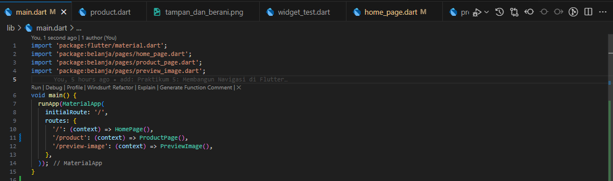
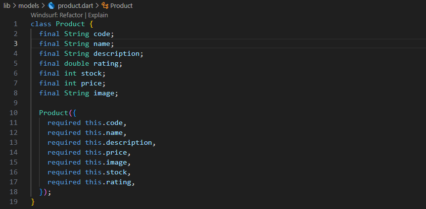
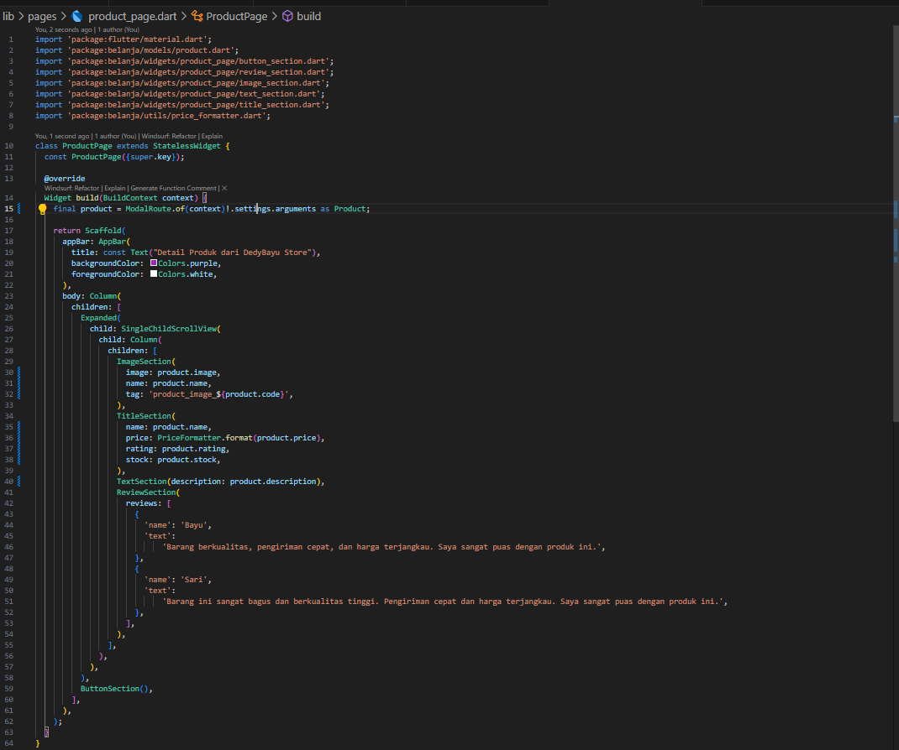
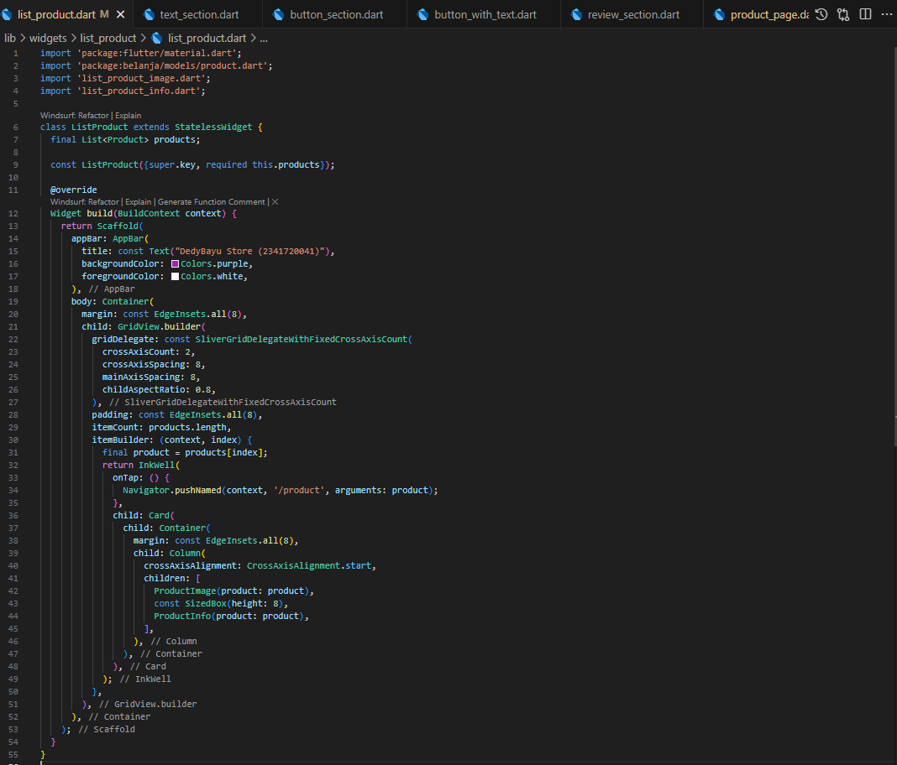
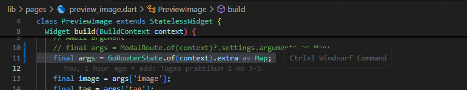

| No. Presensi | Nama               | NIM        | Kelas   |
| ------------ | ------------------ | ---------- | ------- |
| 08           | Dedy Bayu Setiawan | 2341720041 | TI - 3H |

<br>

# Praktikum 1: Membangun Layout di Flutter

## Langkah 1: Buat Project Baru


## Langkah 4: Implementasi title row


# Praktikum 2: Implementasi button row
## Buat widget buttonSection


# Praktikum 3: Implementasi text section
##  Buat widget buttonSection


# Praktikum 4: Implementasi image section
##  Buat widget imageSection


# Kreasi: Membuat Comment 
## Buat widget commentSection


## Pemanggilan di class MyApp


## Hasil Tampilan


# Tugas Praktikum 1
## 1. Selesaikan Praktikum 1 sampai 4, lalu dokumentasikan dan push ke repository Anda berupa screenshot setiap hasil pekerjaan beserta penjelasannya di file README.md!

## 2. Silakan implementasikan di project baru "basic_layout_flutter" dengan mengakses sumber ini: https://docs.flutter.dev/codelabs/3. layout-basics

https://github.com/dedybayu/Pemrograman_Mobile_2025/tree/main/codelab06_flutter/basic_layout_flutter

### 1. Create a visible widget


### 2. Aligning widgets
Horisontal


Vertikal


### 3. Sizing widgets


### 4. Packing widgets


### 5. Nesting rows and columns


### 6. Common layout widgets

#### Container


#### GridView


#### ListView


#### Stack


### 7. Card


## 3. Kumpulkan link commit repository GitHub Anda kepada dosen yang telah disepakati!


# Praktikum 5: Membangun Navigasi di Flutter

## Langkah 1: Siapkan project baru


## Langkah 2: Mendefinisikan Route
home_page.dart


item_page.dart


## Langkah 3: Lengkapi Kode di main.dart


## Langkah 4: Membuat data model


## Langkah 5: Lengkapi kode di class HomePage


## Langkah 6: Membuat ListView dan itemBuilder


## Langkah 7: Menambahkan aksi pada ListView


Tentu, ini adalah format markdown dari teks pada gambar tersebut:

-----

# Tugas Praktikum 2

1.  Untuk melakukan pengiriman data ke halaman berikutnya, cukup menambahkan informasi `arguments` pada penggunaan `Navigator`. Perbarui kode pada bagian `Navigator` menjadi seperti berikut.

    ```dart
    Navigator.pushNamed(context, '/item', arguments: item);
    ```
    
    
2.  Pembacaan nilai yang dikirimkan pada halaman sebelumnya dapat dilakukan menggunakan `ModalRoute`. Tambahkan kode berikut pada blok fungsi `build` dalam halaman `ItemPage`. Setelah nilai didapatkan, anda dapat menggunakannya seperti penggunaan variabel pada umumnya. ([https://docs.flutter.dev/cookbook/navigation/navigate-with-arguments](https://docs.flutter.dev/cookbook/navigation/navigate-with-arguments))

    ```dart
    final itemArgs = ModalRoute.of(context)!.settings.arguments as Item;
    ```
    

    hasil:

    

    price_formatter untuk format harga (tambahan)
    


3.  Pada hasil akhir dari aplikasi **belanja** yang telah anda selesaikan, tambahkan atribut foto produk, stok, dan rating. Ubahlah tampilan menjadi `GridView` seperti di aplikasi marketplace pada umumnya.

4.  Silakan implementasikan `Hero widget` pada aplikasi **belanja** Anda dengan mempelajari dari sumber ini: [https://docs.flutter.dev/cookbook/navigation/hero-animations](https://docs.flutter.dev/cookbook/navigation/hero-animations)

5.  Sesuaikan dan modifikasi tampilan sehingga menjadi aplikasi yang menarik. Selain itu, pecah widget menjadi kode yang lebih kecil. Tambahkan **Nama** dan **NIM** di footer aplikasi **belanja** Anda.

<br>
<hr>
<br>

# Jawaban soal 3 - 5
## Struktur directory
```
lib/
├── main.dart
├── models/
│   └── product.dart
├── pages/
│   ├── home_page.dart
│   ├── item_page.dart
│   └── preview_image.dart
├── utils/
│   └── price_formatter.dart
├── widgets/
│   ├── list_product/
│   │   ├── list_product.dart
│   │   ├── list_product_image.dart
│   │   └── list_product_info.dart
│   ├── product_page/
│   │   ├── button_section.dart
│   │   ├── button_with_text.dart
│   │   ├── image_section.dart
│   │   ├── review_section.dart
│   │   ├── text_section.dart
│   │   └── title_section.dart
│   └── footer_section.dart
```
Saya melakukan perubahan nama **file/class/variabel** dari **Item** menjadi **Product** agar konsisten dan relevan dengan projek

## Modifikasi dan Penambahan
 
### main.dart
  
  
  Terdapat penambahan route baru ```/preview-image``` untuk menampilkan gambar secara full pada product page.


### models/product.dart
  

  Terdapat penambahan atribut ```rating```, ```stock```, ```code```, ```description```, dan ```image```. Image digunakan untuk menyimpan path gambar, deskripsi menyimpan deskripsi produk, dan code digunakan untuk menyimpan kode produk (saat ini digunakan untuk tag Hero agar unik).

### utils/price_formatter.dart
  

  class ini digunakan untuk mengkonveri data int price menjadi string berformat rupiah Indonesia 

### pages/home_page.dart
  

  Kode ini digunakan untuk menampung isi dari home page, kode ini memanggil list produk

### pages/product_page.dart
  

  kode ini digunakan untuk menampilkan detail produk saat produk di list diklik. dalam kode ini akan terbagi menjadi beberapa section yaitu image, title, text, review, button, dan button_with_text. 

### pages/preview_image.dart
  

  kode ini berfungsi untuk menampilkan gambar penuh ketika gambar di product page di klik

### widgets/list_product/list_product.dart
  

  kode ini digunakan untuk menampilkan produk berbentuk card untuk dipanggil di home page. terbagi menjadi 2 section yaitu image dan info

### widgets/list_product/list_product_image.dart
  

  merupakan section dari list_product yang berfungsi untuk menampung/menampilkan gambar produk

### widgets/list_product/list_product_info.dart
  

  merupakan section dari list_product yang berfungsi untuk menampung/menampilkan info (nama, harga, rating) produk


### widgets/product_page/button_section.dart
  

  merupakan section dari produk page yang berfungsi untuk menampilkan button beli dan masukan ke keranjang, kode ini akan memanggil button_with_text

### widgets/product_page/button_with_text.dart
  

  kode ini berisi style untuk button masukan ke keranjang dan beli sekarang

### widgets/product_page/image_section.dart
  

  kode ini merupakan section dari product page yang berfungsi menampilkan gambar

### widgets/product_page/review_section.dart
  

  kode ini merupakan section dari product page yang berfungsi menampilkan review pembeli

### widgets/product_page/text_section.dart
  

  kode ini merupakan section dari product page yang berfungsi menampilkan deskripsi produk

### widgets/product_page/title_section.dart
  

  kode ini merupakan section dari product page yang berfungsi menampilkan nama produk, harga, stok, dan rating
  

### widgets/footer_section.dart
  

  kode ini berfungsi untuk menampilkan nama dan nim saya di footer pada home page

### Hasil:


<br>
<hr>
<br>

6.  Selesaikan Praktikum 5: Navigasi dan Rute tersebut. Cobalah modifikasi menggunakan plugin `go_router`, lalu dokumentasikan dan push ke repository Anda berupa screenshot setiap hasil pekerjaan beserta penjelasannya di file `README.md`. Kumpulkan link commit repository GitHub Anda kepada dosen yang telah disepakati\!
    
  - Memodifikasi kode ```main.dart```

      

      Mengganti route dari menggunakan MaterialApp menjadi GoRouter 


  - Memodifikasi kode ```widgets/list_product/list_product.dart```

      

      Mengganti ```Navigator.pushNamed``` menjadi ```context.push``` untuk route ```/product```
      

  - Memodifikasi kode ```pages/product_page.dart```

      

      Mengganti ```ModalRoute``` menjadi ```GoRouterState``` di ProductPage

      
  - Memodifikasi kode ```widgets/product_page/image_section.dart```

      

      Mengganti ```Navigator.pushNamed``` menjadi ```context.push``` untuk route ```/preview-image```

      
  - Memodifikasi kode ```pages/preview_image.dart```

      

      Mengganti ```ModalRoute``` menjadi ```GoRouterState``` di PreviewImage

<br>
<hr>

# Hasil Akhir:


<br>


<br>


<br>


