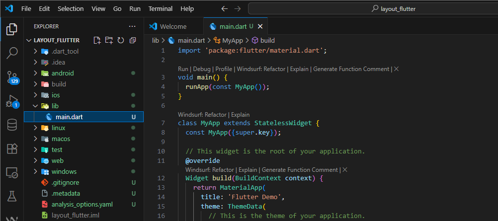

| No. Presensi | Nama               | NIM        | Kelas   |
| ------------ | ------------------ | ---------- | ------- |
| 08           | Dedy Bayu Setiawan | 2341720041 | TI - 3H |

<br>

# Praktikum 1: Membangun Layout di Flutter

## Langkah 1: Buat Project Baru



## Langkah 2: Buka file lib/main.dart


## Langkah 3: Identifikasi layout diagram


## Langkah 4: Implementasi title row


# Praktikum 2: Implementasi button row

# Praktikum 3: Implementasi text section 

# Praktikum 4: Implementasi image section

# Tugas Praktikum 1
1. Selesaikan Praktikum 1 sampai 4, lalu dokumentasikan dan push ke repository Anda berupa screenshot setiap hasil pekerjaan beserta penjelasannya di file README.md!
2. Silakan implementasikan di project baru "basic_layout_flutter" dengan mengakses sumber ini: https://docs.flutter.dev/codelabs/3. layout-basics
3. Kumpulkan link commit repository GitHub Anda kepada dosen yang telah disepakati!

# Praktikum 5: Membangun Navigasi di Flutter

# Tugas Praktikum 2
# Praktikum 5: Navigasi dan Rute

1. **Pengiriman Data Antar Halaman**  
   - Untuk mengirim data ke halaman berikutnya, gunakan `arguments` pada `Navigator`:  
     ```dart
     Navigator.pushNamed(context, '/item', arguments: item);
     ```  
   - Untuk membaca data yang dikirimkan, gunakan `ModalRoute` pada `ItemPage`:  
     ```dart
     final itemArgs = ModalRoute.of(context)!.settings.arguments as Item;
     ```  
   - Referensi: [Navigate with arguments](https://docs.flutter.dev/cookbook/navigation/navigate-with-arguments)

2. **Pengembangan Tampilan Aplikasi Belanja**  
   - Tambahkan atribut foto produk, stok, dan rating.  
   - Ubah tampilan menjadi **GridView** seperti aplikasi marketplace pada umumnya.  
   - Implementasikan **Hero widget** untuk animasi transisi produk.  
     Referensi: [Hero Animations](https://docs.flutter.dev/cookbook/navigation/hero-animations)  
   - Sesuaikan dan modifikasi tampilan agar lebih menarik.  
   - Pecah widget menjadi kode yang lebih kecil agar lebih terstruktur.  
   - Tambahkan **Nama dan NIM** pada footer aplikasi belanja.

3. **Tugas Akhir & Dokumentasi**  
   - Coba modifikasi navigasi menggunakan plugin **go_router**.  
   - Dokumentasikan hasil pekerjaan berupa **screenshot** setiap tahap + **penjelasan** di file `README.md`.  
   - Push hasil pekerjaan ke repository GitHub.  
   - Kumpulkan **link commit repository GitHub** kepada dosen sesuai ketentuan.

# 