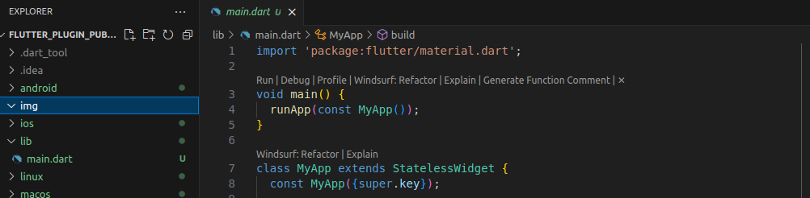
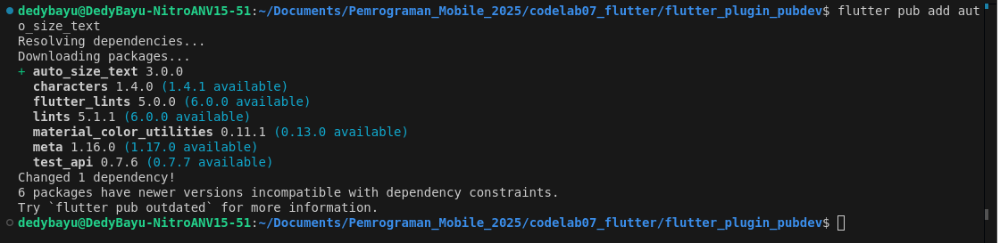
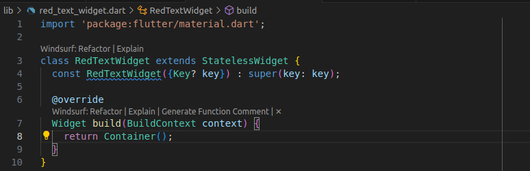
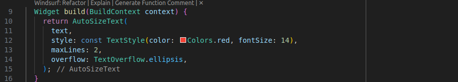
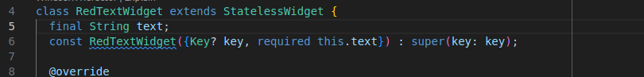
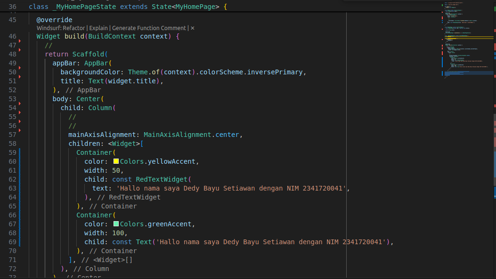
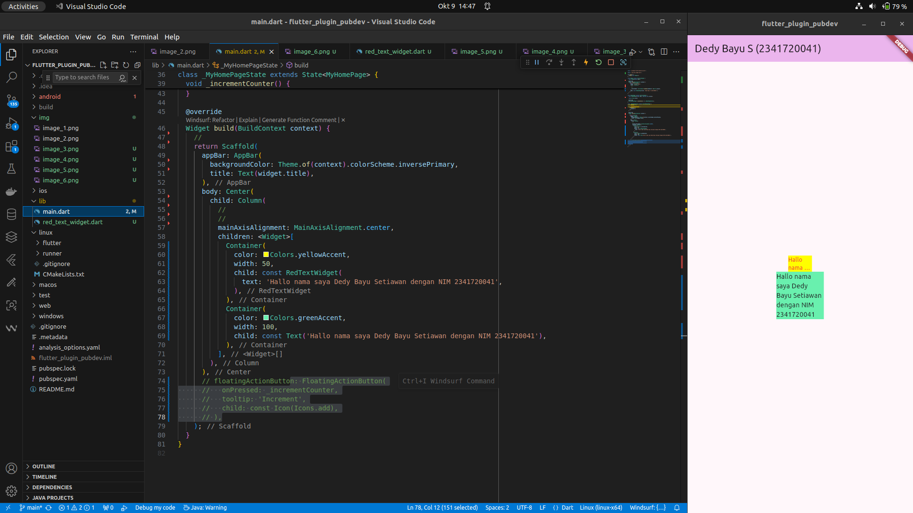
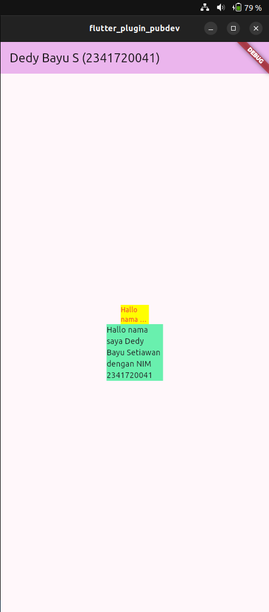

| No. Presensi | Nama               | NIM        | Kelas   |
| ------------ | ------------------ | ---------- | ------- |
| 08           | Dedy Bayu Setiawan | 2341720041 | TI - 3H |

<br>

# Praktikum Menerapkan Plugin di Project Flutter

## Langkah 1: Buat Project Baru



## Langkah 2: Menambahkan Plugin



## Langkah 3: Buat file red_text_widget.dart



## Langkah 4: Tambah Widget AutoSizeText



## Langkah 5: Buat Variabel text dan parameter di constructor




## Langkah 6: Tambahkan widget di main.dart




## Hasil





# Tugas Praktikum
1. Selesaikan Praktikum tersebut, lalu dokumentasikan dan push ke repository Anda berupa screenshot hasil pekerjaan beserta penjelasannya di file README.md!

2. Jelaskan maksud dari langkah 2 pada praktikum tersebut!
    **Jawaban:** Perintah flutter pub add auto_size_text digunakan untuk menambahkan package auto_size_text ke proyek Flutter. Package ini berfungsi agar ukuran teks dapat menyesuaikan secara otomatis dengan ruang tampilan, sehingga teks tidak terpotong atau meluap. Setelah perintah dijalankan, dependensi ditambahkan ke file pubspec.yaml dan otomatis diunduh.

3. Jelaskan maksud dari langkah 5 pada praktikum tersebut!
    **Jawaban:** berfungsi untuk mendefinisikan properti text pada widget dan menerima nilainya lewat konstruktor saat widget dibuat.

    - final String text;
        mendeklarasikan    variabel text yang nilainya tidak bisa diubah setelah diinisialisasi.

    - required this.text
        menandakan bahwa parameter text wajib diisi ketika membuat objek RedTextWidget.

    - super(key: key) 
        meneruskan key ke kelas induk StatelessWidget untuk keperluan identifikasi widget di tree Flutter.

4. Pada langkah 6 terdapat dua widget yang ditambahkan, jelaskan fungsi dan perbedaannya!
    
    **Jawaban:** Widget pertama menggunakan RedTextWidget yang berisi AutoSizeText, sehingga teks berwarna merah dan otomatis menyesuaikan ukuran agar muat dalam lebar 50 piksel.
    
    Widget kedua menggunakan Text biasa, berwarna hitam default, sehingga jika teks terlalu panjang akan terpotong atau meluap dari wadah.

5. Jelaskan maksud dari tiap parameter yang ada di dalam plugin auto_size_text berdasarkan tautan pada dokumentasi ini !
    - text
        Plugin auto_size_text akan otomatis menyesuaikan ukuran font dari teks ini agar muat di dalam batas area widget.

    - style
        Mengatur gaya tampilan teks, seperti warna, ukuran font awal, dan jenis huruf.

    - maxLines
        Menentukan jumlah maksimal baris teks yang boleh ditampilkan. Jika teks lebih panjang dari 2 baris (```maxLines: 2```), maka baris selebihnya tidak akan ditampilkan.

    - overflow
        Menentukan cara menampilkan teks yang melebihi batas baris. Nilai ```TextOverflow.ellipsis``` berarti teks yang tidak muat akan diganti dengan tanda tiga titik (...) di akhir, bukan dipotong tiba-tiba.

6. Kumpulkan laporan praktikum Anda berupa link repository GitHub kepada dosen!