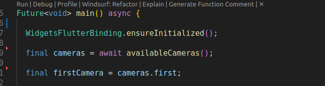
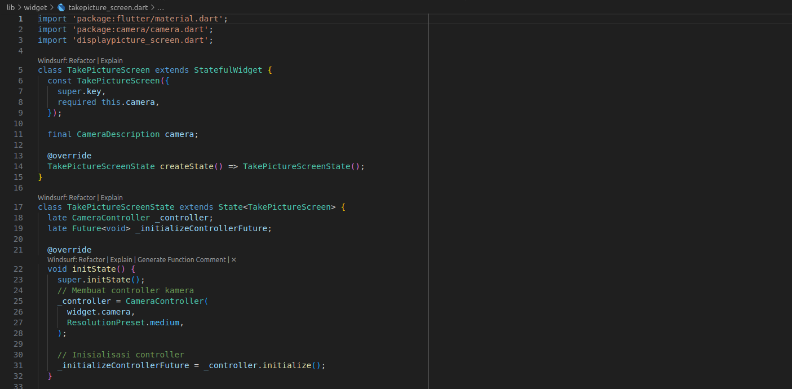
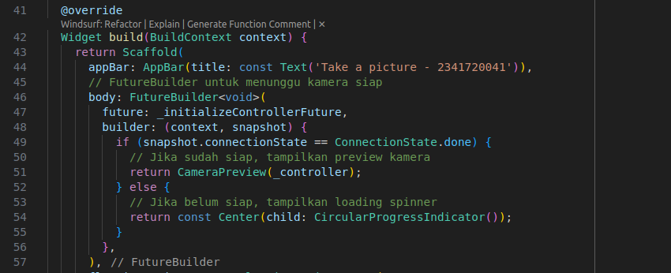
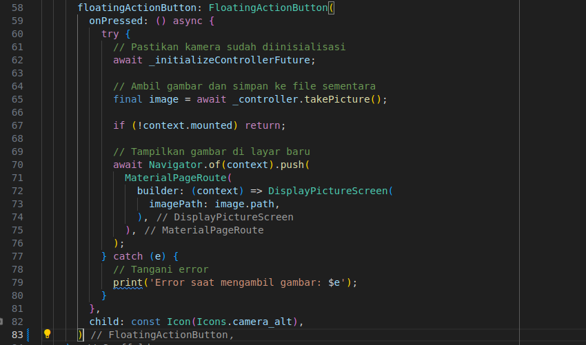
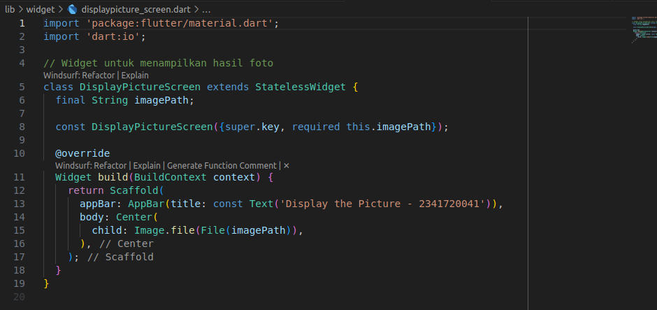
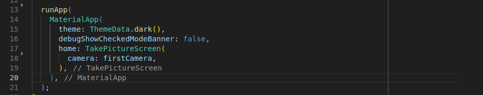
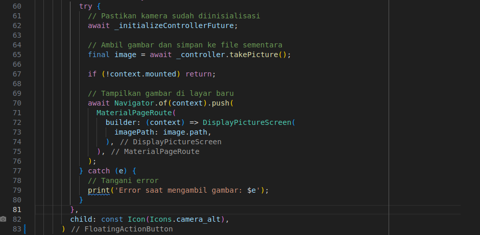
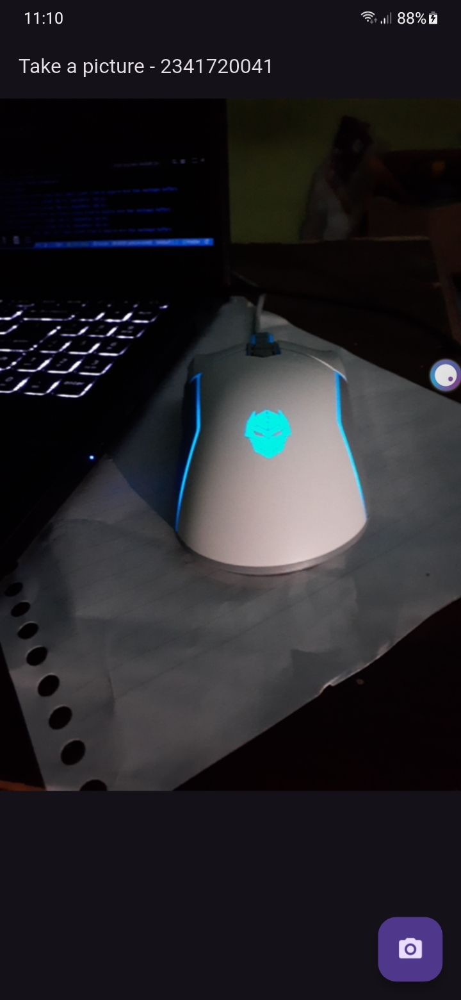

| No. Presensi | Nama               | NIM        | Kelas   |
| ------------ | ------------------ | ---------- | ------- |
| 08           | Dedy Bayu Setiawan | 2341720041 | TI - 3H |

<br>

# Praktikum 1: Mengambil Foto dengan Kamera di Flutter

## Langkah 1: Buat Project Baru

## Langkah 2: Tambah dependensi yang diperlukan
```
flutter pub add camera path_provider path
```

## Langkah 3: Ambil Sensor Kamera dari device
Ubah void main() menjadi async function juga
lib/main.dart




## Langkah 4: Buat dan inisialisasi CameraController

lib/widget/takepicture_screen.dart

[kode lengkap takepicture_screen.dart](https://github.com/dedybayu/Pemrograman_Mobile_2025/blob/main/codelab_09_kamera/lib/widget/takepicture_screen.dart)




## Langkah 5: Gunakan CameraPreview untuk menampilkan preview foto
lib/widget/takepicture_screen.dart




## Langkah 6: Ambil foto dengan CameraController
lib/widget/takepicture_screen.dart




## Langkah 7: Buat widget baru DisplayPictureScreen
lib/widget/displaypicture_screen.dart




## Langkah 8: Edit main.dart
lib/main.dart




## Langkah 9: Menampilkan hasil foto
lib/widget/takepicture_screen.dart




## Hasil:
<p float="left">
  
  
</p>


<br>
<hr>
<br>
<br>

# Praktikum 2: Membuat photo filter carousel

## Langkah 2: Buat widget Selector ring dan dark gradient
lib/widget/filter_selector.dart

## Langkah 3: Buat widget photo filter carousel
lib/widget/filter_carousel.dart

## Langkah 4: Membuat filter warna - bagian 1
lib/widget/carousel_flowdelegate.dart

## Langkah 5: Membuat filter warna
lib/widget/filter_item.dart

## Langkah 6: Implementasi filter carousel
lib/main.dart

