| No. Presensi | Nama               | NIM        | Kelas   |
| ------------ | ------------------ | ---------- | ------- |
| 08           | Dedy Bayu Setiawan | 2341720041 | TI - 3H |

<br>

# Praktikum 1: Mengambil Foto dengan Kamera di Flutter

## Langkah 1: Buat Project Baru

## Langkah 2: Tambah dependensi yang diperlukan
```
flutter pub add camera path_provider path
```

## Langkah 3: Ambil Sensor Kamera dari device
Ubah void main() menjadi async function juga
lib/main.dart


## Langkah 4: Buat dan inisialisasi CameraController

lib/widget/takepicture_screen.dart

[kode lengkap takepicture_screen.dart](https://github.com/dedybayu/Pemrograman_Mobile_2025/blob/main/codelab_09_kamera/lib/widget/takepicture_screen.dart)


## Langkah 5: Gunakan CameraPreview untuk menampilkan preview foto
lib/widget/takepicture_screen.dart


## Langkah 6: Ambil foto dengan CameraController
lib/widget/takepicture_screen.dart


## Langkah 7: Buat widget baru DisplayPictureScreen
lib/widget/displaypicture_screen.dart


## Langkah 8: Edit main.dart
lib/main.dart


## Langkah 9: Menampilkan hasil foto
lib/widget/takepicture_screen.dart


## Hasil:
<p float="left">
  
  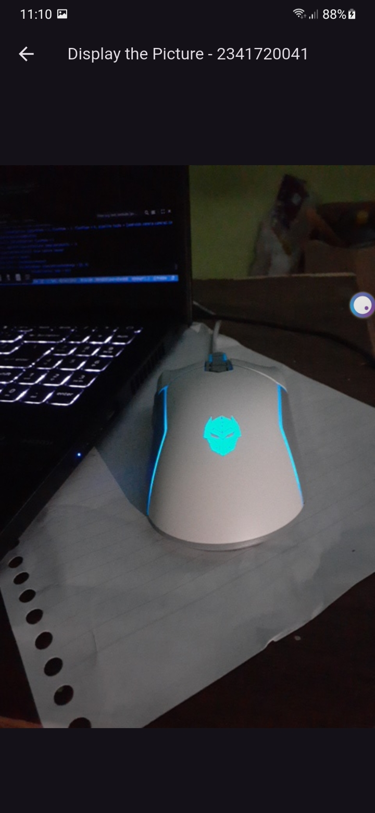
</p>


<br>
<hr>
<br>
<br>

# Praktikum 2: Membuat photo filter carousel

## Langkah 2: Buat widget Selector ring dan dark gradient
lib/widget/filter_selector.dart

[kode lengkap filter_selector.dart](https://github.com/dedybayu/Pemrograman_Mobile_2025/blob/main/codelab_09_kamera/lib/widget/filter_selector.dart)

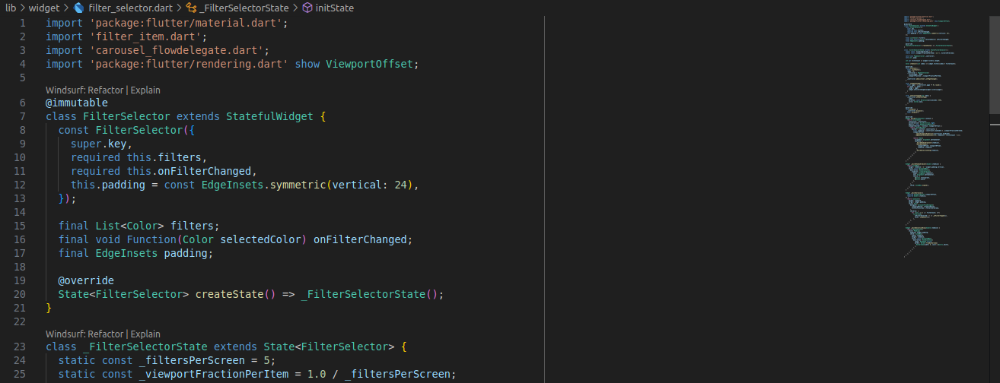


## Langkah 3: Buat widget photo filter carousel
lib/widget/filter_carousel.dart

[kode lengkap filter_carousel.dart](https://github.com/dedybayu/Pemrograman_Mobile_2025/blob/main/codelab_09_kamera/lib/widget/filter_carousel.dart)

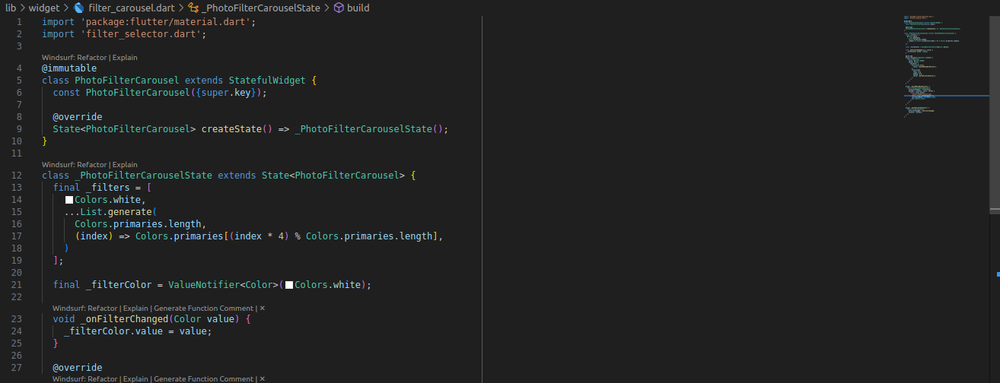


## Langkah 4: Membuat filter warna - bagian 1
lib/widget/carousel_flowdelegate.dart

[kode lengkap carousel_flowdelegate.dart](https://github.com/dedybayu/Pemrograman_Mobile_2025/blob/main/codelab_09_kamera/lib/widget/carousel_flowdelegate.dart)

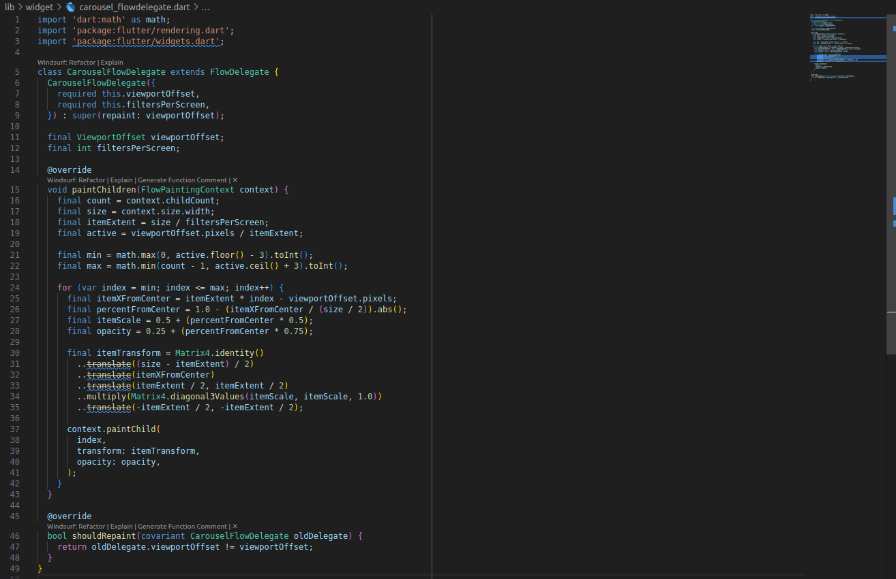


## Langkah 5: Membuat filter warna
lib/widget/filter_item.dart

[kode lengkap filter_item.dart](https://github.com/dedybayu/Pemrograman_Mobile_2025/blob/main/codelab_09_kamera/lib/widget/filter_item.dart)

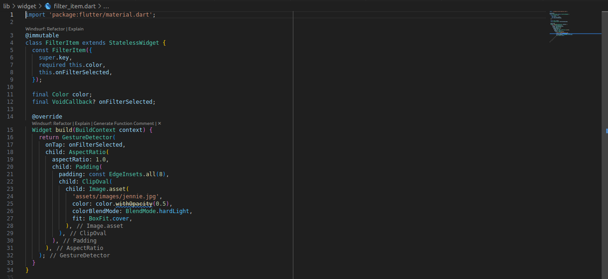


## Langkah 6: Implementasi filter carousel
lib/main.dart

[kode lengkap main.dart](https://github.com/dedybayu/Pemrograman_Mobile_2025/blob/main/codelab_09_kamera/lib/main.dart)

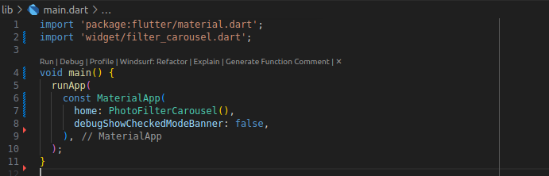


## Hasil:


<br>
<hr>
<br>
<br>


# Tugas Praktikum

## 1. Selesaikan Praktikum 1 dan 2, lalu dokumentasikan dan push ke repository Anda berupa screenshot setiap hasil pekerjaan beserta penjelasannya di file README.md! Jika terdapat error atau kode yang tidak dapat berjalan, silakan Anda perbaiki sesuai tujuan aplikasi dibuat!

## 2. Gabungkan hasil praktikum 1 dengan hasil praktikum 2 sehingga setelah melakukan pengambilan foto, dapat dibuat filter carouselnya!

### main.dart
[kode lengkap main.dart](https://github.com/dedybayu/Pemrograman_Mobile_2025/blob/main/codelab_09_kamera/lib/main.dart)

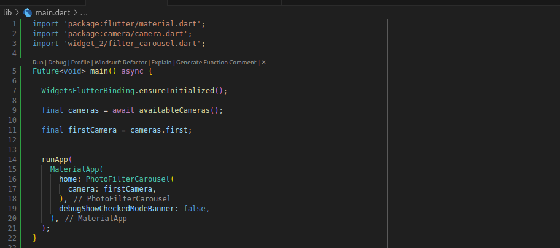

### filter_carousel.dart
[kode lengkap filter_carousel.dart](https://github.com/dedybayu/Pemrograman_Mobile_2025/blob/main/codelab_09_kamera/lib/widget_2/filter_carousel.dart)

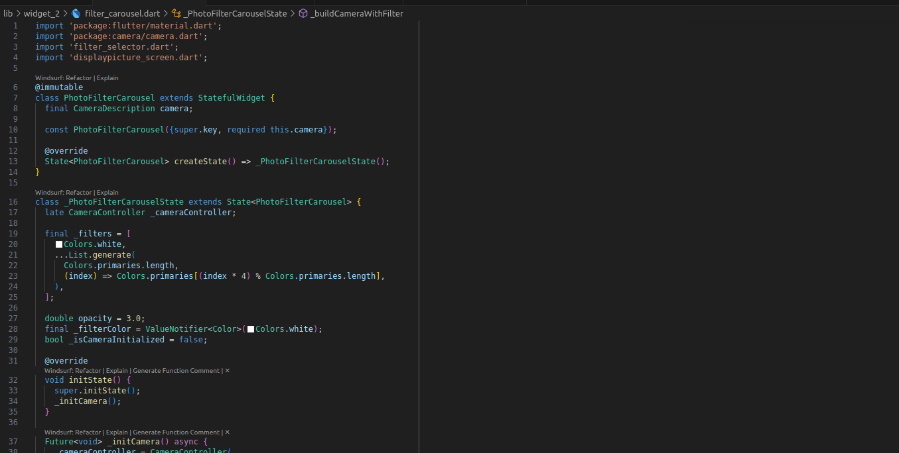


### filter_item.dart
[kode lengkap filter_item.dart](https://github.com/dedybayu/Pemrograman_Mobile_2025/blob/main/codelab_09_kamera/lib/widget_2/filter_item.dart)

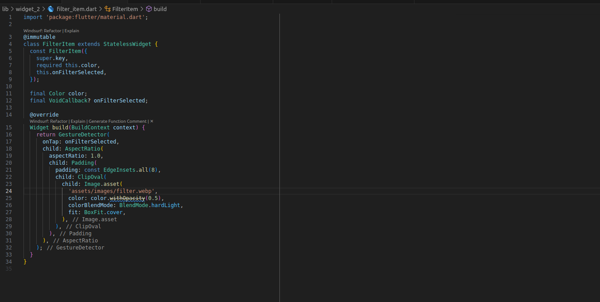


### filter_selector.dart
[kode lengkap filter_selector.dart](https://github.com/dedybayu/Pemrograman_Mobile_2025/blob/main/codelab_09_kamera/lib/widget_2/filter_selector.dart)

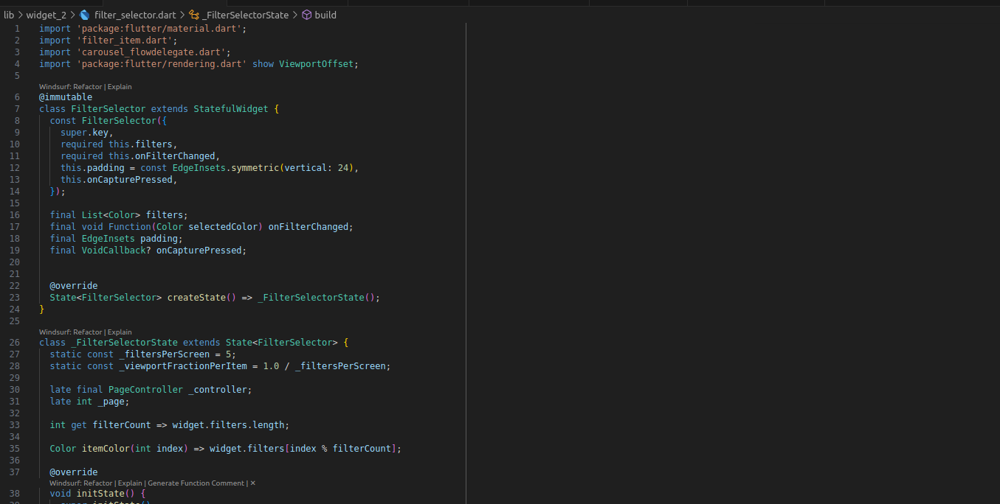
 

### carousel_flowdelegate.dart
[kode lengkap filter_selector.dart](https://github.com/dedybayu/Pemrograman_Mobile_2025/blob/main/codelab_09_kamera/lib/widget_2/filter_selector.dart)

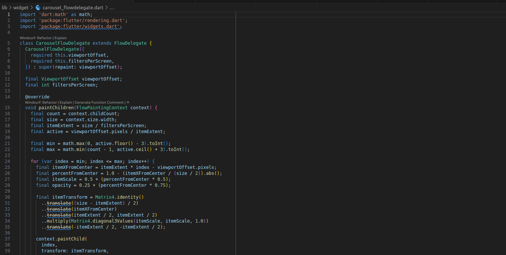


### displaypicture_screen.dart
[kode lengkap displaypicture_screen.dart](https://github.com/dedybayu/Pemrograman_Mobile_2025/blob/main/codelab_09_kamera/lib/widget_2/displaypicture_screen.dart)

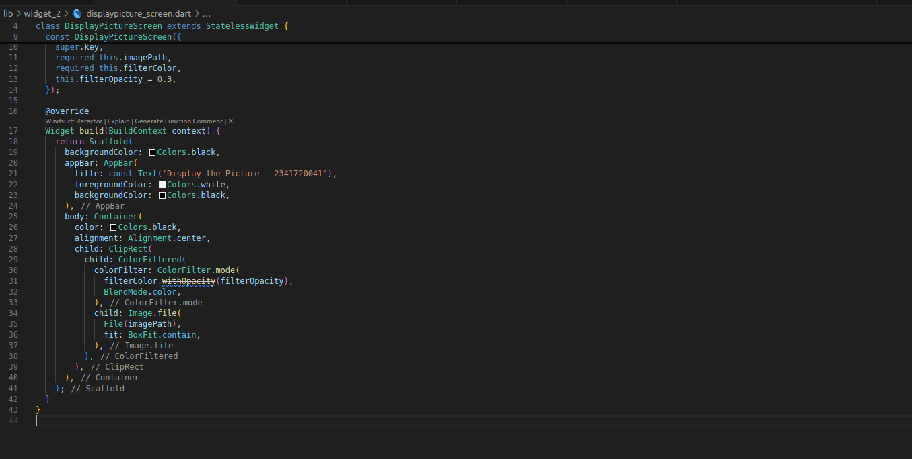

### Hasil Tampilan: 


## 3. Jelaskan maksud void async pada praktikum 1?
Jawaban: ```Future<void> main() async``` digunakan agar fungsi ```main()``` dapat menjalankan proses secara asynchronous, yaitu proses yang membutuhkan waktu tanpa menghentikan jalannya program utama. Kata kunci ```async``` memungkinkan penggunaan ```await``` di dalam fungsi tersebut untuk menunggu hasil operasi yang berjalan lama, seperti inisialisasi kamera melalui ```availableCameras()```. Dengan demikian, program dapat memastikan bahwa kamera telah siap sebelum aplikasi Flutter dijalankan menggunakan r```unApp()```.

## 4. Jelaskan fungsi dari anotasi ```@immutable``` dan @override ?
**Jawaban:** Anotasi ```@immutable``` digunakan untuk menandai bahwa sebuah kelas bersifat tidak dapat diubah setelah objeknya dibuat (immutable). Artinya, semua properti dalam kelas tersebut harus bersifat final dan tidak boleh diubah nilainya selama siklus hidup objek tersebut. Dalam konteks Flutter, hal ini penting terutama pada widget seperti ```StatelessWidget``` agar tampilan aplikasi tetap konsisten, efisien, dan terhindar dari perubahan tak terduga yang dapat menyebabkan kesalahan render.

## 5. Kumpulkan link commit repository GitHub Anda kepada dosen yang telah disepakati!