| No. Presensi | Nama               | NIM        | Kelas   |
| ------------ | ------------------ | ---------- | ------- |
| 08           | Dedy Bayu Setiawan | 2341720041 | TI - 3H |

<br>

# Praktikum 1: Mengambil Foto dengan Kamera di Flutter

## Langkah 1: Buat Project Baru
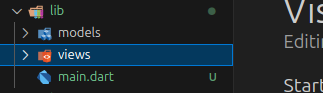

## Langkah 2: Membuat model task.dart
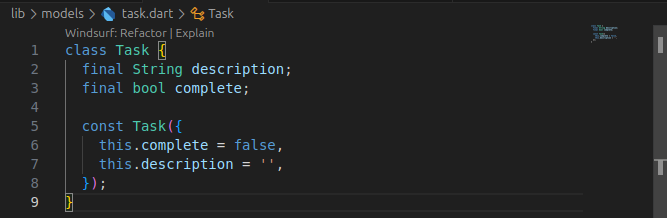


## Langkah 3: Buat file plan.dart
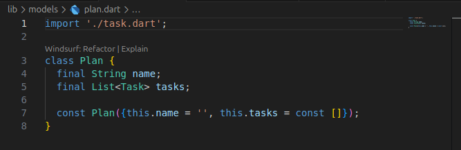


## Langkah 4: Buat file data_layer.dart
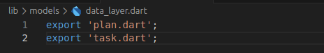


## Langkah 5: Pindah ke file main.dart
```dart
import 'package:flutter/material.dart';
import './views/plan_screen.dart';

void main() => runApp(MasterPlanApp());

class MasterPlanApp extends StatelessWidget {
  const MasterPlanApp({super.key});

  @override
  Widget build(BuildContext context) {
    return MaterialApp(
     theme: ThemeData(primarySwatch: Colors.purple),
     home: PlanScreen(),
    );
  }
}
```


## Langkah 6: buat plan_screen.dart
```dart
import '../models/data_layer.dart';
import 'package:flutter/material.dart';

class PlanScreen extends StatefulWidget {
  const PlanScreen({super.key});

  @override
  State createState() => _PlanScreenState();
}

class _PlanScreenState extends State<PlanScreen> {
  Plan plan = const Plan();

  @override
  Widget build(BuildContext context) {
    return Scaffold(
      appBar: AppBar(title: const Text('Master Plan DedyBayu')),
      body: _buildList(),
      floatingActionButton: _buildAddTaskButton(),
    );
  }
}
```

## Langkah 7: buat method _buildAddTaskButton()
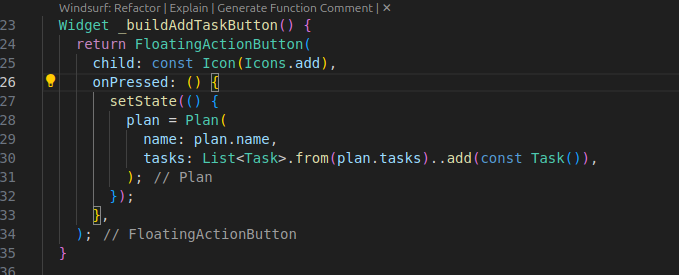


## Langkah 8: buat widget _buildList()
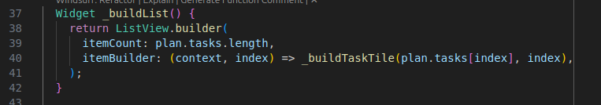


## Langkah 9: buat widget _buildTaskTile
```dart
Widget _buildTaskTile(Task task, int index) {
  return ListTile(
    leading: Checkbox(
      value: task.complete,
      onChanged: (selected) {
        setState(() {
          plan = Plan(
            name: plan.name,
            tasks: List<Task>.from(plan.tasks)
              ..[index] = Task(
                description: task.description,
                complete: selected ?? false,
              ),
          );
        });
      },
    ),
    title: TextFormField(
      initialValue: task.description,
      onChanged: (text) {
        setState(() {
          plan = Plan(
            name: plan.name,
            tasks: List<Task>.from(plan.tasks)
              ..[index] = Task(description: text, complete: task.complete),
          );
        });
      },
    ),
  );
}
```

## Langkah 10: Tambah Scroll Controller
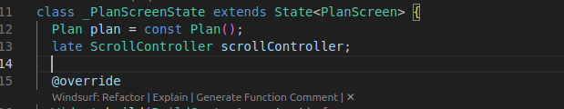


## Langkah 11: Tambah Scroll Listener
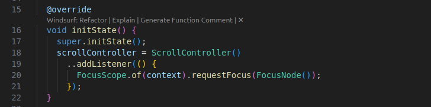


## Langkah 12: Tambah controller dan keyboard behavior
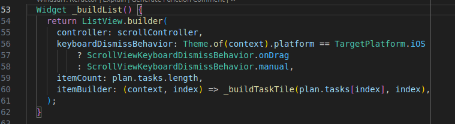


## Langkah 13: Terakhir, tambah method dispose()
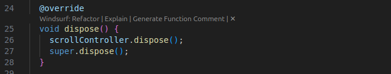


## Hasil
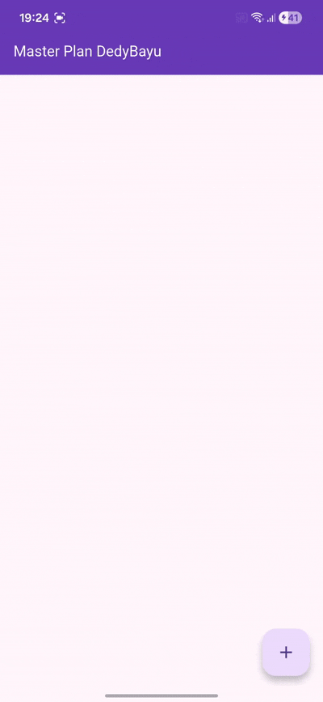


# Tugas Praktikum 1: Dasar State dengan Model-View

1. **Selesaikan langkah-langkah praktikum tersebut, lalu dokumentasikan berupa GIF hasil akhir praktikum beserta penjelasannya di file README.md! Jika Anda menemukan ada yang error atau tidak berjalan dengan baik, silakan diperbaiki.**

2. **Jelaskan maksud dari langkah 4 pada praktikum tersebut! Mengapa dilakukan demikian?**
    **Jawaban:**
    ```dart
    export 'plan.dart';
    export 'task.dart';
    ```
    File ```data_layer.dart``` berfungsi sebagai “barrel file” atau penggabung ekspor.
    Dengan file ini, kita bisa mengimpor seluruh model dari satu tempat saja, bukan satu per satu.


3. **Mengapa perlu variabel plan di langkah 6 pada praktikum tersebut? Mengapa dibuat konstanta ?**
    
    **Jawaban:**
    Karena fungsi variabel ```plan``` digunakan untuk menyimpan state dari seluruh daftar tugas (tasks) dalam aplikasi. Data di dalam plan digunakan di semua widget dalam PlanScreen. Saat pengguna menambah/mengedit task, data plan akan diperbarui dengan setState(). Plan dibuat konstanta karena ```Plan``` adalah immutable object (tidak diubah langsung) — setiap perubahan menghasilkan instance baru dari ```Plan```.


4. **Lakukan capture hasil dari Langkah 9 berupa GIF, kemudian jelaskan apa yang telah Anda buat!**

5. **Apa kegunaan method pada Langkah 11 dan 13 dalam lifecyle state ?**

    **Jawaban:** 
    ```initState()``` Dipanggil sekali saat pertama kali widget dibuat, menginisialisasi scrollController, menambahkan listener untuk mendeteksi event scroll dan menutup keyboard otomatis (menghapus fokus dari semua TextField). 

    Sedangkan ```dispose()``` Dipanggil sekali saat widget dihapus dari tree (tidak digunakan lagi), membersihkan resource scrollController agar tidak terjadi memory leak. ```dispose()``` memastikan bahwa semua resource yang tidak dipakai lagi sudah dibuang dengan benar.

6. **Kumpulkan laporan praktikum Anda berupa link commit atau repository GitHub ke dosen yang telah disepakati!**


# Praktikum 2: Mengelola Data Layer dengan InheritedWidget dan InheritedNotifier

## Langkah 1: Buat file plan_provider.dart
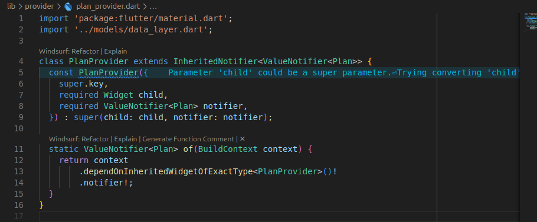


## Langkah 2: Edit main.dart
```dart
import 'package:flutter/material.dart';
import 'package:master_plan/models/data_layer.dart';
import 'package:master_plan/provider/plan_provider.dart';
import './views/plan_screen.dart';

void main() => runApp(MasterPlanApp());

class MasterPlanApp extends StatelessWidget {
  const MasterPlanApp({super.key});

  @override
  Widget build(BuildContext context) {
    return MaterialApp(
      debugShowCheckedModeBanner: false,
      theme: ThemeData(primarySwatch: Colors.purple),
      home: PlanProvider(
        notifier: ValueNotifier<Plan>(const Plan()),
        child: const PlanScreen(),
      ),
    );
  }
}

```

## Langkah 3: Tambah method pada model plan.dart
```dart
import './task.dart';

class Plan {
  int get completedCount => tasks.where((task) => task.complete).length;

  String get completenessMessage =>
      '$completedCount out of ${tasks.length} tasks';

  final String name;
  final List<Task> tasks;

  const Plan({this.name = '', this.tasks = const []});
}
```

## Langkah 4: Pindah ke PlanScreen
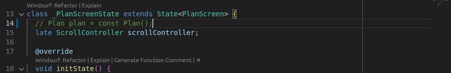


## Langkah 5: Edit method _buildAddTaskButton
```dart
  Widget _buildAddTaskButton(BuildContext context) {
    ValueNotifier<Plan> planNotifier = PlanProvider.of(context);
    return FloatingActionButton(
      child: const Icon(Icons.add),
      onPressed: () {
        Plan currentPlan = planNotifier.value;
        planNotifier.value = Plan(
          name: currentPlan.name,
          tasks: List<Task>.from(currentPlan.tasks)..add(const Task()),
        );
      },
    );
  }
```

## Langkah 6: Edit method _buildTaskTile
```dart
  Widget _buildTaskTile(Task task, int index, BuildContext context) {
    ValueNotifier<Plan> planNotifier = PlanProvider.of(context);
    return ListTile(
      leading: Checkbox(
        value: task.complete,
        onChanged: (selected) {
          Plan currentPlan = planNotifier.value;
          planNotifier.value = Plan(
            name: currentPlan.name,
            tasks: List<Task>.from(currentPlan.tasks)
              ..[index] = Task(
                description: task.description,
                complete: selected ?? false,
              ),
          );
        },
      ),
      title: TextFormField(
        initialValue: task.description,
        onChanged: (text) {
          Plan currentPlan = planNotifier.value;
          planNotifier.value = Plan(
            name: currentPlan.name,
            tasks: List<Task>.from(currentPlan.tasks)
              ..[index] = Task(description: text, complete: task.complete),
          );
        },
      ),
    );
  }
```

## Langkah 7: Edit _buildList
```dart
  Widget _buildList(Plan plan) {
    return ListView.builder(
      controller: scrollController,
      itemCount: plan.tasks.length,
      itemBuilder: (context, index) =>
          _buildTaskTile(plan.tasks[index], index, context),
    );
  }
```

## Langkah 8: Tetap di class PlanScreen
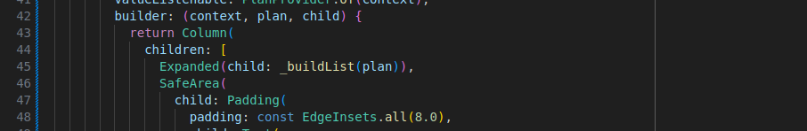

## Langkah 9: Tambah widget SafeArea
```dart
  @override
  Widget build(BuildContext context) {
    return Scaffold(
      appBar: AppBar(
        title: const Text('Master Plan DedyBayu'),
        backgroundColor: Colors.deepPurple,
        foregroundColor: Colors.white,
      ),
      body: ValueListenableBuilder<Plan>(
        valueListenable: PlanProvider.of(context),
        builder: (context, plan, child) {
          return Column(
            children: [
              Expanded(child: _buildList(plan)),
              SafeArea(
                child: Padding(
                  padding: const EdgeInsets.all(8.0),
                  child: Text(
                    plan.completenessMessage,
                    style: const TextStyle(
                      fontSize: 16,
                      fontWeight: FontWeight.w500,
                    ),
                  ),
                ),
              ),
            ],
          );
        },
      ),
      floatingActionButton: _buildAddTaskButton(context),
    );
  }
```

## Hasil:
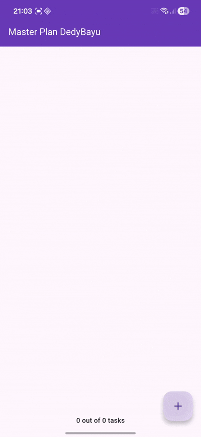


# Tugas Praktikum 2: InheritedWidget

1. Selesaikan langkah-langkah praktikum tersebut, lalu dokumentasikan berupa GIF hasil akhir praktikum beserta penjelasannya di file README.md! Jika Anda menemukan ada yang error atau tidak berjalan dengan baik, silakan diperbaiki sesuai dengan tujuan aplikasi tersebut dibuat.

2. Jelaskan mana yang dimaksud InheritedWidget pada langkah 1 tersebut! Mengapa yang digunakan InheritedNotifier?

    **Jawaban:** 
    ```InheritedWidget``` adalah mekanisme bawaan Flutter yang digunakan untuk mendistribusikan data dari widget induk ke seluruh subtree di bawahnya tanpa perlu meneruskan data lewat constructor satu per satu. InheritedWidget tidak otomatis memberi tahu anak-anaknya saat datanya berubah. Kalau ada perubahan data, kita harus memanggil ```setState()```.

    Sedangkan ```InheritedNotifier``` adalah versi lebih pintar dari InheritedWidget, karena menggabungkan InheritedWidget + Listenable (seperti ValueNotifier), sehingga, widget anak otomatis rebuild ketika nilai notifier berubah.

    ```InheritedNotifier``` dipakai karena kita ingin setiap kali data Plan berubah (misal user menambah task), semua widget yang menggunakan data itu otomatis ter-update, tanpa harus pakai ```setState()``` di mana-mana.


3. Jelaskan maksud dari method di langkah 3 pada praktikum tersebut! Mengapa dilakukan demikian?

    **Jawaban:**
    ```dart
      int get completedCount => tasks.where((task) => task.complete).length;

      String get completenessMessage =>
          '$completedCount out of ${tasks.length} tasks';
    ```
    Kedua method di atas adalah getter, digunakan untuk menghitung progress penyelesaian tugas (task) dalam satu Plan.
    - completedCount: menghitung berapa banyak task yang sudah selesai (task.complete == true)
    - completenessMessage: membuat pesan teks progres seperti

    Hal ini dilakukan karena:
    - Lebih efisien dan terstruktur karena data dihitung otomatis berdasarkan isi tasks.
    - Menghindari perhitungan manual di UI karena logika tetap di model (Plan), bukan di tampilan (PlanScreen).
    - Meningkatkan pemisahan tanggung jawab (Separation of Concern):
      - Model (Plan) menangani logika data.
      - View (PlanScreen) hanya menampilkan hasilnya

4. Lakukan capture hasil dari Langkah 9 berupa GIF, kemudian jelaskan apa yang telah Anda buat!

5. Kumpulkan laporan praktikum Anda berupa link commit atau repository GitHub ke dosen yang telah disepakati !


# Praktikum 3: Membuat State di Multiple Screens

## Langkah 1: Edit PlanProvider


## Langkah 2: Edit main.dart


## Langkah 3: Edit plan_screen.dart


## Langkah 5: Tambah getter Plan


## Langkah 6: Method initState()


## Langkah 7: Widget build


## Langkah 8: Edit _buildTaskTile


## Langkah 9: Buat screen baru


## Langkah 10: Pindah ke class _PlanCreatorScreenState


## Langkah 11: Pindah ke method build


## Langkah 12: Buat widget _buildListCreator


## Langkah 13: Buat void addPlan()


## Langkah 14: Buat widget _buildMasterPlans()


##

##

##

##

##

##

##

##

#

