| No. Presensi | Nama               | NIM        | Kelas   |
| ------------ | ------------------ | ---------- | ------- |
| 08           | Dedy Bayu Setiawan | 2341720041 | TI - 3H |

<br>

# Praktikum 1: Mengambil Foto dengan Kamera di Flutter

## Langkah 1: Buat Project Baru
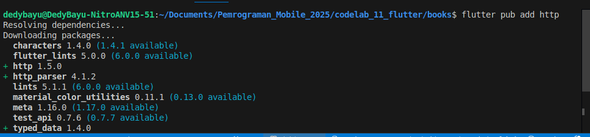

## Langkah 2: Cek file pubspec.yaml

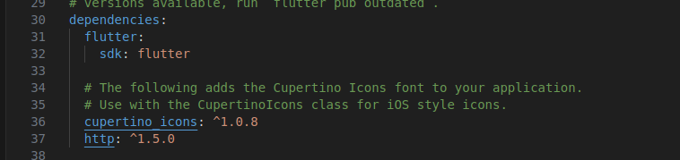

## Langkah 3: Buka file main.dart
```dart
import 'dart:async';
import 'package:flutter/material.dart';
import 'package:http/http.dart';
import 'package:http/http.dart' as http;

void main() {
  runApp(const MyApp());
}

class MyApp extends StatelessWidget {
  const MyApp({super.key});

  @override
  Widget build(BuildContext context) {
    return MaterialApp(
      title: 'Future Demo DedyBayu',
      theme: ThemeData(
        primarySwatch: Colors.blue,
        visualDensity: VisualDensity.adaptivePlatformDensity,
      ),
      home: const FuturePage(),
    );
  }
}

class FuturePage extends StatefulWidget {
  const FuturePage({super.key});

  @override
  State<FuturePage> createState() => _FuturePageState();
}

class _FuturePageState extends State<FuturePage> {
  String result = '';
  @override
  Widget build(BuildContext context) {
    return Scaffold(
      appBar: AppBar(
        title: const Text('Back from the Future'),
      ),
      body: Center(
        child: Column(children: [
          const Spacer(),
          ElevatedButton(
            child: const Text('GO!'),
            onPressed: () {},
          ),
          const Spacer(),
          Text(result),
          const Spacer(),
          const CircularProgressIndicator(),
          const Spacer(),
        ]),
      ),
    );
  }
}
```

### Soal 1
Tambahkan nama panggilan Anda pada title app sebagai identitas hasil pekerjaan Anda.
```dart
    return MaterialApp(
      title: 'Future Demo DedyBayu',
      theme: ThemeData(
        primarySwatch: Colors.blue,
        visualDensity: VisualDensity.adaptivePlatformDensity,
      ),
      home: const FuturePage(),
    );
```


## Langkah 4: Tambah method getData()
```dart
            const Spacer(),
            Text(result),
            const Spacer(),
            const CircularProgressIndicator(),
            const Spacer(),
          ],
        ),
      ),
    );
  }

  Future<Response> getData() async {
    const authority = 'www.googleapis.com';
    const path = '/books/v1/volumes/junbDwAAQBAJ';
    Uri url = Uri.https(authority, path);
    return http.get(url);
  }
}
```
### Soal 2
- Carilah judul buku favorit Anda di Google Books, lalu ganti ID buku pada variabel path di kode tersebut. Caranya ambil di URL browser Anda seperti gambar berikut ini.
    


- Kemudian cobalah akses di browser URI tersebut dengan lengkap seperti ini. Jika menampilkan data JSON, maka Anda telah berhasil. Lakukan capture milik Anda dan tulis di README pada laporan praktikum. Lalu lakukan commit dengan pesan "W11: Soal 2".
    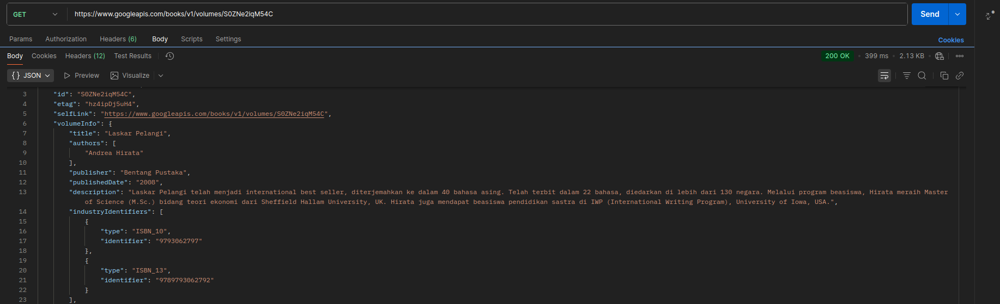


## Langkah 5: Tambah kode di ElevatedButton

### Soal 3
- Jelaskan maksud kode langkah 5 tersebut terkait substring dan catchError!
- Capture hasil praktikum Anda berupa GIF dan lampirkan di README. Lalu lakukan commit dengan pesan "W11: Soal 3".

## Hasil
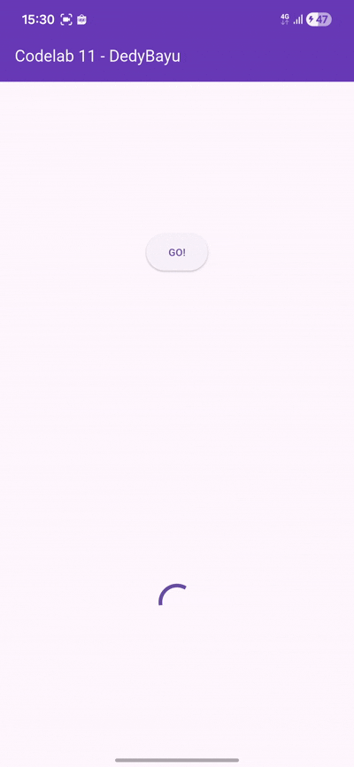


# Praktikum 2: Menggunakan await/async untuk menghindari callbacks

## Langkah 1: Buka file main.dart
Tambahkan tiga method berisi kode seperti berikut di dalam class _FuturePageState.
```dart
  Future<Response> getData() async {
    const authority = 'www.googleapis.com';
    const path = '/books/v1/volumes/S0ZNe2iqM54C';
    Uri url = Uri.https(authority, path);
    return http.get(url);
  }

  Future<int> returnOneAsync() async {
    await Future.delayed(const Duration(seconds: 3));
    return 1;
  }

  Future<int> returnTwoAsync() async {
    await Future.delayed(const Duration(seconds: 3));
    return 2;
  }

  Future<int> returnThreeAsync() async {
    await Future.delayed(const Duration(seconds: 3));
    return 3;
  }
```
## Langkah 2: Tambah method count()
```dart
  Future<int> returnThreeAsync() async {
    await Future.delayed(const Duration(seconds: 3));
    return 3;
  }

  Future count() async {
    int total = 0;

    total = await returnOneAsync();
    total += await returnTwoAsync();
    total += await returnThreeAsync();
    
    setState(() {
      result = total.toString();
    });
  }
```
## Langkah 3: Panggil count()
```dart
            ElevatedButton(
              child: const Text('GO!'),
              onPressed: () {
                count();
                // setState(() {});
                // getData()
                //     .then((value) {
```
## Langkah 4: Run


### Soal 4
- Jelaskan maksud kode langkah 1 dan 2 tersebut!
- Capture hasil praktikum Anda berupa GIF dan lampirkan di README. Lalu lakukan commit dengan pesan "W11: Soal 4".


# Praktikum 3: Menggunakan Completer di Future

## Langkah 1: Buka main.dart
Pastikan telah impor package async
```dart
import 'dart:async';
```
## Langkah 2: Tambahkan variabel dan method
Tambahkan variabel late dan method di class _FuturePageState
```dart
class _FuturePageState extends State<FuturePage> {
  String result = '';
  late Completer completer;
```

```dart
  }

  Future getNumber() {
    completer = Completer<int>();
    calculate();
    return completer.future;
  }

  Future calculate() async {
    await Future.delayed(const Duration(seconds: 5));
    completer.complete(42);
  }
}

```

## Langkah 3: Ganti isi kode onPressed()
```dart
  child: const Text('GO!'),
  onPressed: () {
    getNumber().then((value) {
      setState(() {
        result = value.toString();
      });
    });

    // count();
```

## Langkah 4:
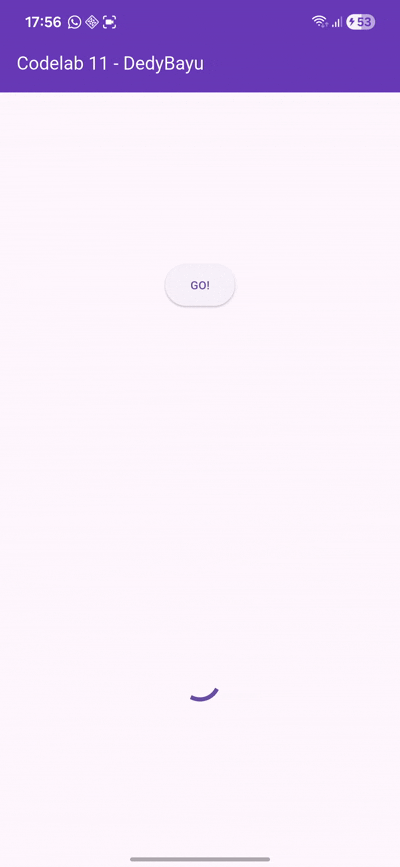


### Soal 5
- Jelaskan maksud kode langkah 2 tersebut!

- Capture hasil praktikum Anda berupa GIF dan lampirkan di README. Lalu lakukan commit dengan pesan "W11: Soal 5".

## Langkah 5: Ganti method calculate()
```dart
  Future calculate() async {
    // await Future.delayed(const Duration(seconds: 5));
    // completer.complete(42);
    try {
      await Future.delayed(const Duration(seconds: 5));
      completer.complete(42);
    } catch (e) {
      completer.completeError(e);
    }
  }
```

## Langkah 6: Pindah ke onPressed()
```dart
    onPressed: () {
      getNumber()
          .then((value) {
            setState(() {
              result = value.toString();
            });
          })
          .catchError((e) {
            result = 'An error occurred';
          });

      // getNumber().then((value) {
      //   setState(() {
```

## Hasil
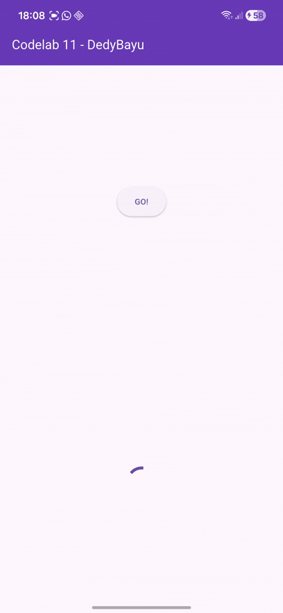

### Soal 6
- Jelaskan maksud perbedaan kode langkah 2 dengan langkah 5-6 tersebut!

- Capture hasil praktikum Anda berupa GIF dan lampirkan di README. Lalu lakukan commit dengan pesan "W11: Soal 6".


# Praktikum 4: Memanggil Future secara paralel

## Langkah 1: Buka file main.dart
Tambahkan method ini ke dalam class _FuturePageState
```dart
  }

  void returnFG(){
    FutureGroup<int> futureGroup = FutureGroup<int>();
    futureGroup.add(returnOneAsync());
    futureGroup.add(returnTwoAsync());
    futureGroup.add(returnThreeAsync());
    futureGroup.close();
    futureGroup.future.then((List <int> value) {
      int total = 0;
      for (var element in value) {
        total += element;
      }
      setState(() {
        result = total.toString();
      });
    });
  }
}
```
## Langkah 2: Edit onPressed()
```dart
    child: const Text('GO!'),
    onPressed: () {
      returnFG();
      // getNumber()
      //     .then((value) {
      //       setState(() {
```

## Langkah 3: Run
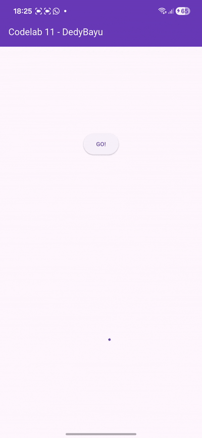

### Soal 7
Capture hasil praktikum Anda berupa GIF dan lampirkan di README. Lalu lakukan commit dengan pesan "W11: Soal 7".


## Langkah 4: Ganti variabel futureGroup
```dart
  void returnFG() {
    final futures = Future.wait<int>([
      returnOneAsync(),
      returnTwoAsync(),
      returnThreeAsync(),
    ]);

    futures.then((List<int> value) {
      int total = 0;
      for (var element in value) {
        total += element;
      }
      setState(() {
        result = total.toString();
      });
    });
  }
```
### Soal 8
- Jelaskan maksud perbedaan kode langkah 1 dan 4!

## Hasil
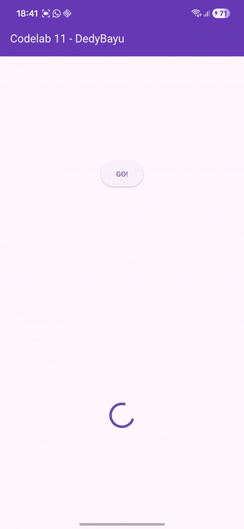


# Praktikum 5: Menangani Respon Error pada Async Code

## Langkah 1: Buka file main.dart
```dart
  }

  Future<int> returnError() async {
    await Future.delayed(const Duration(seconds: 2));
    throw Exception('Something terrible happened!');
  }
}
```
## Langkah 2: ElevatedButton
```dart
  child: const Text('GO!'),
  onPressed: () {
    returnError()
        .then((value) {
          setState(() {
            result = 'Success';
          });
        })
        .catchError((onError) {
          setState(() {
            result = onError.toString();
          });
        })
        .whenComplete(() {
          print('Complete');
        });
        
    // returnFG();
```
## Langkah 3: Run

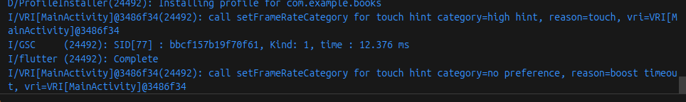


### Soal 9
Capture hasil praktikum Anda berupa GIF dan lampirkan di README. Lalu lakukan commit dengan pesan "W11: Soal 9".

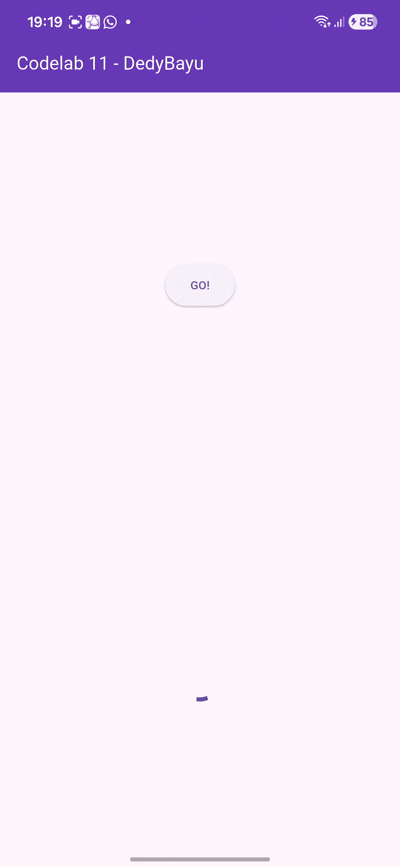

## Langkah 4: Tambah method handleError()
```dart
  onPressed: () {
    handleError()
        .then((value) {
          setState(() {
            result = 'Success';
          });
        })
        .catchError((onError) {
          setState(() {
            result = onError.toString();
          });
        })
        .whenComplete(() {
          print('Complete');
        });
```

## Hasil:


### Soal 10
Panggil method handleError() tersebut di ElevatedButton, lalu run. Apa hasilnya? Jelaskan perbedaan kode langkah 1 dan 4!


# Praktikum 6: Menggunakan Future dengan StatefulWidget

## Langkah 1: install plugin geolocator
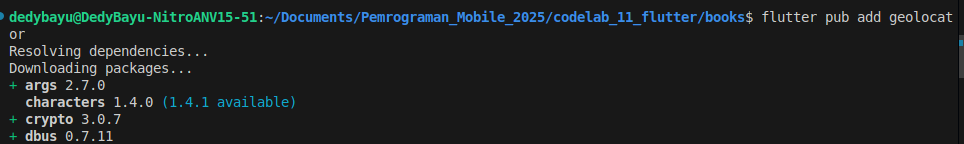

## Langkah 2: Tambah permission GPS

```xml
<manifest xmlns:android="http://schemas.android.com/apk/res/android">
    <uses-permission android:name="android.permission.ACCESS_FINE_LOCATION"/>
    <uses-permission android:name="android.permission.ACCESS_COARSE_LOCATION"/>
```

## Langkah 3: Buat file geolocation.dart
```
dedybayu@DedyBayu-NitroANV15-51:~/Documents/Pemrograman_Mobile_2025/codelab_11_flutter/books$ touch lib/geolocation.dart
dedybayu@DedyBayu-NitroANV15-51:~/Documents/Pemrograman_Mobile_2025/codelab_11_flutter/books$ ls lib/
geolocation.dart  main.dart
```

## Langkah 4: Buat StatefulWidget

## Langkah 5: Isi kode geolocation.dart

### Soal 11
Tambahkan nama panggilan Anda pada tiap properti title sebagai identitas pekerjaan Anda.


## Langkah 6: Edit main.dart
```dart
      ),
      // home: const FuturePage(),
      home: LocationScreen(),

      debugShowCheckedModeBanner: false,
    );
```
## Langkah 7: Run
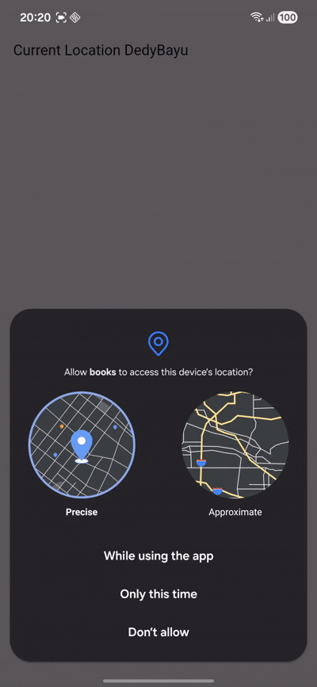


## Langkah 8: Tambahkan animasi loading
```dart
  @override
  Widget build(BuildContext context) {
    final myWidget = myPosition == '' ? const CircularProgressIndicator() : Text(myPosition);
    return Scaffold(
      appBar: AppBar(title: const Text('Current Location DedyBayu')),
      body: Center(child: myWidget),
    );
  }
```

## Hasil
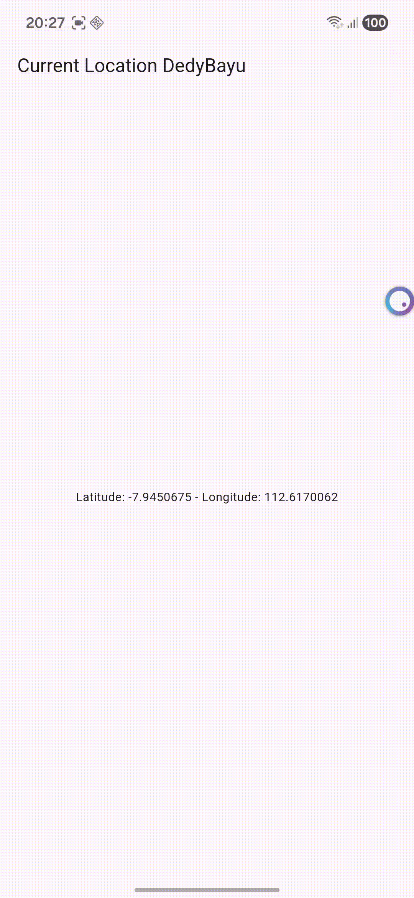


### Soal 12
- Jika Anda tidak melihat animasi loading tampil, kemungkinan itu berjalan sangat cepat. Tambahkan delay pada method getPosition() dengan kode await Future.delayed(const Duration(seconds: 3));
  ```dart
    Future<void> getMyPosition() async {
    setState(() {
      myPosition = '';
    });

    await Future.delayed(const Duration(seconds: 3));

    // Ambil posisi
    Position myPos = await getPosition();

    setState(() {
      myPosition =
          'Latitude: ${myPos.latitude.toString()} - Longitude: ${myPos.longitude.toString()}';
    });
  }
  ```

  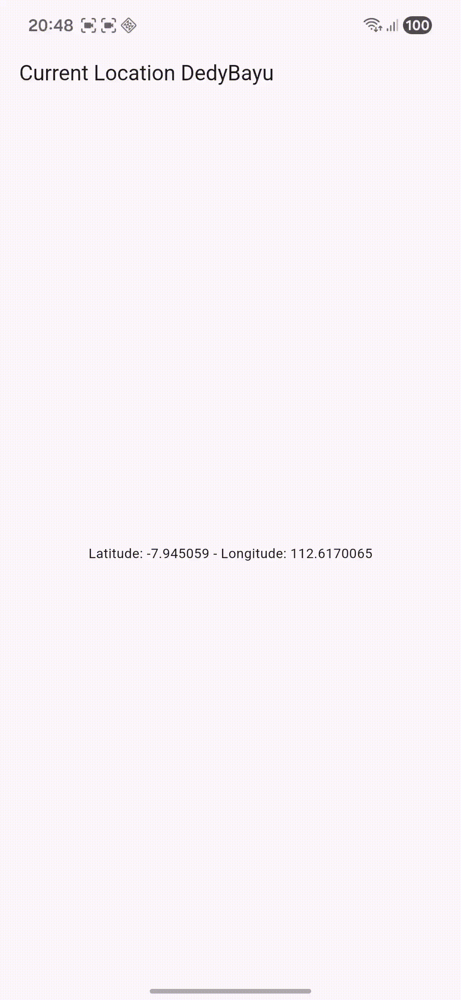

- Apakah Anda mendapatkan koordinat GPS ketika run di browser? Mengapa demikian?

  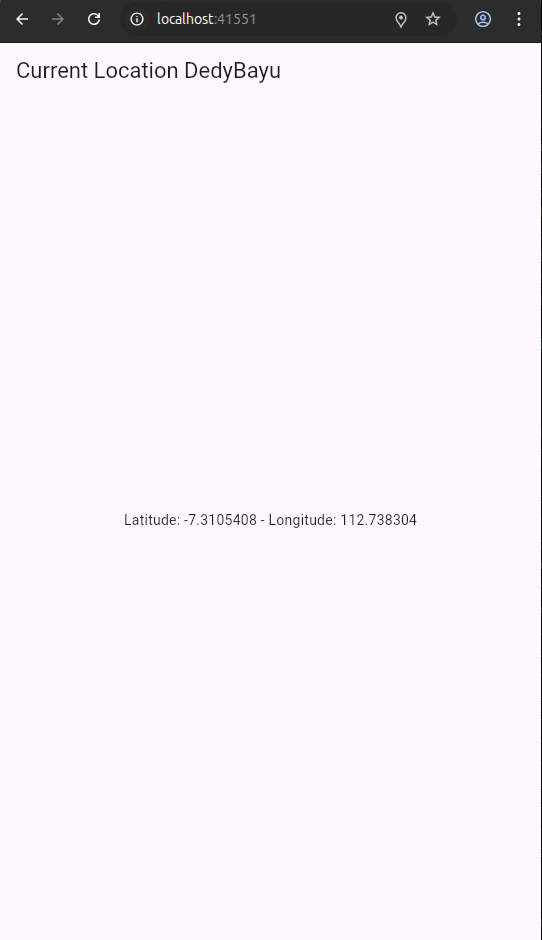

  **Jawaban:** Bisa, karena...... TODO


- Capture hasil praktikum Anda berupa GIF dan lampirkan di README. Lalu lakukan commit dengan pesan "W11: Soal 12".


# Praktikum 7: Manajemen Future dengan FutureBuilder

## Langkah 1: Modifikasi method getPosition()
```dart
  Future<Position> getPosition() async {
    await Geolocator.isLocationServiceEnabled();
    await Future.delayed(const Duration(seconds: 3));
    Position? position = await Geolocator.getCurrentPosition();
    return position!;
  }
```

## Langkah 2: Tambah variabel
```dart
class _LocationScreenState extends State<LocationScreen> {
  String myPosition = '';
  Future<Position>? position;
```

## Langkah 3: Tambah initState()
```dart
  @override
  void initState() {
    super.initState();
    // getMyPosition();
    position = getPosition();
  }
```
## Langkah 4: Edit method build()
```dart
  @override
  Widget build(BuildContext context) {
    return Scaffold(
      appBar: AppBar(title: Text('Current Location DedyBayu')),
      body: Center(
        child: FutureBuilder(
          future: position,
          builder: (BuildContext context, AsyncSnapshot<Position> snapshot) {
            if (snapshot.connectionState == ConnectionState.waiting) {
              return const CircularProgressIndicator();
            } else if (snapshot.connectionState == ConnectionState.done) {
              return Text(snapshot.data.toString());
            } else {
              return const Text('');
            }
          },
        ),
      ),
    );
  }
```

## Hasil
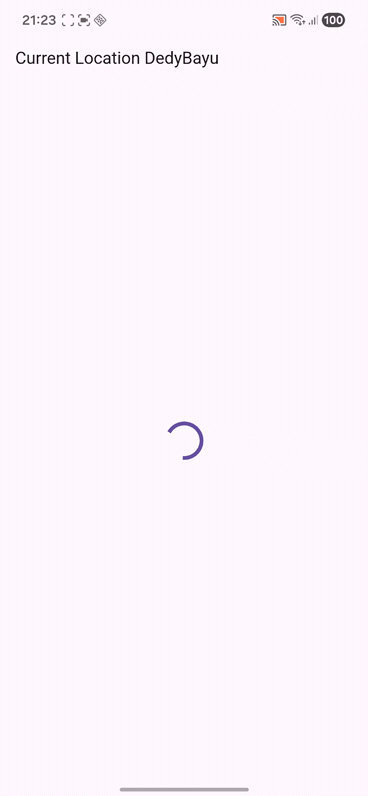

### Soal 13
- Apakah ada perbedaan UI dengan praktikum sebelumnya? Mengapa demikian?
  **Jawaban:** Tidak, Karena ..... TODO

- Capture hasil praktikum Anda berupa GIF dan lampirkan di README. Lalu lakukan commit dengan pesan "W11: Soal 13".

- Seperti yang Anda lihat, menggunakan FutureBuilder lebih efisien, clean, dan reactive dengan Future bersama UI.

## Langkah 5: Tambah handling error

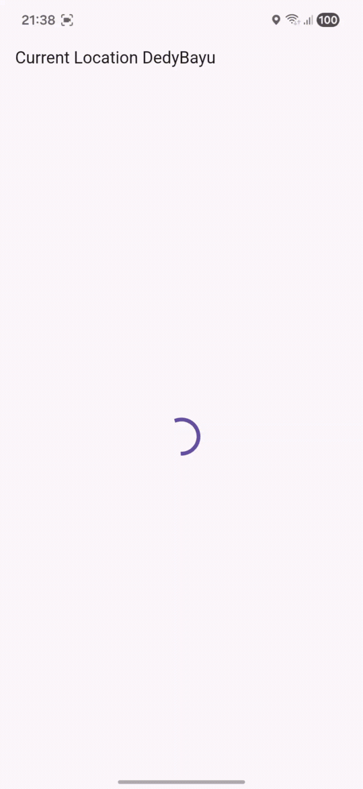

### Soal 14
- Apakah ada perbedaan UI dengan langkah sebelumnya? Mengapa demikian?
  **Jawaban:** Tidak Karena...... TODO

- Capture hasil praktikum Anda berupa GIF dan lampirkan di README. Lalu lakukan commit dengan pesan "W11: Soal 14".


# Praktikum 8: Navigation route dengan Future Function

## Langkah 1: Buat file baru navigation_first.dart
```
dedybayu@DedyBayu-NitroANV15-51:~/Documents/Pemrograman_Mobile_2025/codelab_11_flutter/books$ touch lib/navigation_first.dart
```

## Langkah 2: Isi kode navigation_first.dart
```dart
import 'package:flutter/material.dart';

class NavigationFirst extends StatefulWidget {
  const NavigationFirst({super.key});

  @override
  State<NavigationFirst> createState() => _NavigationFirstState();
}

class _NavigationFirstState extends State<NavigationFirst> {
  Color color = Colors.deepPurple.shade700;
  @override
  Widget build(BuildContext context) {
    return Scaffold(
      backgroundColor: color,
      appBar: AppBar(
        title: const Text('Navigation First Screen DedyBayu'),
      ),
      body: Center(
        child: ElevatedButton(
          child: const Text('Change Color'),
          onPressed: () {
            _navigateAndGetColor(context);
          },
        ),
      ),
    );
  }
}
```


### Soal 15
- Tambahkan nama panggilan Anda pada tiap properti title sebagai identitas pekerjaan Anda.
- Silakan ganti dengan warna tema favorit Anda.

## Langkah 3: Tambah method di class _NavigationFirstState
```dart
  }

  Future _navigateAndGetColor(BuildContext context) async {
    color =
        await Navigator.push(
          context,
          MaterialPageRoute(builder: (context) => const NavigationSecond()),
        ) ??
        Colors.blue;
    setState(() {});
  }
}

```
 
## Langkah 4: Buat file baru navigation_second.dart
```
dedybayu@DedyBayu-NitroANV15-51:~/Documents/Pemrograman_Mobile_2025/codelab_11_flutter/books$ touch lib/navigation_second.dart
dedybayu@DedyBayu-NitroANV15-51:~/Documents/Pemrograman_Mobile_2025/codelab_11_flutter/books$ ls lib
geolocation.dart  main.dart  navigation_dialog.dart  navigation_second.dart
```

## Langkah 5: Buat class NavigationSecond dengan StatefulWidget
```dart
import 'package:flutter/material.dart';

class NavigationSecond extends StatefulWidget {
  const NavigationSecond({super.key});

  @override
  State<NavigationSecond> createState() => _NavigationSecondState();
}

class _NavigationSecondState extends State<NavigationSecond> {
  @override
  Widget build(BuildContext context) {
    Color color;
    return Scaffold(
      appBar: AppBar(
        title: const Text('Navigation Second Screen DedyBayu'),
      ),
      body: Center(
        child: Column(
          mainAxisAlignment: MainAxisAlignment.spaceEvenly,
          children: [
            ElevatedButton(
              child: const Text('Purple'),
              onPressed: () {
                color = Colors.deepPurple.shade700;
                Navigator.pop(context, color);
              },
            ),
            ElevatedButton(
              child: const Text('Green'),
              onPressed: () {
                color = Colors.green.shade700;
                Navigator.pop(context, color);
              },
            ),
            ElevatedButton(
              child: const Text('Yellow'),
              onPressed: () {
                color = Colors.yellow.shade700;
                Navigator.pop(context, color);
              },
            ),
          ],
        ),
      ),
    );
  }
}
```

## Langkah 6: Edit main.dart
```dart
      ),
      // home: const FuturePage(),
      // home: LocationScreen(),
      home: const NavigationFirst(),
      
      debugShowCheckedModeBanner: false,
    );
```
## Langkah 8: Run
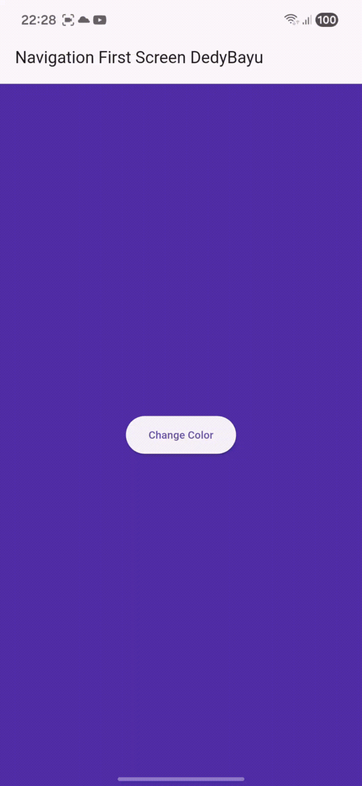

### Soal 16
- Cobalah klik setiap button, apa yang terjadi ? Mengapa demikian ?
- Gantilah 3 warna pada langkah 5 dengan warna favorit Anda!
- Capture hasil praktikum Anda berupa GIF dan lampirkan di README. Lalu lakukan commit dengan pesan "W11: Soal 16".


<br>
<br>

# Praktikum 9: Memanfaatkan async/await dengan Widget Dialog


## Langkah 1: Buat file baru navigation_dialog.dart
```
dedybayu@DedyBayu-NitroANV15-51:~/Documents/Pemrograman_Mobile_2025/codelab_11_flutter/books$ touch lib/navigation_dialog.dart
```

## Langkah 2: Isi kode navigation_dialog.dart
```dart
import 'package:flutter/material.dart';

class NavigationDialogScreen extends StatefulWidget {
  const NavigationDialogScreen({super.key});

  @override
  State<NavigationDialogScreen> createState() => _NavigationDialogScreenState();
}

class _NavigationDialogScreenState extends State<NavigationDialogScreen> {
  Color color = Colors.purple.shade700;

  @override
  Widget build(BuildContext context) {
    return Scaffold(
      backgroundColor: color,
      appBar: AppBar(title: const Text('Navigation Dialog Screen DedyBayu')),
      body: Center(
        child: ElevatedButton(
          child: const Text('Change Color'),
          onPressed: () {},
        ),
      ),
    );
  }
}
```

## Langkah 3: Tambah method async
```dart
  _showColorDialog(BuildContext context) async {
    await showDialog(
      barrierDismissible: false,
      context: context,
      builder: (_) {
        return AlertDialog(
          title: const Text('Very important question'),
          content: const Text('Please choose a color'),
          actions: <Widget>[
            TextButton(
              child: const Text('Blue'),
              onPressed: () {
                color = const Color.fromARGB(255, 7, 4, 136);
                Navigator.pop(context, color);
              },
            ),
            TextButton(
              child: const Text('Yellow'),
              onPressed: () {
                color = Colors.yellow.shade700;
                Navigator.pop(context, color);
              },
            ),
            TextButton(
              child: const Text('Purple'),
              onPressed: () {
                color = Colors.deepPurpleAccent.shade700;
                Navigator.pop(context, color);
              },
            ),
          ],
        );
      },
    );
    setState(() {});
  }
```
## Langkah 4: Panggil method di ElevatedButton
```dart
        child: ElevatedButton(
          child: const Text('Change Color'),
          onPressed: () {
            _showColorDialog(context);
          },
        ),
```

## Langkah 5: Edit main.dart
```dart
      ),
      // home: const FuturePage(),
      // home: LocationScreen(),
      // home: const NavigationFirst(),
      home: const NavigationDialogScreen(),

      debugShowCheckedModeBanner: false,
    );
```
## Langkah 6: Run
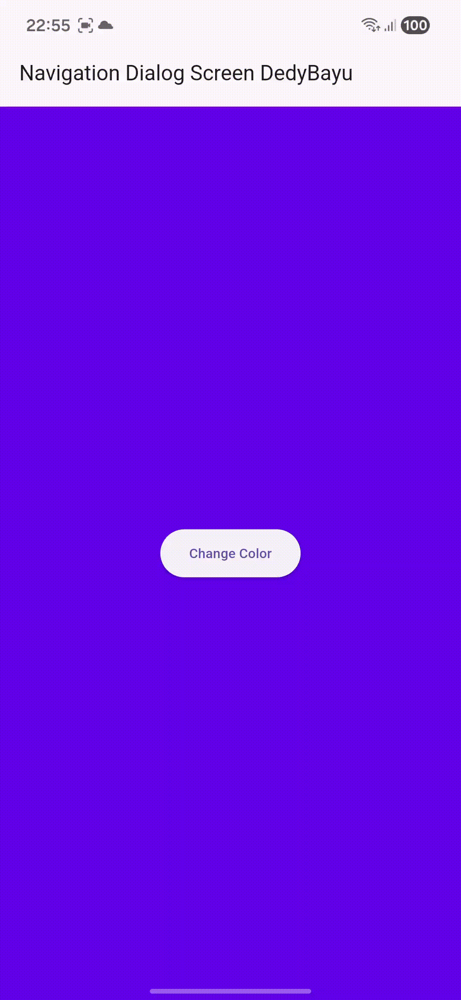


### Soal 17
- Cobalah klik setiap button, apa yang terjadi ? Mengapa demikian ?

- Gantilah 3 warna pada langkah 3 dengan warna favorit Anda!
  ```dart
              TextButton(
              child: const Text('Blue'),
              onPressed: () {
                color = const Color.fromARGB(255, 7, 4, 136);
                Navigator.pop(context, color);
              },
            ),
            TextButton(
              child: const Text('Yellow'),
              onPressed: () {
                color = Colors.yellow.shade700;
                Navigator.pop(context, color);
              },
            ),
            TextButton(
              child: const Text('Purple'),
              onPressed: () {
                color = Colors.deepPurpleAccent.shade700;
                Navigator.pop(context, color);
              },
            ),
  ```
- Capture hasil praktikum Anda berupa GIF dan lampirkan di README. Lalu lakukan commit dengan pesan "W11: Soal 17".

## Hasil
