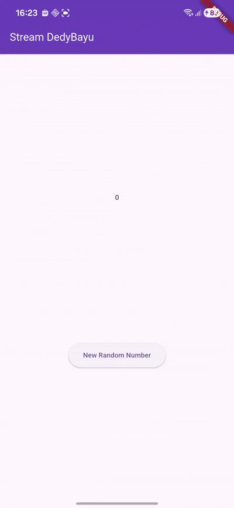
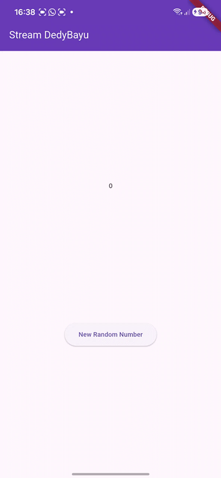

aa
| No. Presensi | Nama               | NIM        | Kelas   |
| ------------ | ------------------ | ---------- | ------- |
| 08           | Dedy Bayu Setiawan | 2341720041 | TI - 3H |

<br><br><br>

# Praktikum 1: Dart Streams

## Langkah 1: Buat Project Baru

## Langkah 2: Buka file main.dart
```dart
import 'package:flutter/material.dart';
import 'stream.dart';

void main() {
  runApp(const MyApp());
}

class MyApp extends StatelessWidget {
  const MyApp({super.key});

  @override
  Widget build(BuildContext context) {
    return MaterialApp(
      title: 'Stream DedyBayu',
      theme: ThemeData(primarySwatch: Colors.deepPurple),
      home: const StreamHomePage(),
    );
  }
}

class StreamHomePage extends StatefulWidget {
  const StreamHomePage({super.key});

  @override
  State<StreamHomePage> createState() => _StreamHomePageState();
}
```

### Soal 1
- Tambahkan nama panggilan Anda pada title app sebagai identitas hasil pekerjaan Anda.
- Gantilah warna tema aplikasi sesuai kesukaan Anda.
- Lakukan commit hasil jawaban Soal 1 dengan pesan "W12: Jawaban Soal 1"


## Langkah 3: Buat file baru stream.dart
```dart
import 'package:flutter/material.dart';

class ColorStream {

}
```
## Langkah 4: Tambah variabel colors
```dart
import 'package:flutter/material.dart';

class ColorStream {
  final List<Color> colors = [
    Colors.red,
    Colors.orange,
    Colors.yellow,
    Colors.green,
    Colors.blue,
    Colors.purple,
  ];
}
```

### Soal 2
- Tambahkan 5 warna lainnya sesuai keinginan Anda pada variabel colors tersebut.
- Lakukan commit hasil jawaban Soal 2 dengan pesan "W12: Jawaban Soal 2"


## Langkah 5: Tambah method getColors()
```dart
  Stream<Color> getColor() async* {
  }
```

## Langkah 6: Tambah perintah yield*
```dart
    yield* Stream.periodic(const Duration(seconds: 1), (int t) {
      int index = t % colors.length;
      return colors[index];
    });
```

## Langkah 7: Buka main.dart
Ketik kode impor file ini pada file main.dart
```dart 
import 'stream.dart';
```

## Langkah 8: Tambah variabel
```dart
class _StreamHomePageState extends State<StreamHomePage> {
  Color color = Colors.deepPurple;
  late ColorStream colorStream;
```

## Langkah 9: Tambah method changeColor()
```dart
  void changeColor() async {
    await for (var eventColor in colorStream.getColor()) {
      setState(() {
        color = eventColor;
      });
    }
  }
```


## Langkah 10: Lakukan override initState()
```dart
  @override
  void initState() {
    super.initState();
    colorStream = ColorStream();
    changeColor();
  }
```


## Langkah 11: Ubah isi Scaffold()
```dart
  Widget build(BuildContext context) {
    return Scaffold(
      appBar: AppBar(title: const Text('Stream DedyBayu')),
      body: Container(decoration: BoxDecoration(color: color),),
    );
  }
```

## Langkah 12: Run


# Praktikum 2: Stream controllers dan sinks


## Langkah 1: Buka file stream.dart

```dart
class NumberStrean {
  final StreamController<int> controller = StreamController<int>();
}
```

## Langkah 2: Tambah class NumberStream
```dart
import 'dart:async';

```

## Langkah 3: Tambah StreamController
```dart
  final StreamController<int> controller = StreamController<int>();
```

## Langkah 4: Tambah method addNumberToSink
```dart
  void addNumberToSink(int newNumber) {
    controller.sink.add(newNumber);
  }

```

## Langkah 5: Tambah method close()
```dart
  void close() {
    controller.close();
  }
```

## Langkah 6: Buka main.dart
```dart
import 'dart:async';
import 'dart:math';
```

## Langkah 7: Tambah variabel
```dart
  int lastNumber = 0;
  late StreamController<int> numberStreamController;
  late NumberStrean numberStream;
```

## Langkah 8: Edit initState()
```dart
  @override
  void initState() {
    numberStream = NumberStrean();
    numberStreamController = numberStream.controller;
    Stream stream = numberStreamController.stream;

    stream.listen((event) {
      setState(() {
        lastNumber = event;
      });
    });

    super.initState();
    // colorStream = ColorStream();
    // changeColor();
  }
```

## Langkah 9: Edit dispose()
```dart
  @override
  void dispose() {
    numberStreamController.close();
    super.dispose();
  }

```

## Langkah 10: Tambah method addRandomNumber()
```dart
  void addRandomNumber() {
    Random random = Random();
    int myNum = random.nextInt(10);
    numberStream.addNumberToSink(myNum);
  }
```

## Langkah 11: Edit method build()

```dart
  Widget build(BuildContext context) {
    return Scaffold(
      appBar: AppBar(title: const Text('Stream DedyBayu'), backgroundColor: color, foregroundColor: Colors.white,),
      // body: Container(decoration: BoxDecoration(color: color)),
      body: SizedBox(
        width: double.infinity,
        child: Column(
          mainAxisAlignment: MainAxisAlignment.spaceEvenly,
          crossAxisAlignment: CrossAxisAlignment.center,
          children: [
            Text(lastNumber.toString()),
            ElevatedButton(
              onPressed: () => addRandomNumber(),
              child: Text('New Random Number'),
            ),
          ],
        ),
      ),
    );
  }
```

## Langkah 12: Run



## Langkah 13: Buka stream.dart
```dart
  addError() {
    controller.sink.addError('Error');
  }
```
## Langkah 14: Buka main.dart
```dart
    stream
        .listen((event) {
          setState(() {
            lastNumber = event;
          });
        })
        .onError((error) {
          setState(() {
            lastNumber = -1;
          });
        });
```

## Langkah 15: Edit method addRandomNumber()
```dart
  void addRandomNumber() {
    Random random = Random();
    // int myNum = random.nextInt(10);
    // numberStream.addNumberToSink(myNum);
    numberStream.addError();
  }
```

## Hasil



### Soal 7

- Jelaskan maksud kode langkah 13 sampai 15 tersebut!
- Kembalikan kode seperti semula pada Langkah 15, comment addError() agar Anda dapat melanjutkan ke praktikum 3 berikutnya.
- Lalu lakukan commit dengan pesan "W12: Jawaban Soal 7".


# Praktikum 3: Injeksi data ke streams

## Langkah 1: Buka main.dart
```dart

```

## Langkah 2: Tambahkan kode ini di initState
```dart

```

## Langkah 3: Tetap di initState
```dart

```

## Langkah 4: Run


# Praktikum 4: Subscribe ke stream events

## Langkah 1: Tambah variabel
```dart

```

## Langkah 2: Edit initState()
```dart

```

## Langkah 3: Tetap di initState()
```dart

```

## Langkah 4: Tambah properti onDone()
```dart

```

```dart

```
## Langkah 5: Tambah method baru
```dart

```

## Langkah 6: Pindah ke method dispose()
```dart

```

## Langkah 7: Pindah ke method build()
```dart

```

```dart

```
## Langkah 8: Edit method addRandomNumber()
```dart

```

## Langkah 9: Run
```dart

```

## Langkah 10: Tekan button ‘Stop Subscription'
```dart

```


# Praktikum 5: Multiple stream subscriptions

## Langkah 1: Buka file main.dart
```dart

```

## Langkah 2: Edit initState()
```dart

```

## Langkah 3: Run
```dart

```
```dart

```

```dart

```
## Langkah 4: Set broadcast stream
```dart

```

```dart

```
## Langkah 5: Edit method build()
```dart

```

## Langkah 6: Run


# Praktikum 6: StreamBuilder

## Langkah 1: Buat Project Baru
```dart

```

## Langkah 2: Buat file baru stream.dart
```dart

```

```dart

```
## Langkah 3: Tetap di file stream.dart
```dart

```

## Langkah 4: Edit main.dart
```dart

```

## Langkah 5: Tambah variabel

```dart

```

## Langkah 6: Edit initState()
```dart

```

## Langkah 7: Edit method build()
```dart

```

## Langkah 8: Run


# Praktikum 7: BLoC Pattern

## Langkah 1: Buat Project baru
```dart

```

## Langkah 2: Isi kode random_bloc.dart
```dart

```

## Langkah 3: Buat class RandomNumberBloc()
```dart

```

## Langkah 4: Buat variabel StreamController
```dart

```

## Langkah 5: Buat constructor
```dart

```

## Langkah 6: Buat method dispose()
```dart

```


## Langkah 7: Edit main.dart
```dart

```


## Langkah 9: Lakukan impor material dan random_bloc.dart
```dart

```


## Langkah 10: Buat StatefulWidget RandomScreen
```dart

```


## Langkah 11: Buat variabel
```dart

```


## Langkah 12: Buat method dispose()
```dart

```


## Langkah 13: Edit method build()
```dart

```


##
##
##
##
##
##


