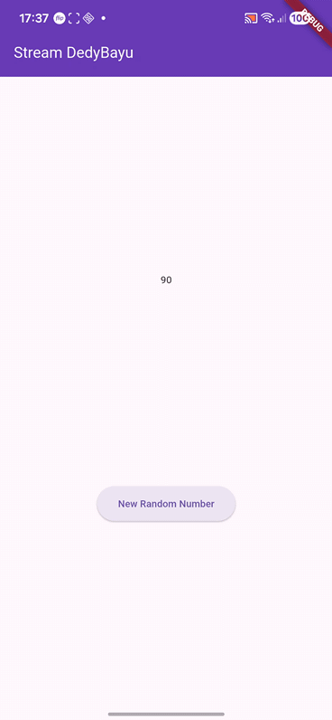
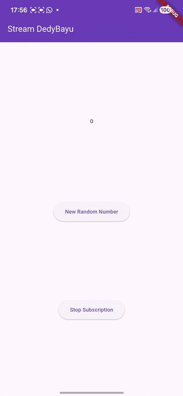
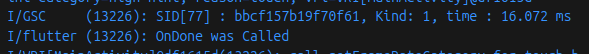
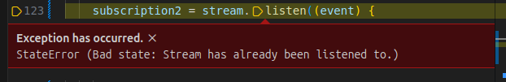
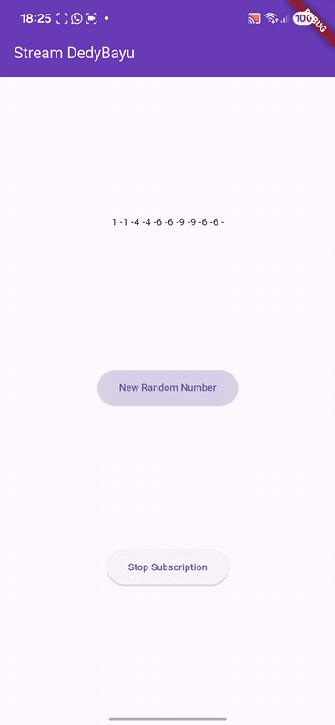
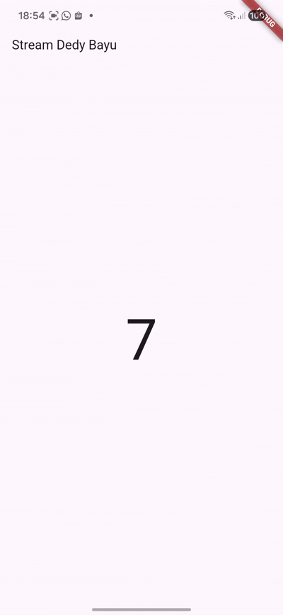
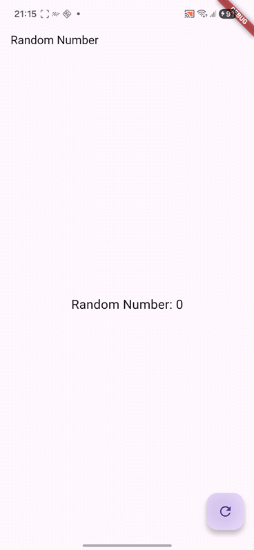

| No. Presensi | Nama               | NIM        | Kelas   |
| ------------ | ------------------ | ---------- | ------- |
| 08           | Dedy Bayu Setiawan | 2341720041 | TI - 3H |

<br><br><br>

# Praktikum 1: Dart Streams

## Langkah 1: Buat Project Baru
Buatlah sebuah project flutter baru dengan nama ```stream_nama``` (beri nama panggilan Anda) di folder **week-12/src/** repository GitHub Anda.

## Langkah 2: Buka file main.dart
```dart
import 'package:flutter/material.dart';
import 'stream.dart';

void main() {
  runApp(const MyApp());
}

class MyApp extends StatelessWidget {
  const MyApp({super.key});

  @override
  Widget build(BuildContext context) {
    return MaterialApp(
      title: 'Stream DedyBayu',
      theme: ThemeData(primarySwatch: Colors.deepPurple),
      home: const StreamHomePage(),
    );
  }
}

class StreamHomePage extends StatefulWidget {
  const StreamHomePage({super.key});

  @override
  State<StreamHomePage> createState() => _StreamHomePageState();
}
```

### Soal 1
- Tambahkan nama panggilan Anda pada title app sebagai identitas hasil pekerjaan Anda.
- Gantilah warna tema aplikasi sesuai kesukaan Anda.
- Lakukan commit hasil jawaban Soal 1 dengan pesan "W12: Jawaban Soal 1"


## Langkah 3: Buat file baru stream.dart
```dart
import 'package:flutter/material.dart';

class ColorStream {

}
```
## Langkah 4: Tambah variabel colors
```dart
import 'package:flutter/material.dart';

class ColorStream {
  final List<Color> colors = [
    Colors.red,
    Colors.orange,
    Colors.yellow,
    Colors.green,
    Colors.blue,
    Colors.purple,
  ];
}
```

### Soal 2
- Tambahkan 5 warna lainnya sesuai keinginan Anda pada variabel colors tersebut.
- Lakukan commit hasil jawaban Soal 2 dengan pesan "W12: Jawaban Soal 2"


## Langkah 5: Tambah method getColors()
```dart
  Stream<Color> getColor() async* {
  }
```

## Langkah 6: Tambah perintah yield*
```dart
    yield* Stream.periodic(const Duration(seconds: 1), (int t) {
      int index = t % colors.length;
      return colors[index];
    });
```

### Soal 3
- **Jelaskan fungsi keyword yield* pada kode tersebut!**

  **Fungsi `yield*`**
  `yield*` digunakan untuk **meneruskan seluruh event dari stream lain** ke stream yang sedang dibuat.

- Apa maksud isi perintah kode tersebut?

  **Maksud kode**
  Kode tersebut membuat stream yang **mengirim warna setiap 1 detik**, dan index warna akan berputar terus menggunakan operasi `t % colors.length`.

- Lakukan commit hasil jawaban Soal 3 dengan pesan "W12: Jawaban Soal 3"

## Langkah 7: Buka main.dart
Ketik kode impor file ini pada file main.dart
```dart
import 'stream.dart';
```

## Langkah 8: Tambah variabel
```dart
class _StreamHomePageState extends State<StreamHomePage> {
  Color color = Colors.deepPurple;
  late ColorStream colorStream;
```

## Langkah 9: Tambah method changeColor()
```dart
  void changeColor() async {
    await for (var eventColor in colorStream.getColor()) {
      setState(() {
        color = eventColor;
      });
    }
  }
```


## Langkah 10: Lakukan override initState()
```dart
  @override
  void initState() {
    super.initState();
    colorStream = ColorStream();
    changeColor();
  }
```


## Langkah 11: Ubah isi Scaffold()
```dart
  Widget build(BuildContext context) {
    return Scaffold(
      appBar: AppBar(title: const Text('Stream DedyBayu')),
      body: Container(decoration: BoxDecoration(color: color),),
    );
  }
```

## Langkah 12: Run


## Langkah 13: Ganti isi method changeColor()
Anda boleh comment atau hapus kode sebelumnya, lalu ketika kode seperti berikut.

### Soal 5
- **Jelaskan perbedaan menggunakan listen dan await for (langkah 9) !**

  **Perbedaan `listen` dan `await for`:**

  * **`await for`** → Menunggu setiap event stream secara berurutan (blocking).
  * **`listen`** → Menerima event menggunakan callback, berjalan non-blocking, cocok untuk UI.

- Lakukan commit hasil jawaban Soal 5 dengan pesan "W12: Jawaban Soal 5"


<br><br>

# Praktikum 2: Stream controllers dan sinks


## Langkah 1: Buka file stream.dart

```dart
class NumberStrean {
  final StreamController<int> controller = StreamController<int>();
}
```

## Langkah 2: Tambah class NumberStream
```dart
import 'dart:async';

```

## Langkah 3: Tambah StreamController
```dart
  final StreamController<int> controller = StreamController<int>();
```

## Langkah 4: Tambah method addNumberToSink
```dart
  void addNumberToSink(int newNumber) {
    controller.sink.add(newNumber);
  }

```

## Langkah 5: Tambah method close()
```dart
  void close() {
    controller.close();
  }
```

## Langkah 6: Buka main.dart
```dart
import 'dart:async';
import 'dart:math';
```

## Langkah 7: Tambah variabel
```dart
  int lastNumber = 0;
  late StreamController<int> numberStreamController;
  late NumberStrean numberStream;
```

## Langkah 8: Edit initState()
```dart
  @override
  void initState() {
    numberStream = NumberStrean();
    numberStreamController = numberStream.controller;
    Stream stream = numberStreamController.stream;

    stream.listen((event) {
      setState(() {
        lastNumber = event;
      });
    });

    super.initState();
    // colorStream = ColorStream();
    // changeColor();
  }
```

## Langkah 9: Edit dispose()
```dart
  @override
  void dispose() {
    numberStreamController.close();
    super.dispose();
  }

```

## Langkah 10: Tambah method addRandomNumber()
```dart
  void addRandomNumber() {
    Random random = Random();
    int myNum = random.nextInt(10);
    numberStream.addNumberToSink(myNum);
  }
```

## Langkah 11: Edit method build()

```dart
  Widget build(BuildContext context) {
    return Scaffold(
      appBar: AppBar(title: const Text('Stream DedyBayu'), backgroundColor: color, foregroundColor: Colors.white,),
      // body: Container(decoration: BoxDecoration(color: color)),
      body: SizedBox(
        width: double.infinity,
        child: Column(
          mainAxisAlignment: MainAxisAlignment.spaceEvenly,
          crossAxisAlignment: CrossAxisAlignment.center,
          children: [
            Text(lastNumber.toString()),
            ElevatedButton(
              onPressed: () => addRandomNumber(),
              child: Text('New Random Number'),
            ),
          ],
        ),
      ),
    );
  }
```

## Langkah 12: Run


### Soal 6
- **Jelaskan maksud kode langkah 8 dan 10 tersebut!**

  **Maksud kode langkah 8**

  Pada langkah 8:

  * `NumberStrean()` dibuat untuk menampung StreamController.
  * `numberStreamController = numberStream.controller` menghubungkan controller ke UI.
  * `stream.listen(...)` akan **mendengarkan setiap angka baru** yang dikirim ke stream.
  * Setiap ada event angka masuk, UI di-*update* dengan `setState` sehingga `lastNumber` tampil di layar.

  Intinya: **UI otomatis berubah setiap kali stream mengirim angka.**

  **Maksud kode langkah 10**

  Pada langkah 10:

  * Random number (0–9) dibuat menggunakan `Random().nextInt(10)`.
  * Angka tersebut dikirim ke stream dengan `addNumberToSink()`.
  * Karena stream sedang listen, angka baru otomatis tampil di layar.

  Intinya: **Menambahkan angka acak ke stream, lalu angka itu muncul di UI.**

- Capture hasil praktikum Anda berupa GIF dan lampirkan di README.
- Lalu lakukan commit dengan pesan "W12: Jawaban Soal 6".

## Langkah 13: Buka stream.dart
```dart
  addError() {
    controller.sink.addError('Error');
  }
```
## Langkah 14: Buka main.dart
```dart
    stream
        .listen((event) {
          setState(() {
            lastNumber = event;
          });
        })
        .onError((error) {
          setState(() {
            lastNumber = -1;
          });
        });
```

## Langkah 15: Edit method addRandomNumber()
```dart
  void addRandomNumber() {
    Random random = Random();
    // int myNum = random.nextInt(10);
    // numberStream.addNumberToSink(myNum);
    numberStream.addError();
  }
```

## Hasil


### Soal 7

- **Jelaskan maksud kode langkah 13 sampai 15 tersebut!**

  **Maksud kode langkah 13–15**

  * **Langkah 13**
    Menambahkan `addError()` yang mengirim *error event* ke stream.

  * **Langkah 14**
    Menambahkan handler `.onError()`, sehingga jika stream menerima error, UI akan menampilkan `-1`.

  * **Langkah 15**
    Mengganti logika tombol agar selalu memanggil `addError()` → sehingga UI akan menampilkan `-1` setiap kali tombol ditekan.

  Intinya: **Langkah 13–15 digunakan untuk menguji bagaimana stream menangani error, dan UI bereaksi terhadap error dengan menampilkan -1.**

- Kembalikan kode seperti semula pada Langkah 15, comment addError() agar Anda dapat melanjutkan ke praktikum 3 berikutnya.

- Lalu lakukan commit dengan pesan "W12: Jawaban Soal 7".


<br><br>


# Praktikum 3: Injeksi data ke streams

## Langkah 1: Buka main.dart
```dart
  late StreamTransformer transformer;
```

## Langkah 2: Tambahkan kode ini di initState
```dart
    transformer = StreamTransformer<int, int>.fromHandlers(
      handleData: (value, sink) {
        sink.add(value * 10);
      },
      handleError: (error, trace, sink) {
        sink.add(-1);
      },
      handleDone: (sink) => sink.close()
    );
```

## Langkah 3: Tetap di initState
```dart
    stream
        .transform(transformer)
        .listen((event) {
          setState(() {
            lastNumber = event;
          });
        })
        .onError((error) {
          setState(() {
            lastNumber = -1;
          });
        });
```

## Langkah 4: Run


### Soal 8
- **Jelaskan maksud kode langkah 1-3 tersebut!**

  * **Langkah 1**
    Membuat variabel `StreamTransformer` untuk memproses data sebelum diterima UI.

  * **Langkah 2**
    Membuat transformer yang:

    * mengalikan data dengan **10** (`handleData`)
    * mengubah error menjadi **-1** (`handleError`)
    * menutup stream saat selesai (`handleDone`)

  * **Langkah 3**
    Menerapkan transformer ke stream sebelum `listen`, sehingga UI hanya menerima data yang sudah diproses (hasil ×10 atau -1 jika error).


- Capture hasil praktikum Anda berupa GIF dan lampirkan di README.
- Lalu lakukan commit dengan pesan "W12: Jawaban Soal 8".


<br><br>


# Praktikum 4: Subscribe ke stream events

## Langkah 1: Tambah variabel
```dart
  late StreamSubscription subscription;
```

## Langkah 2: Edit initState()
```dart
  @override
  void initState() {
    numberStream = NumberStrean();
    numberStreamController = numberStream.controller;
    Stream stream = numberStreamController.stream;

    subscription = stream.listen((event) {
      setState(() {
        lastNumber = event;
      });
    });
    super.initState();
  }
```

## Langkah 3: Tetap di initState()
```dart
    subscription.onError((error) {
      setState(() {
        lastNumber = -1;
      });
    });
```

## Langkah 4: Tambah properti onDone()
```dart
    subscription.onDone(() {
      print("OnDone was Called");
    });
```

```dart

```
## Langkah 5: Tambah method baru
```dart
  void stopStream() {
    numberStreamController.close();
  }
```

## Langkah 6: Pindah ke method dispose()
```dart
  @override
  void dispose() {
    // numberStreamController.close();
    subscription.cancel();
    super.dispose();
  }
```

## Langkah 7: Pindah ke method build()
```dart
            ElevatedButton(
              onPressed: () => stopStream(),
              child: Text('Stop Subscription'),
            ),
```

## Langkah 8: Edit method addRandomNumber()
```dart
  void addRandomNumber() {
    Random random = Random();
    int myNum = random.nextInt(10);
    // numberStream.addNumberToSink(myNum);
    // numberStream.addError();

    if (!numberStreamController.isClosed) {
      numberStream.addNumberToSink(myNum);
    } else {
      setState(() {
        lastNumber = -1;
      });
    }
  }
```

## Langkah 9: Run




## Langkah 10: Tekan button ‘Stop Subscription'




### Soal 9
- **Jelaskan maksud kode langkah 2, 6 dan 8 tersebut!**

  * **Langkah 2**
    Membuat `subscription` untuk mendengarkan stream; setiap event baru langsung ditampilkan ke UI.

  * **Langkah 6**
    `subscription.cancel()` menghentikan listener saat widget dibuang agar tidak terjadi memory leak.

  * **Langkah 8**
    Mengirim angka hanya jika stream belum ditutup; jika sudah ditutup, tampilkan `-1` agar tidak terjadi error.

- Capture hasil praktikum Anda berupa GIF dan lampirkan di README.
- Lalu lakukan commit dengan pesan "W12: Jawaban Soal 9".


<br><br>

# Praktikum 5: Multiple stream subscriptions

## Langkah 1: Buka file main.dart
```dart
  late StreamSubscription subscription2;
```

## Langkah 2: Edit initState()
```dart

```

## Langkah 3: Run




### Soal 10
- Jelaskan mengapa error itu bisa terjadi ?
    **Jawaban:** Error "Stream has already been listened to" terjadi karena satu stream hanya boleh didengarkan sekali. Di kode kamu, stream yang sama dipanggil .listen() dua kali, sehingga Dart menolaknya. Solusinya adalah: gunakan StreamController.broadcast() jika ingin banyak listener, atau cukup gunakan satu listener saja.

## Langkah 4: Set broadcast stream
```dart
  void initState() {
    numberStream = NumberStrean();
    numberStreamController = numberStream.controller;
    // Stream stream = numberStreamController.stream;
    Stream stream = numberStreamController.stream.asBroadcastStream();
```

## Langkah 5: Edit method build()
```dart
 children: [
            Text(values),
            // Text(lastNumber.toString()),
            ElevatedButton(
              onPressed: () => addRandomNumber(),
              child: Text('New Random Number'),
            ),
```

## Langkah 6: Run


### Soal 11
- Jelaskan mengapa hal itu bisa terjadi ?

  Hal tersebut bisa terjadi karena stream sudah diubah menjadi **broadcast stream** menggunakan `.asBroadcastStream()`.

  Broadcast stream **mengizinkan banyak listener** sekaligus, sehingga:

  * `subscription` pertama **dan**
  * `subscription2` kedua

  dapat menerima data yang sama **secara bersamaan**, tanpa error “Stream has already been listened to”.

  **Kesimpulan**: broadcast stream memungkinkan multi-subscription sehingga semua listener mendapatkan event yang sama.*


- Capture hasil praktikum Anda berupa GIF dan lampirkan di README.
- Lalu lakukan commit dengan pesan "W12: Jawaban Soal 10,11".


<br><br>

# Praktikum 6: StreamBuilder

## Langkah 1: Buat Project Baru

## Langkah 2: Buat file baru stream.dart
```dart
import 'dart:math';

class NumberStream {

}
```
## Langkah 3: Tetap di file stream.dart
```dart
import 'dart:math';

class NumberStream {
  Stream<int> getNumbers() async* {
    yield* Stream.periodic(const Duration(seconds: 1), (int t) {
      Random random = Random();
      int myNum = random.nextInt(10);
      return myNum;
    });
  }
}
```

## Langkah 4: Edit main.dart
```dart
import 'package:flutter/material.dart';
import 'stream.dart';
import 'dart:async';

void main() {
  runApp(const MyApp());
}

class MyApp extends StatelessWidget {
  const MyApp({super.key});

  @override
  Widget build(BuildContext context) {
    return MaterialApp(
      title: 'Stream',
      theme: ThemeData(primarySwatch: Colors.deepPurple),
      home: const StreamHomePage(),
    );
  }
}

class StreamHomePage extends StatefulWidget {
  const StreamHomePage({super.key});

  @override
  State<StreamHomePage> createState() => _StreamHomePageState();
}

class _StreamHomePageState extends State<StreamHomePage> {
  late Stream<int> numberStream;

  @override
  void initState() {
    super.initState();
    numberStream = NumberStream().getNumbers();
  }

  @override
  Widget build(BuildContext context) {
    return Scaffold(
      appBar: AppBar(title: const Text('Stream Dedy Bayu')),
      body: StreamBuilder(
        stream: numberStream,
        initialData: 0,
        builder: (context, snapshot) {
          if (snapshot.hasError) {
            print('Error');
          }
          if (snapshot.hasData) {
            return Center(
              child: Text(
                snapshot.data.toString(),
                style: const TextStyle(fontSize: 96),
              ),
            );
          } else {
            return const SizedBox.shrink();
          }
        },
      ),
    );
  }
}
```

## Langkah 5: Tambah variabel

```dart
class _StreamHomePageState extends State<StreamHomePage> {
  late Stream<int> numberStream;
```

## Langkah 6: Edit initState()
```dart
  @override
  void initState() {
    super.initState();
    numberStream = NumberStream().getNumbers();
  }

```

## Langkah 7: Edit method build()
```dart
  @override
  Widget build(BuildContext context) {
    return Scaffold(
      appBar: AppBar(title: const Text('Stream Dedy Bayu')),
      body: StreamBuilder(
        stream: numberStream,
        initialData: 0,
        builder: (context, snapshot) {
          if (snapshot.hasError) {
            print('Error');
          }
          if (snapshot.hasData) {
            return Center(
              child: Text(
                snapshot.data.toString(),
                style: const TextStyle(fontSize: 96),
              ),
            );
          } else {
            return const SizedBox.shrink();
          }
        },
      ),
    );
  }
```

## Langkah 8: Run



### Soal 12
- Jelaskan maksud kode pada langkah 3 dan 7 !


Berikut jawaban **singkat dan jelas** untuk **Soal 12**:

---

## ✅ **Jawaban Soal 12 (Singkat)**

  * **Langkah 3 — getNumbers()**

    Method `getNumbers()` menghasilkan stream yang setiap 1 detik:

    * membuat angka random 0–9,
    * mengirimkannya ke stream menggunakan `yield* Stream.periodic()`.

    **Intinya:** membuat stream yang terus-menerus mengirim angka random setiap detik.

  * **Langkah 7 — StreamBuilder**

    `StreamBuilder` mendengarkan `numberStream` dan otomatis rebuild UI setiap ada data baru.

    * `initialData: 0` → angka awal yang ditampilkan.
    * Jika ada data (`snapshot.hasData`), UI menampilkan angka tersebut.
    * Jika error, hanya menampilkan log "Error".

    **Intinya:** StreamBuilder membuat UI selalu update mengikuti data stream tanpa perlu setState manual.


- Capture hasil praktikum Anda berupa GIF dan lampirkan di README.
- Lalu lakukan commit dengan pesan "W12: Jawaban Soal 12".


<br><br>

# Praktikum 7: BLoC Pattern

## Langkah 1: Buat Project baru
```dart

```

## Langkah 2: Isi kode random_bloc.dart
```dart
import 'dart:async';
import 'dart:math';
```

## Langkah 3: Buat class RandomNumberBloc()
```dart
class RandomNumberBloc {
}
```

## Langkah 4: Buat variabel StreamController
```dart
  // StreamController for input events
  final _generateRandomController = StreamController<void>();
  // StreamController for output
  final _randomNumberController = StreamController<int>();
  // Input Sink
  Sink<void> get generateRandom => _generateRandomController.sink;
  // Output Stream.
  Stream<int> get randomNumber => _randomNumberController.stream;
  // _secondsStreamController.sink;
```

## Langkah 5: Buat constructor
```dart
  RandomNumberBloc() {
    _generateRandomController.stream.listen((_) {
      final random = Random().nextInt(10);
      _randomNumberController.sink.add(random);
    });
  }
```

## Langkah 6: Buat method dispose()
```dart
  void dispose() {
    _generateRandomController.close();
    _randomNumberController.close();
  }
```


## Langkah 7: Edit main.dart
```dart
import 'package:bloc_random_dedybayu/random_screen.dart';
import 'package:flutter/material.dart';

void main() {
  runApp(const MyApp());
}

class MyApp extends StatelessWidget {
  const MyApp({super.key});

  @override
  Widget build(BuildContext context) {
    return MaterialApp(
      title: 'Flutter Demo',
      theme: ThemeData(
        primarySwatch: Colors.blue,
      ),
      home: const RandomScreen(),
    );
  }
}
```


## Langkah 9: Lakukan impor material dan random_bloc.dart
```dart
import 'package:flutter/material.dart';
import 'rancom_bloc.dart';
```


## Langkah 10: Buat StatefulWidget RandomScreen
Buatlah di dalam file ```random_screen.dart```


## Langkah 11: Buat variabel
```dart
  final _bloc = RandomNumberBloc();

```


## Langkah 12: Buat method dispose()
```dart
  @override
  void dispose() {
    _bloc.dispose();
    super.dispose();
  }
```


## Langkah 13: Edit method build()
```dart
  @override
  Widget build(BuildContext context) {
    return Scaffold(
      appBar: AppBar(title: const Text('Random Number')),
      body: Center(
        child: StreamBuilder<int>(
          stream: _bloc.randomNumber,
          initialData: 0,
          builder: (context, snapshot) {
            return Text(
              'Random Number: ${snapshot.data}',
              style: const TextStyle(fontSize: 24),
            );
          },
        ),
      ),
      floatingActionButton: FloatingActionButton(
        onPressed: () => _bloc.generateRandom.add(null),
        child: const Icon(Icons.refresh),
      ),
    );
  }
```


## Hasil: 



### Soal 13
- Jelaskan maksud praktikum ini ! Dimanakah letak konsep pola BLoC-nya ?
  Jawaban: Praktikum ini bertujuan mengenalkan cara memisahkan logika bisnis dari UI menggunakan pola **BLoC (Business Logic Component)**.
  
  Konsep BLoC terlihat pada penggunaan StreamController, sink sebagai input event, dan stream sebagai output data. UI hanya mendengarkan stream melalui StreamBuilder, sementara proses pembuatan angka random ditangani di BLoC, sehingga kode lebih rapi dan terpisah.
  
- Capture hasil praktikum Anda berupa GIF dan lampirkan di README.
- Lalu lakukan commit dengan pesan "W12: Jawaban Soal 13".

