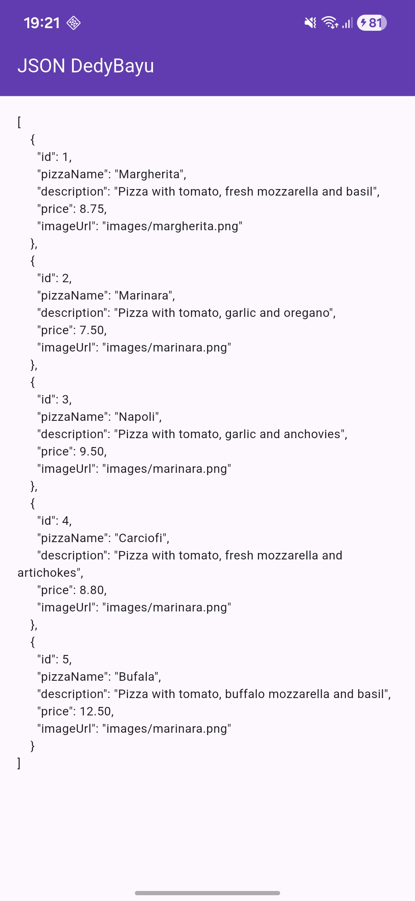
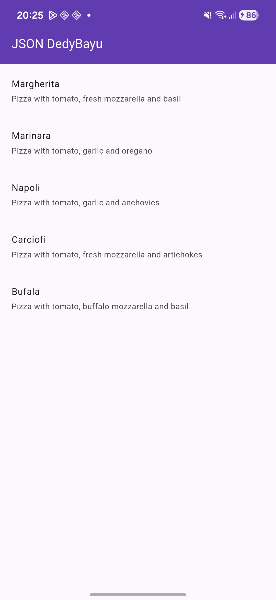
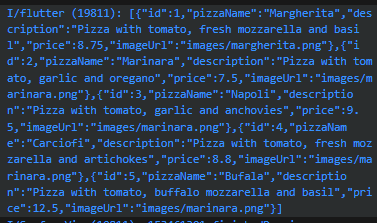
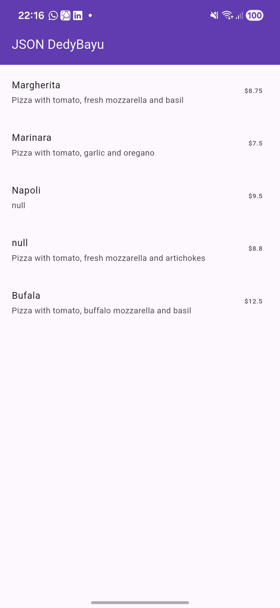
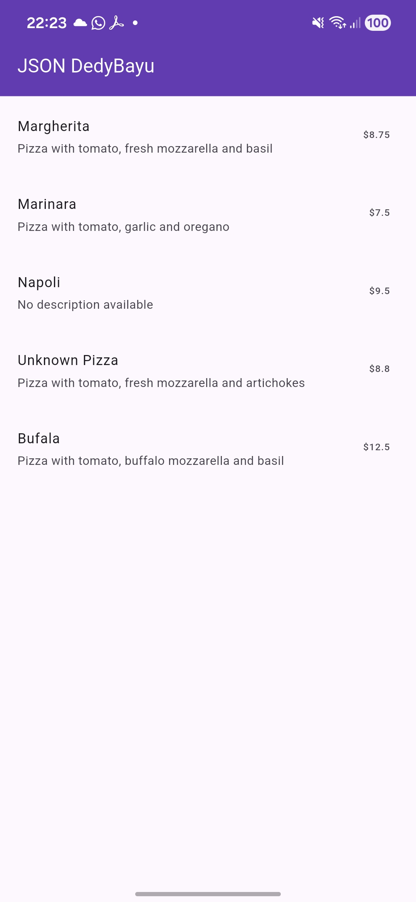
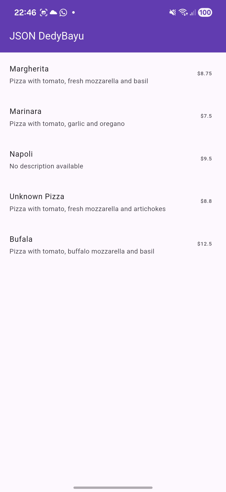
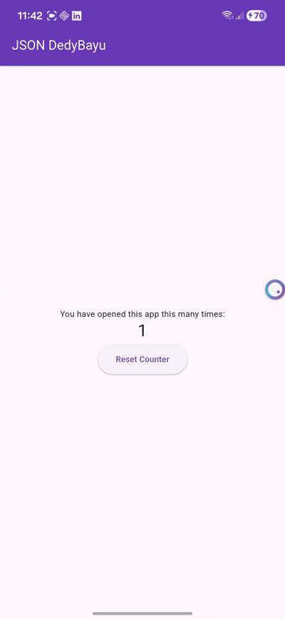
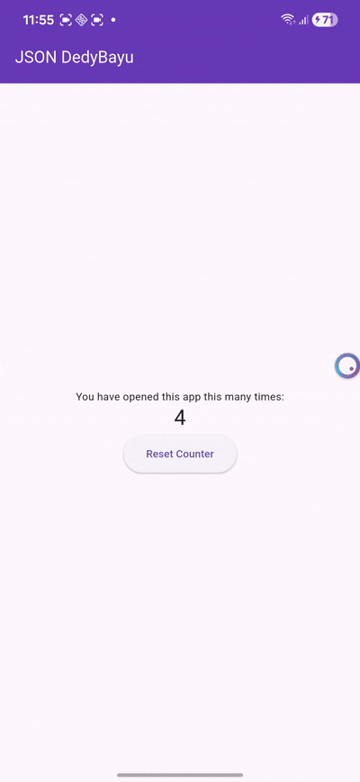
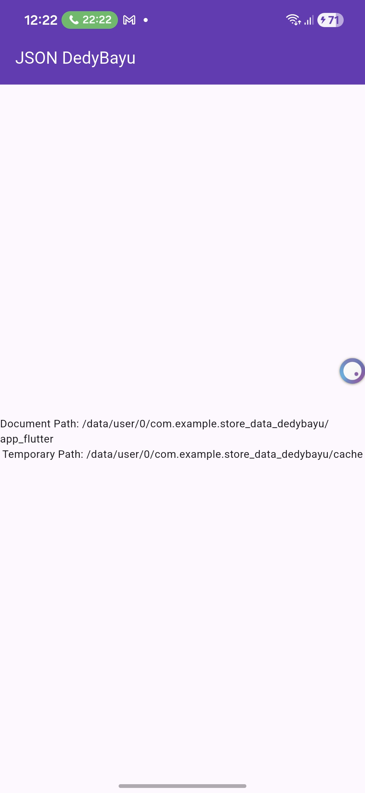

| No. Presensi | Nama               | NIM        | Kelas   |
| ------------ | ------------------ | ---------- | ------- |
| 08           | Dedy Bayu Setiawan | 2341720041 | TI - 3H |

<br><br><br>

# Praktikum 1: Konversi Dart model ke JSON


## Langkah 1: Buat Project Baru

## Langkah 2: Buka file main.dart
```dart
import 'package:flutter/material.dart';

void main() {
  runApp(const MyApp());
}

class MyApp extends StatelessWidget {
  const MyApp({super.key});

  // This widget is the root of your application.
  @override
  Widget build(BuildContext context) {
    return MaterialApp(
      title: 'Flutter JSON Demo',
      theme: ThemeData(primarySwatch: Colors.blue),
      home: const MyHomePage(),
      debugShowCheckedModeBanner: false,
    );
  }
}

class MyHomePage extends StatefulWidget {
  const MyHomePage({super.key});

  @override
  State<MyHomePage> createState() => _MyHomePageState();
}

class _MyHomePageState extends State<MyHomePage> {

  @override
  Widget build(BuildContext context) {
    return Scaffold(
      appBar: AppBar(title: const Text('JSON DedyBayu'), backgroundColor: Colors.deepPurple, foregroundColor: Colors.white,),
      
      body: Container(
      ),
    );
  }
}

```


### Soal 1
- Tambahkan nama panggilan Anda pada title app sebagai identitas hasil pekerjaan Anda.
- Gantilah warna tema aplikasi sesuai kesukaan Anda.
- Lakukan commit hasil jawaban Soal 1 dengan pesan "W13: Jawaban Soal 1"

## Langkah 3: Buat folder baru assets
Buat folder baru assets di root projec4

## Langkah 4: Buat file baru pizzalist.json
```json
[ 
    { 
      "id": 1, 
      "pizzaName": "Margherita", 
      "description": "Pizza with tomato, fresh mozzarella and basil",
      "price": 8.75, 
      "imageUrl": "images/margherita.png" 
    }, 
    { 
      "id": 2, 
      "pizzaName": "Marinara", 
      "description": "Pizza with tomato, garlic and oregano",
      "price": 7.50, 
      "imageUrl": "images/marinara.png"  
    }, 
    { 
      "id": 3, 
      "pizzaName": "Napoli", 
      "description": "Pizza with tomato, garlic and anchovies",
      "price": 9.50, 
      "imageUrl": "images/marinara.png"  
    }, 
    { 
      "id": 4, 
      "pizzaName": "Carciofi", 
      "description": "Pizza with tomato, fresh mozzarella and artichokes",
      "price": 8.80, 
      "imageUrl": "images/marinara.png"  
    }, 
    { 
      "id": 5, 
      "pizzaName": "Bufala", 
      "description": "Pizza with tomato, buffalo mozzarella and basil",
      "price": 12.50, 
      "imageUrl": "images/marinara.png"  
    }
]
```

## Langkah 5: Edit pubspec.yaml
```yaml
# The following section is specific to Flutter packages.
flutter:
  uses-material-design: true
  assets:
    - assets/
```

## Langkah 6: Edit main.dart
```dart
class _MyHomePageState extends State<MyHomePage> {
  String pizzaString = '';
```

## Langkah 7: Tetap di main.dart
method readJsonFile untuk membaca file json.
```dart
  Future<void> loadJsonPizza() async {
    pizzaString = await DefaultAssetBundle.of(
      context,
    ).loadString('assets/pizza_list.json');
    setState(() {});
  }
```

## Langkah 8: Panggil method readJsonFile
```dart
  @override
  Widget build(BuildContext context) {
    loadJsonPizza();
    return Scaffold(
```

## Langkah 9: Tampilkan hasil JSON
```dart
      body: Container(
        padding: const EdgeInsets.all(16.0),
        child: Text(pizzaString),
      ),
```

## Langkah 10: Run



### Soal 2
- Masukkan hasil capture layar ke laporan praktikum Anda.
- Lakukan commit hasil jawaban Soal 2 dengan pesan "W13: Jawaban Soal 2"


## Langkah 11: Buat file baru pizza.dart

## Langkah 12: Model pizza.dart
pizza model
```dart
class Pizza {
  final int id;
  final String pizzaName;
  final String description;
  final double price;
  final String imageUrl;

  Pizza({
    required this.id,
    required this.pizzaName,
    required this.description,
    required this.price,
    required this.imageUrl,
  });
}
```

## Langkah 13: Buat constructor()
Di dalam class Pizza definisikan constructor fromJson, yang mana akan mengambil data berupa Map sebagai parameter dan mengubah Map ke objek Pizza seperti kode berikut:

```dart
  Pizza.fromJson(Map<String, dynamic> json)
      : id = json['id'],
        pizzaName = json['pizzaName'],
        description = json['description'],
        price = json['price'].toDouble(),
        imageUrl = json['imageUrl'];
```

## Langkah 14: Pindah ke class _MyHomePageState
```dart
  Future readJsonFile() async {
    String jsonString = await DefaultAssetBundle.of(
      context,
    ).loadString('assets/pizza_list.json');
    List pizzaMapList = jsonDecode(jsonString);

    List<Pizza> myPizzas = [];
    for (var pizzaMap in pizzaMapList) {
      Pizza myPizza = Pizza.fromJson(pizzaMap);
      myPizzas.add(myPizza);
    }
    return myPizzas;
  }
```

## Langkah 15: Pastikan impor class
```dart
import 'dart:convert';
import 'package:flutter/material.dart';
import 'package:store_data_dedybayu/model/pizza.dart';
```

## Langkah 16: Konversi List Map ke List Objek Dart
```dart
    List<Pizza> myPizzas = [];
    for (var pizzaMap in pizzaMapList) {
      Pizza myPizza = Pizza.fromJson(pizzaMap);
      myPizzas.add(myPizza);
```

## Langkah 17: return myPizzas
```dart
    return myPizzas;
```

## Langkah 18: Perbarui Signature Method
```dart
  Future<List<Pizza>> readJsonFile() async {
```

## Langkah 19: Deklarasikan Variabel State
```dart
  String convertToJSON(List<Pizza> pizzas) {
```

## Langkah 20: Panggil di initState dan Perbarui State
```dart
  @override
  void initState() {
    super.initState();
    readJsonFile().then((value) {
      setState(() {
        myPizzas = value;
      });
    });
  }

```

## Langkah 21: Tampilkan Data di ListView
```dart
  return Scaffold(
      appBar: AppBar(
        title: const Text('JSON DedyBayu'),
        backgroundColor: Colors.deepPurple,
        foregroundColor: Colors.white,
      ),

      body: ListView.builder(
        itemCount: myPizzas.length,
        itemBuilder: (context, index) {
          return ListTile(
            title: Text(myPizzas[index].pizzaName),
            subtitle: Text(myPizzas[index].description),
          );
        },
      ),
    );
  }
```

## Langkah 22: Run



### Soal 3
- Masukkan hasil capture layar ke laporan praktikum Anda.
- Lakukan commit hasil jawaban Soal 2 dengan pesan "W13: Jawaban Soal 3"

## Langkah 23: Tambahkan Method toJson() (Serialization)
```dart
  Map<String, dynamic> toJson() {
    return {
      'id': id,
      'pizzaName': pizzaName,
      'description': description,
      'price': price,
      'imageUrl': imageUrl,
    };
  }
```

## Langkah 24: Buat Fungsi Konversi JSON String
```dart
  String convertedJSON(List<Pizza> pizzas) {
    return jsonEncode(pizzas.map((pizza) => pizza.toJson()).toList());
  
```

## Langkah 25: Tampilkan Output JSON di Konsol
```dart
      myPizzas.add(myPizza);
    }
    String json = convertToJSON(myPizzas);
    print(json);
    return myPizzas;
  }
}
```

## Langkah 26: Cek Output Konsol



<br><br><br>

# Praktikum 2: Handle kompatibilitas data JSON

##  Langkah 1: Simulasikan Error
```json
[ 
    { 
      "id": "1", 
      "pizzaName": "Margherita", 
      "description": "Pizza with tomato, fresh mozzarella and basil",
      "price": 8.75, 
      "imageUrl": "images/margherita.png" 
    }, 
    { 
      "id": 2, 
      "pizzaName": "Marinara", 
      "description": "Pizza with tomato, garlic and oregano",
      "price": 7.50, 
      "imageUrl": null
    }, 
    { 
      "id": 3, 
      "pizzaName": "Napoli", 
      "description": null,
      "price": "9.50", 
      "imageUrl": "images/marinara.png"  
    }, 
```

## Langkah 2: Lihat Error Tipe Data String ke Int
```json
      "id": "1", 
```

## Langkah 3: Terapkan tryParse dan Null Coalescing pada ID
```dart
      : id = int.tryParse(json['id'].toString()) ?? 0,
```

## Langkah 4: Simulasikan Error Null pada String
```dart
        imageUrl = json['imageUrl'] ?? '';
```

## Langkah 5: Terapkan Null Coalescing pada String
```dart

```

## Langkah 6: Gunakan toString() untuk Field String
```dart
        pizzaName = json['pizzaName'].toString(),
        description = json['description'].toString(),
```

## Langkah 7: Simulasikan Error Tipe Data String ke Double
```dart

```

## Langkah 8: Terapkan double.tryParse
```dart
  Pizza.fromJson(Map<String, dynamic> json)
      : id = int.tryParse(json['id'].toString()) ?? 0,
        pizzaName = json['pizzaName'].toString(),
        description = json['description'].toString(),
        price = double.tryParse(json['price'].toString()) ?? 0.0,
        imageUrl = json['imageUrl'] ?? '';
```

## Langkah 9: Run dan Perhatikan Output Null



## Langkah 10: Tambahkan Operator Ternary untuk Output User-Friendly
```dart
  Pizza.fromJson(Map<String, dynamic> json)
      : id = int.tryParse(json['id'].toString()) ?? 0,
        pizzaName = json['pizzaName'] != null && json['pizzaName'].toString().isNotEmpty
            ? json['pizzaName'].toString()
            : 'Unknown Pizza',
        description = json['description'] != null
            ? json['description'].toString()
            : 'No description available',
        price = double.tryParse(json['price'].toString()) ?? 0.0,
        imageUrl = json['imageUrl'] ?? '';
```

## Langkah 11: Run


### Soal 4
- Capture hasil running aplikasi Anda, kemudian impor ke laporan praktikum Anda!
- Lalu lakukan commit dengan pesan "W13: Jawaban Soal 4".


<br><br><br>

# Praktikum 3: Menangani error JSON


## Langkah 1: Buka pizza.dart dan Buat Konstanta
```dart
const keyId = 'id';
const keyPizzaName = 'pizzaName';
const keyDescription = 'description';
const keyPrice = 'price';
const keyImageUrl = 'imageUrl';
```
 
## Langkah 2: Perbarui fromJson() menggunakan Konstanta
```dart
  Pizza.fromJson(Map<String, dynamic> json)
      : id = int.tryParse(json[keyId].toString()) ?? 0,
        pizzaName = json[keyPizzaName] != null && json[keyPizzaName].toString().isNotEmpty
            ? json[keyPizzaName].toString()
            : 'Unknown Pizza',
        description = json[keyDescription] != null
            ? json[keyDescription].toString()
            : 'No description available',
        price = double.tryParse(json[keyPrice].toString()) ?? 0.0,
        imageUrl = json[keyImageUrl] ?? '';
```

## Langkah 3: Perbarui toJson() menggunakan Konstanta
```dart
  Map<String, dynamic> toJson() {
    return {
      keyId: id,
      keyPizzaName: pizzaName,
      keyDescription: description,
      keyPrice: price,
      keyImageUrl: imageUrl,
    };
  }
```

## Langkah 4: Run


### Soal 5
- Jelaskan maksud kode lebih safe dan maintainable!
- Capture hasil praktikum Anda dan lampirkan di README.
- Lalu lakukan commit dengan pesan "W13: Jawaban Soal 5".


<br><br><br>

# Praktikum 4: SharedPreferences


## Langkah 1: Tambahkan Dependensi
```bash
flutter pub add shared_preferences
```

## Langkah 2: Install Dependensi
Jalankan flutter pub get jika editor Anda tidak melakukannya secara otomatis.


## Langkah 3: Lakukan Import
```dart
import 'package:shared_preferences/shared_preferences.dart';
```

## Langkah 4: Tambahkan Variabel appCounter
```dart
class _MyHomePageState extends State<MyHomePage> {
  String pizzaString = '';
  List<Pizza> myPizzas = [];

  int appCounter = 0;
```

## Langkah 5: Buat Method readAndWritePreference
```dart
  Future readAndWritePreference() async {
  }
```

## Langkah 6: Dapatkan Instance SharedPreferences
```dart
  Future readAndWritePreference() async {
    SharedPreferences prefs = await SharedPreferences.getInstance();
```

## Langkah 7: Baca, Cek Null, dan Increment Counter
```dart
    appCounter = prefs.getInt('appCounter') ?? 0;
    appCounter++;
```

## Langkah 8: Simpan Nilai Baru
```dart
    await prefs.setInt('appCounter', appCounter);
  }
```

## Langkah 9: Perbarui State
```dart
      setState(() {
        // myPizzas = value;
        appCounter = appCounter;
      });
```

## Langkah 10: Panggil di initState()
```dart
  @override
  void initState() {
    super.initState();
    readAndWritePreference();
    readJsonFile().then((value) {
      setState(() {
        // myPizzas = value;
        appCounter = appCounter;
      });
    });
  }
```

## Langkah 11: Perbarui Tampilan (body)
```dart
      body: Center(
        child: Column(
          mainAxisAlignment: MainAxisAlignment.center,
          children: <Widget>[
            Text('You have opened this app this many times:'),
            Text(
              '$appCounter',
              style: Theme.of(context).textTheme.headlineMedium,
            ),
            ElevatedButton(
              onPressed: () {},
              child: const Text('Reset Counter'),
            ),
          ],
        ),
      ),
```

## Langkah 12: Run



## Langkah 13: Buat Method deletePreference()
```dart
  Future deletePreference() async {
    SharedPreferences prefs = await SharedPreferences.getInstance();
    await prefs.clear();
    setState(() {
      appCounter = 0;
    });
  }
```

## Langkah 14: Panggil deletePreference()
```dart
            ElevatedButton(
              onPressed: () {
                deletePreference();
              },
              child: const Text('Reset Counter'),
            ),
```

## Langkah 15: Run


### Soal 6
- Capture hasil praktikum Anda berupa GIF dan lampirkan di README.
- Lalu lakukan commit dengan pesan "W13: Jawaban Soal 6".


<br><br><br>

# Praktikum 5: Akses filesystem dengan path_provider

## Langkah 1: Tambahkan Dependensi
```bash
flutter pub add path_provider 
```

## Langkah 2: Lakukan Import
```dart
import 'package:path_provider/path_provider.dart';
```

## Langkah 3: Tambahkan Variabel Path State
```dart
  String documentPath = '';
  String tempPath = '';
```

## Langkah 4: Buat Method getPaths()
```dart
  Future getPaths() async {
    final docDirectory = await getApplicationDocumentsDirectory();
    final tempDirectory = await getTemporaryDirectory();
    setState(() {
      documentPath = docDirectory.path;
      tempPath = tempDirectory.path;
    });
  }

```

## Langkah 5: Panggil getPaths() di initState()
```dart
  @override
  void initState() {
    super.initState();
    readAndWritePreference();
    getPaths();
```

## Langkah 6: Perbarui Tampilan
```dart
      body: Center(
        child: Column(
          mainAxisAlignment: MainAxisAlignment.center,
          children: <Widget>[
            Text('Document Path: $documentPath'),
            Text('Temporary Path: $tempPath'),
          ],
        ),
      ),
```

## Langkah 7: Run



<br><br><br>

# Praktikum 6: Akses filesystem dengan direktori

## Langkah 1: Lakukan Import dart:io
```dart

```

## Langkah 2: Tambahkan Variabel File dan Text
```dart

```

## Langkah 3: Buat Method writeFile()
```dart

```

## Langkah 4: Inisialisasi File dan Panggil writeFile() di initState()
```dart

```

## Langkah 5: Buat Method readFile()
```dart

```

## Langkah 7: Run

### Soal 8
- Jelaskan maksud kode pada langkah 3 dan 7 !
- Capture hasil praktikum Anda berupa GIF dan lampirkan di README.
- Lalu lakukan commit dengan pesan "W13: Jawaban Soal 8"


<br><br><br>

# Praktikum 7: Menyimpan data dengan enkripsi/dekripsi 

## Langkah 1: Tambahkan Dependensi
```dart

```

## Langkah 2: Lakukan Import
```dart

```

## Langkah 3: Tambahkan Variabel dan Controller
```dart

```

## Langkah 4: Inisialisasi Secure Storage
```dart

```

```dart

```
## Langkah 5: Buat Method writeToSecureStorage()
```dart

```

## Langkah 6: Buat Method readFromSecureStorage()
```dart

```

## Langkah 7: Edit build() untuk UI dan Logic
```dart

```

## Langkah 8: Hubungkan Read ke Tombol
```dart

```

## Langkah 9: Run

## 
## 
## 
## 
## 
## 
## 
## 
## 
## 
## 
## 
## 
## 
## 
## 
## 
## 
## 
## 
## 
## 
## 
## 
## 
## 
## 
## 
## 
## 
## 
## 
## 
## 
## 
## 
## 
## 
## 
## 
## 
## 
## 
## 
## 
## 
## 
## 
## 
## 
## 
## 
## 
## 
## 
## 
## 
## 
## 
## 
## 
## 
## 
## 
## 
## 


