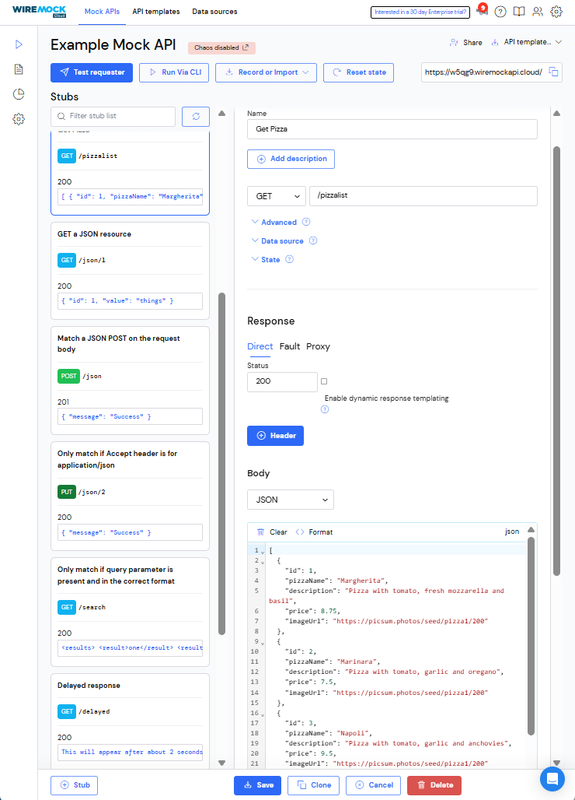
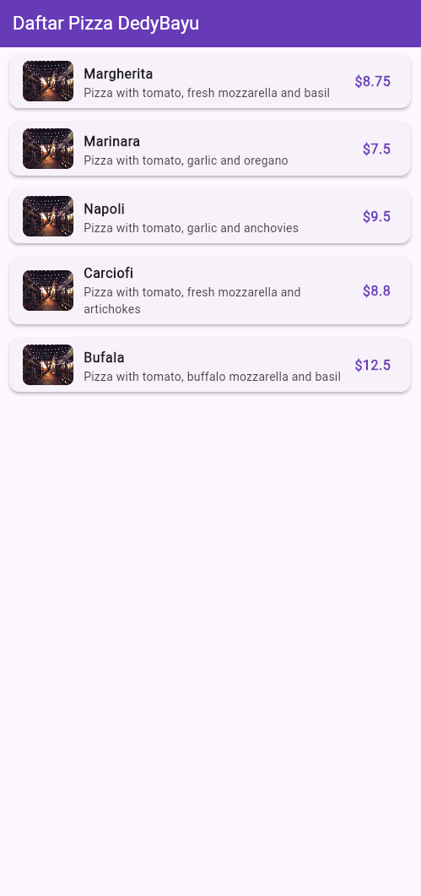
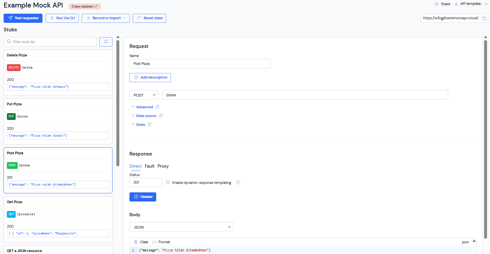
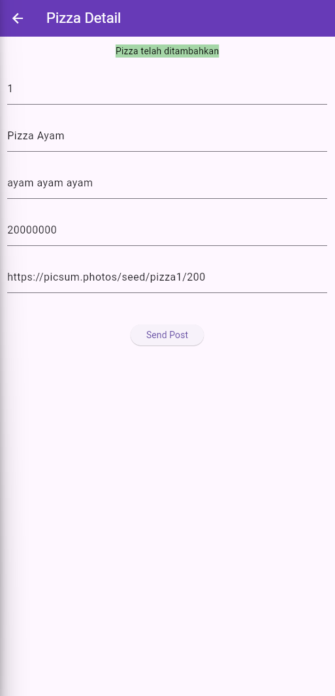
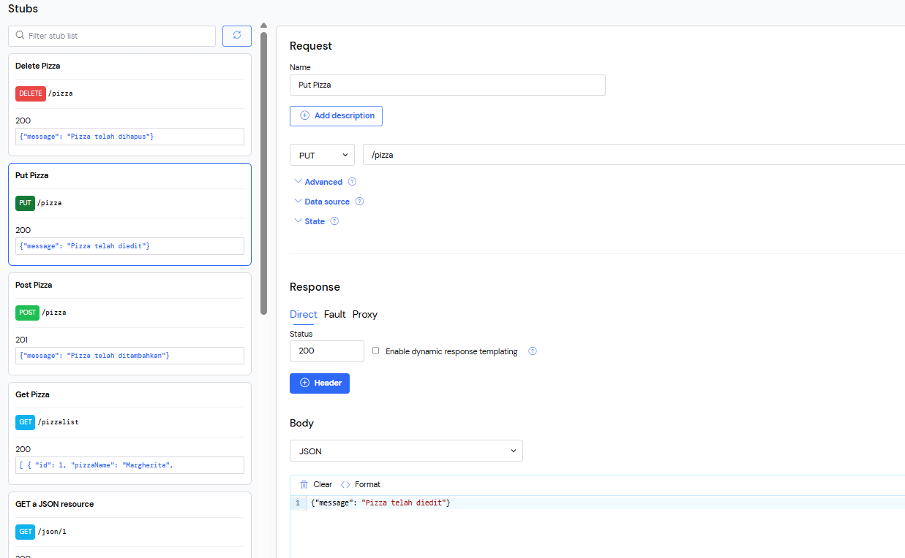
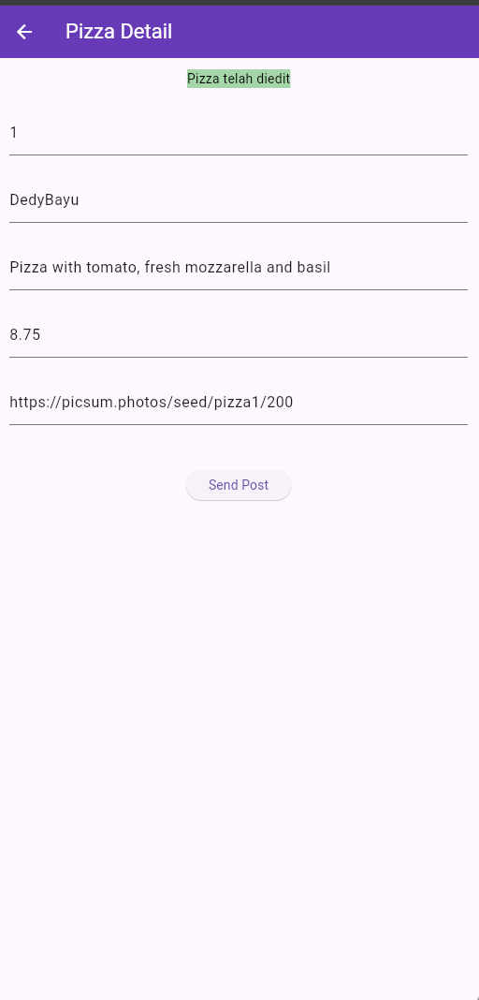
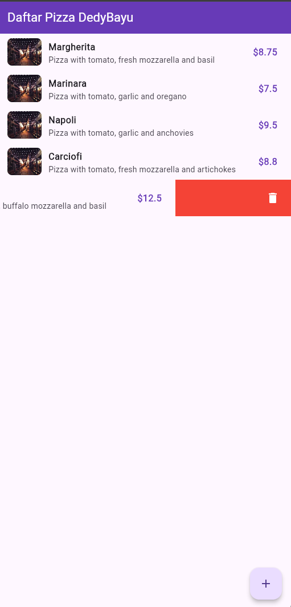
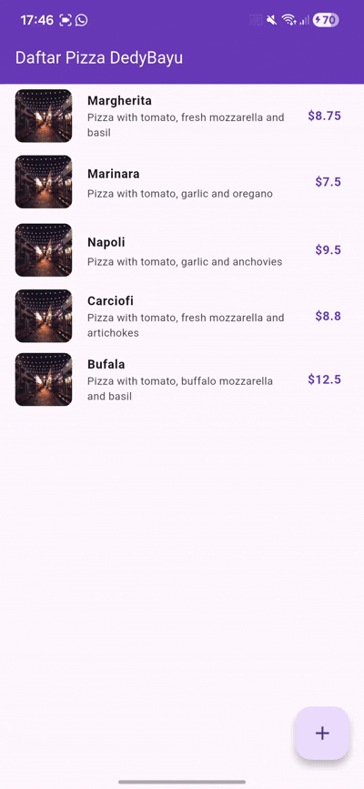

| No. Presensi | Nama               | NIM        | Kelas   |
| ------------ | ------------------ | ---------- | ------- |
| 08           | Dedy Bayu Setiawan | 2341720041 | TI - 3H |

<br><br><br>

# Praktikum 1: Membuat layanan Mock API


## 1. Membuat API untuk GET ```/pizzalist``` dengan layanan Mock Lab

## Membuat API GET


## Helper

```dart
import 'dart:io';
import 'package:http/http.dart' as http;
import 'dart:convert';
import 'models/pizza.dart';

class HttpHelper {
  final String authority = 'w5qg9.wiremockapi.cloud';
  final String path = 'pizzalist';

  static final HttpHelper _httpHelper = HttpHelper._internal();
  HttpHelper._internal();
  factory HttpHelper() {
    return _httpHelper;
  }

  Future<List<Pizza>> getPizzaList() async {
    final Uri url = Uri.https(authority, path);
    final http.Response result = await http.get(url);
    if (result.statusCode == HttpStatus.ok) {
      final jsonResponse = json.decode(result.body);
      //provide a type argument to the map method to avoid type
      //error
      List<Pizza> pizzas = jsonResponse
          .map<Pizza>((i) => Pizza.fromJson(i))
          .toList();
      return pizzas;
    } else {
      return [];
    }
  }
}

```


## main.dart
```dart
import 'dart:convert';
import 'package:flutter/material.dart';
import 'package:store_data_dedybayu/httphelper.dart';
import 'package:store_data_dedybayu/models/pizza.dart';

void main() {
  runApp(const MyApp());
}

class MyApp extends StatelessWidget {
  const MyApp({super.key});

  @override
  Widget build(BuildContext context) {
    return MaterialApp(
      title: 'Pizza List',
      debugShowCheckedModeBanner: false,
      theme: ThemeData(primarySwatch: Colors.blue),
      home: const PizzaPage(),
    );
  }
}

class PizzaPage extends StatefulWidget {
  const PizzaPage({super.key});

  @override
  State<PizzaPage> createState() => _PizzaPageState();
}

class _PizzaPageState extends State<PizzaPage> {
  List<Pizza> pizzas = [];
  bool isLoading = true;

  @override
  void initState() {
    super.initState();
    loadPizzasFromApi();
  }

  Future<void> loadPizzasFromApi() async {
    final data = await callPizzas();

    setState(() {
      pizzas = data;
      isLoading = false;
    });
  }

  Future<List<Pizza>> callPizzas() async {
    HttpHelper helper = HttpHelper();
    return await helper.getPizzaList();
  }

  @override
  Widget build(BuildContext context) {
    return Scaffold(
      appBar: AppBar(
        title: const Text("Daftar Pizza DedyBayu"),
        backgroundColor: Colors.deepPurple,
        foregroundColor: Colors.white,
      ),

      body: isLoading
          ? const Center(child: CircularProgressIndicator())
          : ListView.builder(
              itemCount: pizzas.length,
              itemBuilder: (context, index) {
                final p = pizzas[index];

                return Card(
                  margin: const EdgeInsets.symmetric(
                    horizontal: 12,
                    vertical: 8,
                  ),
                  elevation: 3,
                  shape: RoundedRectangleBorder(
                    borderRadius: BorderRadius.circular(12),
                  ),
                  child: ListTile(
                    leading: p.imageUrl.isNotEmpty
                        ? ClipRRect(
                            borderRadius: BorderRadius.circular(8),
                            child: Image.network(
                              p.imageUrl,
                              width: 60,
                              height: 60,
                              fit: BoxFit.cover,
                              errorBuilder: (_, __, ___) =>
                                  const Icon(Icons.image),
                            ),
                          )
                        : const Icon(Icons.local_pizza, size: 40),

                    title: Text(
                      p.pizzaName,
                      style: const TextStyle(fontWeight: FontWeight.bold),
                    ),

                    subtitle: Text(p.description),

                    trailing: Text(
                      "\$${p.price}",
                      style: const TextStyle(
                        fontSize: 16,
                        fontWeight: FontWeight.bold,
                        color: Colors.deepPurple,
                      ),
                    ),
                  ),
                );
              },
            ),
    );
  }
}
```

## Hasil:



<br><br><br>

# Praktikum 2: Mengirim Data ke Web Service (POST)
## Membuat API POST 


## pizza_detail.dart
```dart
import 'package:flutter/material.dart';
import 'models/pizza.dart';
import 'httphelper.dart';

class PizzaDetailScreen extends StatefulWidget {
  const PizzaDetailScreen({super.key});
  @override
  State<PizzaDetailScreen> createState() => _PizzaDetailScreenState();
}

class _PizzaDetailScreenState extends State<PizzaDetailScreen> {
  final TextEditingController txtId = TextEditingController();
  final TextEditingController txtName = TextEditingController();
  final TextEditingController txtDescription = TextEditingController();
  final TextEditingController txtPrice = TextEditingController();
  final TextEditingController txtImageUrl = TextEditingController();

  String operationResult = '';

  @override
  void dispose() {
    txtId.dispose();
    txtName.dispose();
    txtDescription.dispose();
    txtPrice.dispose();
    txtImageUrl.dispose();
    super.dispose();
  }

  Future postPizza() async {
    HttpHelper helper = HttpHelper();

    Pizza pizza = Pizza(
      id: int.tryParse(txtId.text) ?? 0, 
      pizzaName: txtName.text,
      description: txtDescription.text,
      price: double.tryParse(txtPrice.text) ?? 0.0,
      imageUrl: txtImageUrl.text,
    );

    String result = await helper.postPizza(pizza);

    setState(() {
      operationResult =
          result; // <-- di sini message tampil: "Pizza telah ditambahkan"
    });
  }

  @override
  Widget build(BuildContext context) {
    return Scaffold(
      appBar: AppBar(
        title: const Text('Pizza Detail'),
        backgroundColor: Colors.deepPurple,
        foregroundColor: Colors.white,
      ),
      body: Padding(
        padding: const EdgeInsets.all(12),
        child: SingleChildScrollView(
          child: Column(
            children: [
              Text(
                operationResult,
                style: TextStyle(
                  backgroundColor: Colors.green[200],
                  color: Colors.black,
                ),
              ),
              const SizedBox(height: 24),

              TextField(
                controller: txtId,
                decoration: const InputDecoration(hintText: 'Insert ID'),
              ),
              const SizedBox(height: 24),

              TextField(
                controller: txtName,
                decoration: const InputDecoration(
                  hintText: 'Insert Pizza Name',
                ),
              ),
              const SizedBox(height: 24),

              TextField(
                controller: txtDescription,
                decoration: const InputDecoration(
                  hintText: 'Insert Description',
                ),
              ),
              const SizedBox(height: 24),

              TextField(
                controller: txtPrice,
                decoration: const InputDecoration(hintText: 'Insert Price'),
              ),
              const SizedBox(height: 24),

              TextField(
                controller: txtImageUrl,
                decoration: const InputDecoration(hintText: 'Insert Image Url'),
              ),
              const SizedBox(height: 48),

              ElevatedButton(
                child: const Text('Send Post'),
                onPressed: postPizza,
              ),
            ],
          ),
        ),
      ),
    );
  }
}
```


## httphelper.dart
Tambahan: 
```dart
  Future<String> postPizza(Pizza pizza) async {
    const postPath = 'pizza'; // <-- tanpa slash!

    Uri url = Uri.https(authority, postPath);

    final response = await http.post(
      url,
      headers: {
        'Content-Type': 'application/json',
      },
      body: jsonEncode(pizza.toJson()),
    );

    if (response.statusCode == 200 || response.statusCode == 201) {
      final data = jsonDecode(response.body);
      return data['message'] ?? 'Success';
    } else {
      return 'Error: ${response.statusCode}';
    }
  }
```


## main.dart
```dart
      floatingActionButton: FloatingActionButton(
        child: const Icon(Icons.add),
        onPressed: () {
          Navigator.push(
            context,
            MaterialPageRoute(
              builder: (context) => const PizzaDetailScreen(),
            ),
          );
        },
      ),
    );
  }
}
```

## Hasill:



<br><br><br>

# Praktikum 3: Memperbarui Data di Web Service (PUT)

## Membuat API PUT 



## Membuat method put di Helper
```dart
  Future<String> putPizza(Pizza pizza) async {
    const putPath = 'pizza'; // <-- tanpa slash!

    Uri url = Uri.https(authority, putPath);

    final response = await http.put(
      url,
      headers: {'Content-Type': 'application/json'},
      body: jsonEncode(pizza.toJson()),
    );

    if (response.statusCode == 200 || response.statusCode == 201) {
      final data = jsonDecode(response.body);
      return data['message'] ?? 'Success';
    } else {
      return 'Error: ${response.statusCode}';
    }
  }
```

## Membuat pizza_detail.dart

```dart
import 'package:flutter/material.dart';
import 'models/pizza.dart';
import 'httphelper.dart';

class PizzaDetailScreen extends StatefulWidget {
  const PizzaDetailScreen({super.key});
  @override
  State<PizzaDetailScreen> createState() => _PizzaDetailScreenState();
}

class _PizzaDetailScreenState extends State<PizzaDetailScreen> {
  final TextEditingController txtId = TextEditingController();
  final TextEditingController txtName = TextEditingController();
  final TextEditingController txtDescription = TextEditingController();
  final TextEditingController txtPrice = TextEditingController();
  final TextEditingController txtImageUrl = TextEditingController();

  String operationResult = '';

  @override
  void dispose() {
    txtId.dispose();
    txtName.dispose();
    txtDescription.dispose();
    txtPrice.dispose();
    txtImageUrl.dispose();
    super.dispose();
  }

  @override
void initState() {
  if (!widget.isNew && widget.pizza != null) {
    txtId.text = widget.pizza!.id.toString();
    txtName.text = widget.pizza!.pizzaName;
    txtDescription.text = widget.pizza!.description;
    txtPrice.text = widget.pizza!.price.toString();
    txtImageUrl.text = widget.pizza!.imageUrl;
  }
  super.initState();
}


  Future postPizza() async {
    HttpHelper helper = HttpHelper();

    Pizza pizza = Pizza(
      id: int.tryParse(txtId.text) ?? 0,
      pizzaName: txtName.text,
      description: txtDescription.text,
      price: double.tryParse(txtPrice.text) ?? 0.0,
      imageUrl: txtImageUrl.text,
    );

    String result = await helper.postPizza(pizza);

    setState(() {
      operationResult =
          result; 
    });
  }

  @override
  Widget build(BuildContext context) {
    return Scaffold(
      appBar: AppBar(
        title: const Text('Pizza Detail'),
        backgroundColor: Colors.deepPurple,
        foregroundColor: Colors.white,
      ),
      body: Padding(
        padding: const EdgeInsets.all(12),
        child: SingleChildScrollView(
          child: Column(
            children: [
              Text(
                operationResult,
                style: TextStyle(
                  backgroundColor: Colors.green[200],
                  color: Colors.black,
                ),
              ),
              const SizedBox(height: 24),

              TextField(
                controller: txtId,
                decoration: const InputDecoration(hintText: 'Insert ID'),
              ),
              const SizedBox(height: 24),

              TextField(
                controller: txtName,
                decoration: const InputDecoration(
                  hintText: 'Insert Pizza Name',
                ),
              ),
              const SizedBox(height: 24),

              TextField(
                controller: txtDescription,
                decoration: const InputDecoration(
                  hintText: 'Insert Description',
                ),
              ),
              const SizedBox(height: 24),

              TextField(
                controller: txtPrice,
                decoration: const InputDecoration(hintText: 'Insert Price'),
              ),
              const SizedBox(height: 24),

              TextField(
                controller: txtImageUrl,
                decoration: const InputDecoration(hintText: 'Insert Image Url'),
              ),
              const SizedBox(height: 48),

              ElevatedButton(
                child: const Text('Send Post'),
                onPressed: savePizza,
              ),
            ],
          ),
        ),
      ),
    );
  }
}

```


## Perubahan kode di main.dart untuk membuka detail 
```dart
 @override
  Widget build(BuildContext context) {
    return Scaffold(
      appBar: AppBar(
        title: const Text("Daftar Pizza DedyBayu"),
        backgroundColor: Colors.deepPurple,
        foregroundColor: Colors.white,
      ),

      body: isLoading
          ? const Center(child: CircularProgressIndicator())
          : ListView.builder(
              itemCount: pizzas.length,
              itemBuilder: (context, position) {
                final pizza = pizzas[position];

                return Dismissible(
                  key: Key(pizza.id.toString()),
                  background: Container(
                    color: Colors.red,
                    alignment: Alignment.centerRight,
                    padding: const EdgeInsets.only(right: 20),
                    child: const Icon(Icons.delete, color: Colors.white),
                  ),
                  direction: DismissDirection.endToStart,

                  onDismissed: (direction) async {
                    HttpHelper helper = HttpHelper();

                    // Hapus dari server
                    await helper.deletePizza(pizza.id);

                    // Hapus dari list UI
                    setState(() {
                      pizzas.removeAt(position);
                    });

                    ScaffoldMessenger.of(context).showSnackBar(
                      const SnackBar(content: Text("Pizza deleted")),
                    );
                  },

                  child: ListTile(
                    leading: pizza.imageUrl.isNotEmpty
                        ? ClipRRect(
                            borderRadius: BorderRadius.circular(8),
                            child: Image.network(
                              pizza.imageUrl,
                              width: 60,
                              height: 60,
                              fit: BoxFit.cover,
                              errorBuilder: (_, __, ___) =>
                                  const Icon(Icons.image),
                            ),
                          )
                        : const Icon(Icons.local_pizza, size: 40),

                    title: Text(
                      pizza.pizzaName,
                      style: const TextStyle(fontWeight: FontWeight.bold),
                    ),
                    subtitle: Text(pizza.description),

                    trailing: Text(
                      "\$${pizza.price}",
                      style: const TextStyle(
                        fontSize: 16,
                        fontWeight: FontWeight.bold,
                        color: Colors.deepPurple,
                      ),
                    ),

                    onTap: () {
                      Navigator.push(
                        context,
                        MaterialPageRoute(
                          builder: (context) => PizzaDetailScreen(
                            isNew: false,
                            pizza: pizza,
                          ),
                        ),
                      );
                    },
                  ),
                );
              },
            ),

      floatingActionButton: FloatingActionButton(
        child: const Icon(Icons.add),
        onPressed: () {
          Navigator.push(
            context,
            MaterialPageRoute(
              builder: (context) => const PizzaDetailScreen(isNew: true),
            ),
          );
        },
      ),
    );
  }
```
## Hasil:




<br><br><br>


# Praktikum 4: Menghapus Data dari Web Service (DELETE)

## Penambahan method Delete ke Helper

```dart
  Future<String> deletePizza(int id) async {
    final String deletePath = 'pizza/$id'; // endpoint: /pizza/ID

    Uri url = Uri.https(authority, deletePath);

    final http.Response response = await http.delete(url);

    if (response.statusCode == 200 || response.statusCode == 201) {
      final data = jsonDecode(response.body);
      return data['message'] ?? 'Berhasil menghapus';
    } else {
      return 'Error: ${response.statusCode}';
    }
  }
```

## Penambahan di kelas _MyHomePageState, refactor itemBuilder dari ListView.builder sehingga ListTile terkandung dalam widget Dismissible

```dart
 body: isLoading
    ? const Center(child: CircularProgressIndicator())
    : ListView.builder(
        itemCount: pizzas.length,
        itemBuilder: (context, position) {
          final pizza = pizzas[position];

          return Dismissible(
            key: Key(pizza.id.toString()),
            background: Container(
              color: Colors.red,
              alignment: Alignment.centerRight,
              padding: const EdgeInsets.only(right: 20),
              child: const Icon(Icons.delete, color: Colors.white),
            ),
            direction: DismissDirection.endToStart,

            onDismissed: (direction) async {
              HttpHelper helper = HttpHelper();

              // Hapus dari server
              await helper.deletePizza(pizza.id);

              // Hapus dari list UI
              setState(() {
                pizzas.removeAt(position);
              });

              ScaffoldMessenger.of(context).showSnackBar(
                const SnackBar(content: Text("Pizza deleted")),
              );
            },

            child: ListTile(
              leading: pizza.imageUrl.isNotEmpty
```


## Hasil:



<br><br><br>


# Kode Final

## httphelper.dart
```dart
import 'dart:io';
import 'package:http/http.dart' as http;
import 'dart:convert';
import 'models/pizza.dart';

class HttpHelper {
  final String authority = 'w5qg9.wiremockapi.cloud';
  final String path = 'pizzalist';

  static final HttpHelper _httpHelper = HttpHelper._internal();
  HttpHelper._internal();
  factory HttpHelper() => _httpHelper;

  Future<List<Pizza>> getPizzaList() async {
    final Uri url = Uri.https(authority, path);
    final http.Response result = await http.get(url);

    if (result.statusCode == HttpStatus.ok) {
      final jsonResponse = json.decode(result.body);
      return jsonResponse.map<Pizza>((i) => Pizza.fromJson(i)).toList();
    } else {
      return [];
    }
  }

  Future<String> postPizza(Pizza pizza) async {
    const postPath = 'pizza'; // <-- tanpa slash!

    Uri url = Uri.https(authority, postPath);

    final response = await http.post(
      url,
      headers: {'Content-Type': 'application/json'},
      body: jsonEncode(pizza.toJson()),
    );

    if (response.statusCode == 200 || response.statusCode == 201) {
      final data = jsonDecode(response.body);
      return data['message'] ?? 'Success';
    } else {
      return 'Error: ${response.statusCode}';
    }
  }

  Future<String> putPizza(Pizza pizza) async {
    const putPath = 'pizza'; // <-- tanpa slash!

    Uri url = Uri.https(authority, putPath);

    final response = await http.put(
      url,
      headers: {'Content-Type': 'application/json'},
      body: jsonEncode(pizza.toJson()),
    );

    if (response.statusCode == 200 || response.statusCode == 201) {
      final data = jsonDecode(response.body);
      return data['message'] ?? 'Success';
    } else {
      return 'Error: ${response.statusCode}';
    }
  }

  Future<String> deletePizza(int id) async {
    final String deletePath = 'pizza/$id'; // endpoint: /pizza/ID

    Uri url = Uri.https(authority, deletePath);

    final http.Response response = await http.delete(url);

    if (response.statusCode == 200 || response.statusCode == 201) {
      final data = jsonDecode(response.body);
      return data['message'] ?? 'Berhasil menghapus';
    } else {
      return 'Error: ${response.statusCode}';
    }
  }
}

```

## pizza_detail.dart
```dart
import 'package:flutter/material.dart';
import 'models/pizza.dart';
import 'httphelper.dart';

class PizzaDetailScreen extends StatefulWidget {
  final Pizza? pizza;   // <-- nullable
  final bool isNew;

  const PizzaDetailScreen({
    super.key,
    this.pizza,         // <-- tidak wajib
    required this.isNew,
  });


  @override
  State<PizzaDetailScreen> createState() => _PizzaDetailScreenState();
}

class _PizzaDetailScreenState extends State<PizzaDetailScreen> {
  final TextEditingController txtId = TextEditingController();
  final TextEditingController txtName = TextEditingController();
  final TextEditingController txtDescription = TextEditingController();
  final TextEditingController txtPrice = TextEditingController();
  final TextEditingController txtImageUrl = TextEditingController();

  String operationResult = '';

  @override
  void dispose() {
    txtId.dispose();
    txtName.dispose();
    txtDescription.dispose();
    txtPrice.dispose();
    txtImageUrl.dispose();
    super.dispose();
  }

  @override
void initState() {
  if (!widget.isNew && widget.pizza != null) {
    txtId.text = widget.pizza!.id.toString();
    txtName.text = widget.pizza!.pizzaName;
    txtDescription.text = widget.pizza!.description;
    txtPrice.text = widget.pizza!.price.toString();
    txtImageUrl.text = widget.pizza!.imageUrl;
  }
  super.initState();
}


  Future postPizza() async {
    HttpHelper helper = HttpHelper();

    Pizza pizza = Pizza(
      id: int.tryParse(txtId.text) ?? 0,
      pizzaName: txtName.text,
      description: txtDescription.text,
      price: double.tryParse(txtPrice.text) ?? 0.0,
      imageUrl: txtImageUrl.text,
    );

    String result = await helper.postPizza(pizza);

    setState(() {
      operationResult =
          result; // <-- di sini message tampil: "Pizza telah ditambahkan"
    });
  }

  Future savePizza() async {
    HttpHelper helper = HttpHelper();
    Pizza pizza = Pizza(
      id: int.tryParse(txtId.text) ?? 0,
      pizzaName: txtName.text,
      description: txtDescription.text,
      price: double.tryParse(txtPrice.text) ?? 0.0,
      imageUrl: txtImageUrl.text,
    );
    final result = await (widget.isNew
        ? helper.postPizza(pizza)
        : helper.putPizza(pizza));
    setState(() {
      operationResult = result;
    });
  }

  @override
  Widget build(BuildContext context) {
    return Scaffold(
      appBar: AppBar(
        title: const Text('Pizza Detail'),
        backgroundColor: Colors.deepPurple,
        foregroundColor: Colors.white,
      ),
      body: Padding(
        padding: const EdgeInsets.all(12),
        child: SingleChildScrollView(
          child: Column(
            children: [
              Text(
                operationResult,
                style: TextStyle(
                  backgroundColor: Colors.green[200],
                  color: Colors.black,
                ),
              ),
              const SizedBox(height: 24),

              TextField(
                controller: txtId,
                decoration: const InputDecoration(hintText: 'Insert ID'),
              ),
              const SizedBox(height: 24),

              TextField(
                controller: txtName,
                decoration: const InputDecoration(
                  hintText: 'Insert Pizza Name',
                ),
              ),
              const SizedBox(height: 24),

              TextField(
                controller: txtDescription,
                decoration: const InputDecoration(
                  hintText: 'Insert Description',
                ),
              ),
              const SizedBox(height: 24),

              TextField(
                controller: txtPrice,
                decoration: const InputDecoration(hintText: 'Insert Price'),
              ),
              const SizedBox(height: 24),

              TextField(
                controller: txtImageUrl,
                decoration: const InputDecoration(hintText: 'Insert Image Url'),
              ),
              const SizedBox(height: 48),

              ElevatedButton(
                child: const Text('Send Post'),
                onPressed: savePizza,
              ),
            ],
          ),
        ),
      ),
    );
  }
}

```


## main.dart
```dart
import 'package:flutter/material.dart';
import 'package:store_data_dedybayu/httphelper.dart';
import 'package:store_data_dedybayu/models/pizza.dart';
import 'package:store_data_dedybayu/pizza_detail.dart';

void main() {
  runApp(const MyApp());
}

class MyApp extends StatelessWidget {
  const MyApp({super.key});

  @override
  Widget build(BuildContext context) {
    return MaterialApp(
      title: 'Pizza List',
      debugShowCheckedModeBanner: false,
      theme: ThemeData(primarySwatch: Colors.blue),
      home: const PizzaPage(),
    );
  }
}

class PizzaPage extends StatefulWidget {
  const PizzaPage({super.key});

  @override
  State<PizzaPage> createState() => _PizzaPageState();
}

class _PizzaPageState extends State<PizzaPage> {
  List<Pizza> pizzas = [];
  bool isLoading = true;

  @override
  void initState() {
    super.initState();
    loadPizzasFromApi();
  }

  Future<void> loadPizzasFromApi() async {
    final data = await callPizzas();
    setState(() {
      pizzas = data;
      isLoading = false;
    });
  }

  Future<List<Pizza>> callPizzas() async {
    HttpHelper helper = HttpHelper();
    return await helper.getPizzaList();
  }

  @override
  Widget build(BuildContext context) {
    return Scaffold(
      appBar: AppBar(
        title: const Text("Daftar Pizza DedyBayu"),
        backgroundColor: Colors.deepPurple,
        foregroundColor: Colors.white,
      ),

      body: isLoading
          ? const Center(child: CircularProgressIndicator())
          : ListView.builder(
              itemCount: pizzas.length,
              itemBuilder: (context, position) {
                final pizza = pizzas[position];

                return Dismissible(
                  key: Key(pizza.id.toString()),
                  background: Container(
                    color: Colors.red,
                    alignment: Alignment.centerRight,
                    padding: const EdgeInsets.only(right: 20),
                    child: const Icon(Icons.delete, color: Colors.white),
                  ),
                  direction: DismissDirection.endToStart,

                  onDismissed: (direction) async {
                    HttpHelper helper = HttpHelper();

                    // Hapus dari server
                    await helper.deletePizza(pizza.id);

                    // Hapus dari list UI
                    setState(() {
                      pizzas.removeAt(position);
                    });

                    ScaffoldMessenger.of(context).showSnackBar(
                      const SnackBar(content: Text("Pizza deleted")),
                    );
                  },

                  child: ListTile(
                    leading: pizza.imageUrl.isNotEmpty
                        ? ClipRRect(
                            borderRadius: BorderRadius.circular(8),
                            child: Image.network(
                              pizza.imageUrl,
                              width: 60,
                              height: 60,
                              fit: BoxFit.cover,
                              errorBuilder: (_, __, ___) =>
                                  const Icon(Icons.image),
                            ),
                          )
                        : const Icon(Icons.local_pizza, size: 40),

                    title: Text(
                      pizza.pizzaName,
                      style: const TextStyle(fontWeight: FontWeight.bold),
                    ),
                    subtitle: Text(pizza.description),

                    trailing: Text(
                      "\$${pizza.price}",
                      style: const TextStyle(
                        fontSize: 16,
                        fontWeight: FontWeight.bold,
                        color: Colors.deepPurple,
                      ),
                    ),

                    onTap: () {
                      Navigator.push(
                        context,
                        MaterialPageRoute(
                          builder: (context) => PizzaDetailScreen(
                            isNew: false,
                            pizza: pizza,
                          ),
                        ),
                      );
                    },
                  ),
                );
              },
            ),

      floatingActionButton: FloatingActionButton(
        child: const Icon(Icons.add),
        onPressed: () {
          Navigator.push(
            context,
            MaterialPageRoute(
              builder: (context) => const PizzaDetailScreen(isNew: true),
            ),
          );
        },
      ),
    );
  }
}

```


## Hasil Final
